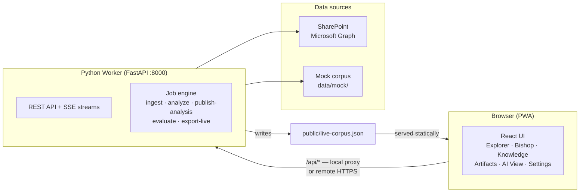
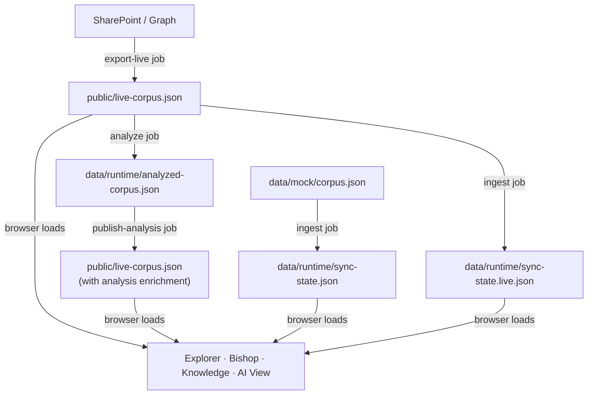
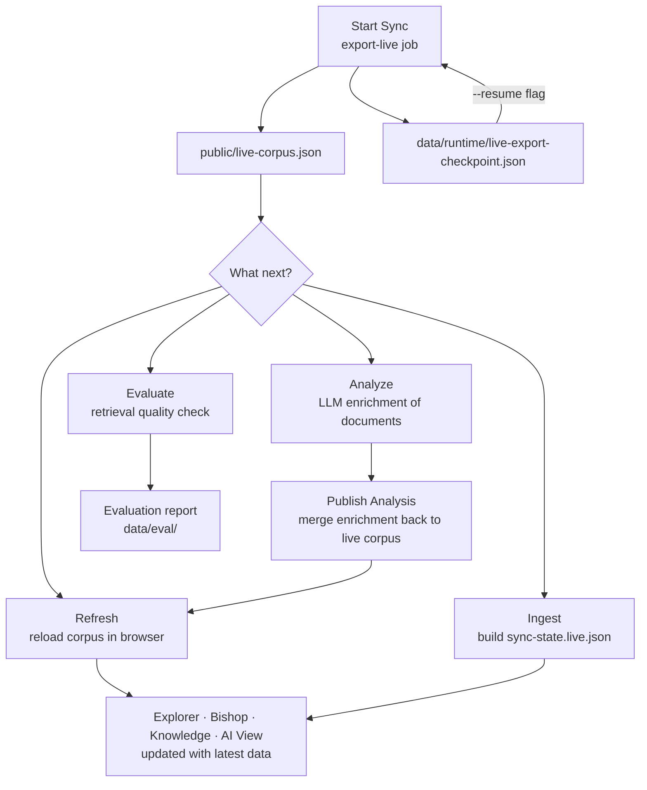
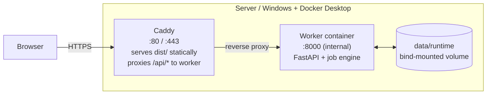

# DeepVault Nexus

<p align="center">
  <a href="./LICENSE"></a>
  
  
  
  
  
</p>

DeepVault is the RAG solution: it connects governed knowledge sources, builds retrieval-ready artifacts, and powers knowledge-grounded experiences across the product set.

DeepVault Nexus is the web platform used to administer and validate that solution end to end. It is the control surface for the DeepVault products, including `Navy`, `Bishop`, and the shared `Knowledge` / `Artifacts` / runtime administration flows.

## Architecture



## Corpus pipeline



## What You Get

- **Explorer** — browse sources, inspect documents, filter by site and role
- **Bishop** — permission-aware grounded Q&A with source traces
- **Knowledge** — coverage, refresh timing, provenance, and the streamed operations console
- **Artifacts** — generated-output inspection, processed-file drill-down, debugging records
- **AI View** — response confidence, recent answers, inputs that would have improved the answer
- **Settings** — runtime scope, assistant-context tuning, role selection, provider selection, worker connection

## Requirements

- Node 22 + npm
- Python 3.9+ (for local worker)
- Docker Desktop (optional — for running the worker as a container)

## Install

```bash
npm install
cp .env.exemple .env.local   # Windows: copy .env.exemple .env.local
```

Edit `.env.local` with your values. Never commit it.

### Worker virtual environment

```bash
python3 -m venv .venv-worker
. .venv-worker/bin/activate          # Windows: .venv-worker\Scripts\activate
pip install -r worker/requirements.txt
```

---

## Quick Command Matrix

| Goal | Command |
|---|---|
| **Dev — frontend only** (mock corpus, no worker) | `npm run dev` |
| **Dev — full stack** (worker + Vite, one terminal) | `npm run dev:all` |
| **Dev — stop full stack** | `Ctrl+C` in the terminal |
| **Dev — worker only** (attach your own Vite) | `npm run dev:worker` |
| **Dev — worker in Docker** (remote mode) | `npm run docker:build` then `npm run docker:worker`; set `VITE_WORKER_PROXY_TARGET=http://localhost:8001` before `npm run dev` |
| **Dev — stop Docker worker** | `npm run docker:stop` (from any terminal) |
| **Prod — build + start stack** | `npm run prod` |
| **Prod — start existing containers** | `npm run prod:up` |
| **Prod — stop containers** | `npm run prod:down` |
| **Prod — follow logs** | `npm run prod:logs` |
| Export live corpus from SharePoint | `npm run export:live` |
| Ingest mock corpus | `npm run ingest` |
| Ingest live corpus | `npm run ingest:live -- --input public/live-corpus.json` |
| Analyze corpus (LLM enrichment) | `npm run analyze` |
| Publish analysis to live corpus | `npm run analyze:publish` |
| Evaluate retrieval quality (mock) | `npm run evaluate` |
| Evaluate retrieval quality (live) | `npm run evaluate:live -- --input public/live-corpus.json` |
| Full local check (lint + test + build + eval) | `npm run check` |
| Full CI pass locally | `npm run ci:local` |

---

## Running Locally

### Option A — one terminal (recommended)

Starts the Python worker and the Vite dev server together, with prefixed, colour-coded output:

```bash
npm run dev:all
```

Open the Vite URL shown in the terminal (typically `http://localhost:5173`).

Worker only (attach your own Vite separately):

```bash
npm run dev:worker
```

### Option B — two terminals

Terminal 1 — Python worker:

```bash
. .venv-worker/bin/activate
python3 -m uvicorn worker.main:app --reload --host 0.0.0.0 --port 8000
```

Terminal 2 — Vite dev server:

```bash
npm run dev
```

Vite proxies `/api/*` to `http://localhost:8000` automatically.

### Mock corpus (default)

The app loads the bundled `data/mock/corpus.json` by default. No worker needed for read-only browsing.

### Live corpus in the browser

```bash
VITE_DEEPVAULT_DATA_MODE=live npm run dev
# Windows PowerShell: $env:VITE_DEEPVAULT_DATA_MODE="live"; npm run dev
# Windows cmd:        set VITE_DEEPVAULT_DATA_MODE=live && npm run dev
```

The app loads `public/live-corpus.json`. Falls back to mock if the file is missing.

---

## Running the Worker in Docker (remote mode)

Use this to test the `remote` worker mode — the frontend connects to the worker over HTTP instead of the same-origin proxy.

### 1. Build the image

```bash
npm run docker:build
```

### 2. Start the container

```bash
npm run docker:worker
```

This mounts `data/runtime` from the repo so the containerised worker shares job artifacts and corpus files with the local Vite dev server. The worker listens on **port 8001** under the name `deepvault-worker-dev`.
When the frontend runs locally against that container, set `VITE_WORKER_PROXY_TARGET=http://localhost:8001` so the Vite `/api` proxy points at the Docker worker instead of the default local-worker port.

### 3. Stop the container

```bash
npm run docker:stop
```

Works from any terminal — no need to find the container ID.

### 4. Configure Settings

In the app, go to **Settings → Worker**:

| Field | Value |
|---|---|
| Worker mode | `remote` |
| Worker URL | `http://localhost:8001` |
| Worker token | *(leave blank — no auth in dev)* |

Or pre-seed these values in `.env.local` so Settings opens pre-filled on first load:

```env
VITE_WORKER_MODE=remote
VITE_WORKER_URL=http://localhost:8001
```

Then run the frontend against the Docker worker:

```bash
npm run dev
```

> **Note:** `VITE_WORKER_MODE` and `VITE_WORKER_URL` only seed the defaults the first time Settings is loaded on a given device. Once saved, localStorage takes precedence. The worker token is never read from env — enter it manually in Settings.

---

## Live Data Workflow

Live mode exports real SharePoint content via Microsoft Graph and loads it into the app.

### 1. Configure `.env.local`

```env
DEEPVAULT_ENTRA_AUTH_MODE=delegated        # or: application
DEEPVAULT_ENTRA_APP_ID=<azure-app-id>
DEEPVAULT_ENTRA_TENANT_ID=<azure-tenant-id>
DEEPVAULT_ENTRA_SECRET_VALUE=<client-secret>   # required for app-only auth
DEEPVAULT_ENTRA_SITES=https://yourtenant.sharepoint.com/sites/site1
DEEPVAULT_PILOT_SITE_NAMES=Site 1
```

See [`.env.exemple`](./.env.exemple) for the full reference.

### 2. Run Start Sync from the app (recommended)

Open **Knowledge → Operations** and press **Start Sync**. The streamed log shows progress, and in delegated mode it prints the device-code URL in both the terminal and the operations console so you can authenticate.

### 3. Or export from the CLI

```bash
npm run export:live          # full export from Graph
npm run export:live -- --mode mock    # dry-run without hitting Graph
npm run export:live -- --resume       # delta from local checkpoint
```

### 4. Operational flow after a sync



Recommended sequence after a full live sync:

1. **Start Sync** — generate the latest live corpus
2. **Refresh** — load it into the current browser session
3. **Ingest** — write the derived live sync snapshot
4. **Analyze** — enrich documents with LLM summaries
5. **Publish Analysis** — merge enrichment back to `public/live-corpus.json`
6. **Evaluate** — validate retrieval quality on the enriched corpus

---

## Hosted Deployment

For production deployment on a server with Docker:

```bash
npm run prod          # build frontend + start Caddy + worker containers
npm run prod:up       # start existing containers (after a git pull + build)
npm run prod:down     # stop all containers
npm run prod:logs     # follow container logs
```

See [`docs/deployment-guide.md`](./docs/deployment-guide.md) for the full operator runbook: environment variables, Entra SSO setup, operator allowlist, Windows startup automation, and troubleshooting.



---

## Validation

```bash
npm run lint
npm run typecheck
npm run test
npm run build
npm run evaluate
npm run e2e
```

Full CI pass locally (lint + typecheck + coverage + build + eval + e2e):

```bash
npm run ci:local
```

`npm run evaluate` always runs against the deterministic mock baseline, regardless of `OPENAI_API_KEY`, `DEEPVAULT_DATA_MODE`, or `DEEPVAULT_CORPUS_PATH` set in the environment.

---

## Security Notes

- Provider API keys entered in Settings are browser-scoped local values, not server-side secrets.
- `VITE_*` variables are bundled into the frontend JavaScript — never put tokens or secrets in them.
- The worker token (for remote mode) is kept in `sessionStorage` and must be entered manually in Settings.
- Worker jobs receive only the environment variables required for the selected operation.
- Bishop conversation history lives in `localStorage` on the current device until you clear it.
- Prefer `.env.local` and CLI workflows for higher-trust live export and evaluation runs.

---

## Data Files

Generated local artifacts are ignored by Git:

| Path | Contents |
|---|---|
| `public/live-corpus.json` | Exported SharePoint corpus (with optional analysis enrichment) |
| `data/runtime/` | Job artifacts, sync state, analyzed corpus, checkpoint |
| `data/eval/*.live.json` | Live evaluation results |
| `.env.local` | Local credentials and configuration |

These files can contain exported business content and must remain local.

---

## Troubleshooting

| Symptom | Likely cause | Fix |
|---|---|---|
| Worker not responding | venv not activated or process not running | Run `npm run dev:worker` or `npm run dev:all` |
| 500 on job start | Worker process crashed | Check terminal for Python traceback |
| Browser shows mock corpus in live mode | `public/live-corpus.json` missing | Run **Start Sync** or `npm run export:live` |
| Device code URL not visible | Check both the `[worker]` terminal and the Operations console log | The URL appears in both after the latest fix |
| Settings reset after browser clear | localStorage cleared | Re-enter Settings or set `VITE_WORKER_MODE` / `VITE_WORKER_URL` in `.env.local` |
| Docker worker not reachable | Image not built | Run `npm run docker:build` first |
| PWA showing stale build | Service worker cached old version | Run `npm run e2e -- tests/e2e/pwa-refresh.spec.ts` |
| `npm run export:live` reuses old content | `--resume` flag active | Omit `--resume` to force a full fresh export |
