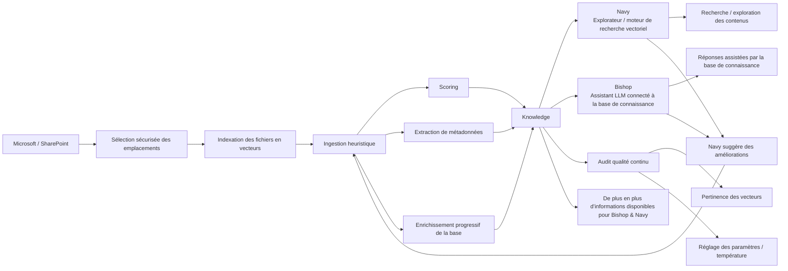
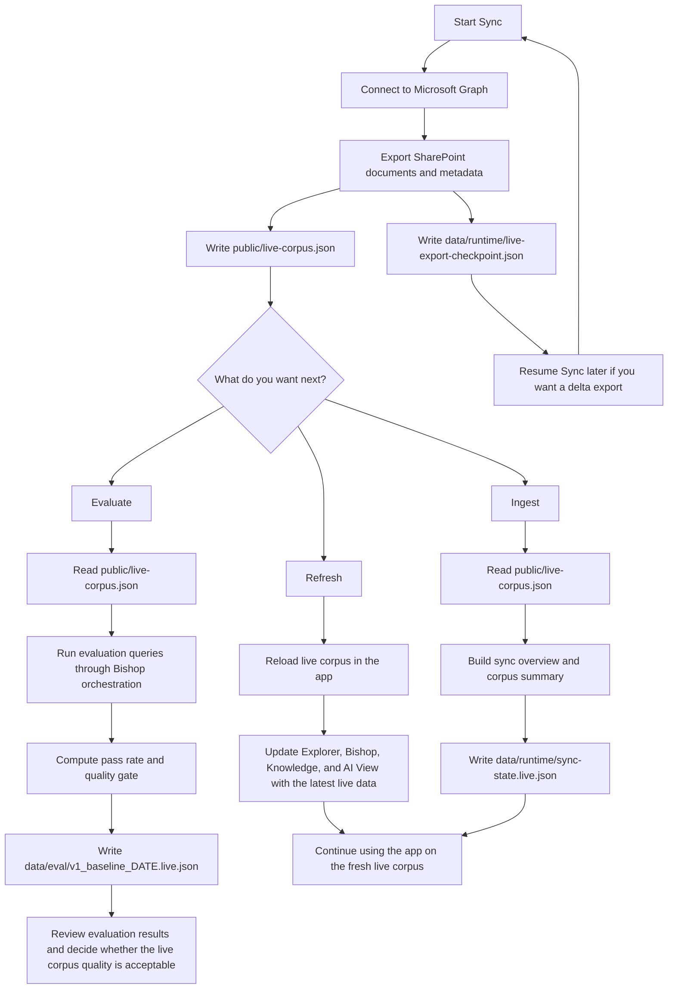

# DeepVault Nexus

<p align="center">
  <a href="./LICENSE"></a>
  
  
  
  
  
</p>

DeepVault is the RAG solution: it connects governed knowledge sources, builds retrieval-ready artifacts, and powers knowledge-grounded experiences across the product set.

DeepVault Nexus is the web platform used to administer and validate that solution end to end before a hosted backend exists.
It is the control surface for the DeepVault products, including `Navy`, `Bishop`, and the shared `Knowledge` / `Artifacts` / runtime administration flows that support them.



It gives you:

- `Explorer` for browsing sources and inspecting documents
- `DeepVault - Bishop` for permission-aware grounded Q&A
- `Knowledge` for coverage, visibility, refresh timing, provenance, and the streamed operations console
- `Artifacts` for generated-output inspection, processed-file drill-down, and debugging generated records
- `AI View` for response confidence, recent answers, and the inputs that would have helped
- `Settings` for runtime scope, assistant-context tuning, persisted role selection, provider selection, and local API keys
- a mock corpus for fast local work
- a live corpus path for testing against real SharePoint exports

This repo is intentionally local-first:

- mock mode runs without Microsoft Graph
- live mode uses a browser-ready JSON export from your SharePoint sites
- the live export is generated from the Microsoft Graph / Entra settings in `.env.local`

## Security Notes

- Provider API keys entered in `Settings` are browser-scoped local values persisted on the current device, not server-side secrets.
- Bishop remote calls are made from the app runtime, so treat those keys as local development credentials only.
- Worker jobs receive only the environment variables required for the selected operation instead of the full in-browser secret set.
- Bishop conversation history is persisted in `localStorage` on the current device and survives reloads and browser restarts until you clear it.
- Prefer `.env.local` and CLI workflows for higher-trust live export and evaluation runs.

## What You Can Test

- document discovery and source inspection
- grounded retrieval with source traces
- role-based visibility
- generated-output inspection through `Artifacts`
- persisted `Artifacts` filter/grouping choices across reloads
- local ingestion snapshots
- live SharePoint export generation
- live corpus loading in the browser
- installable offline-capable PWA behavior and browser-driven refresh validation

## Requirements

- Node 22
- npm

## Install

1. Install dependencies:

   ```bash
   npm install
   ```

2. Create your local environment file:

   ```bash
   cp .env.exemple .env.local
   ```

   Windows PowerShell:

   ```powershell
   Copy-Item .env.exemple .env.local
   ```

   Windows Command Prompt:

   ```cmd
   copy .env.exemple .env.local
   ```

3. Edit `.env.local` with your own values.

Keep real credentials and tenant data local. Do not commit `.env.local`.

## Quick Start

Run the local app with the bundled mock corpus:

```bash
npm run dev
```

Open the Vite URL shown in the terminal.

When the app opens, it shows a `Getting started` modal with the project vision and the main navigation areas.
That modal now introduces `Explorer`, `Bishop`, `Knowledge`, `Artifacts`, `AI View`, and `Settings`.

If you want to use the live corpus file in the browser:

```bash
VITE_DEEPVAULT_DATA_MODE=live npm run dev
```

Windows PowerShell:

```powershell
$env:VITE_DEEPVAULT_DATA_MODE="live"; npm run dev
```

Windows Command Prompt:

```cmd
set VITE_DEEPVAULT_DATA_MODE=live && npm run dev
```

That makes the app try to load `public/live-corpus.json`.
You can also switch the same setting from `Settings` in the app; the local setting overrides the env default.
If the file is missing, the app falls back to the bundled mock corpus.

## Local Testing Guide

This is the fastest path for validating the product locally.

### 1. Start the app

```bash
npm run dev
```

Use this when you want to work with the bundled mock corpus.

### 2. Inspect sources in Explorer

- use `Settings` to change the active role, provider, and site scope
- use the site filter to narrow the corpus
- search for titles, tags, or keywords
- click a document card to inspect its metadata, summary, and excerpt

### 3. Ask Bishop

- switch to `Bishop`
- ask a grounded question about the corpus
- press `Enter` to send, or `Shift + Enter` to add a new line
- optionally keep conversation context enabled so Bishop reuses previous turns
- tune grounded source count, retrieval candidate pool, and reused history turns from `Settings -> Runtime -> Assistant context`
- Bishop keeps answered history in local browser storage until you clear it
- check the answer trace for sources, chunk count, token count, and latency

### 4. Check Knowledge

- switch to `Knowledge`
- verify site counts, visible docs, and refresh metadata
- use the operations console to run refresh, ingest, or evaluation jobs and follow the streamed log

### 5. Inspect Artifacts

- switch to `Artifacts`
- the default filter opens on `Processed files`
- filter and grouping selections persist across reloads on the same device
- inspect processed-file records, derived outputs, provenance, and diagnostics for debugging

### 6. Review AI View

- switch to `AI View`
- inspect recent Bishop responses with their confidence and status
- review the recurring hints about what input would have improved the answer

### 7. Run the local snapshot generators

```bash
npm run ingest
npm run evaluate
```

These commands validate the local mock corpus pipeline and the deterministic baseline.
`npm run evaluate` explicitly ignores ambient provider API keys plus local `DEEPVAULT_DATA_MODE` / `DEEPVAULT_CORPUS_PATH` overrides so the mock baseline stays hermetic across developer machines and CI runners.

### 8. Run the full local check

```bash
npm run check
```

That runs lint, typecheck, tests, build, and the mock evaluation.
`npm run check` is implemented in Node and is intended to run the same way on macOS, Linux, and Windows.
The helper launcher used by `evaluate`, `ingest`, `export:live`, and `e2e` resolves the Windows `node_modules/.bin/*.cmd` shims explicitly and runs them through the Windows shell so those commands stay runnable on GitHub Actions Windows runners.

### 9. Reproduce the CI lane locally

```bash
npm run ci:local
```

That command runs lint, typecheck, coverage, build, mock evaluation, Playwright browser install, and the end-to-end suite in one pass.

If you want the coverage report and threshold check:

```bash
npm run test:coverage
```

## Live Data Workflow

Live mode is for testing against real SharePoint content exported through Microsoft Graph.

### 1. Configure `.env.local`

The live exporter reads these settings from `.env.local`:

- `DEEPVAULT_ENTRA_AUTH_MODE`
- `DEEPVAULT_ENTRA_BASE_URL`
- `DEEPVAULT_ENTRA_TIMEOUT_SECONDS`
- `DEEPVAULT_ENTRA_SCOPES`
- `DEEPVAULT_ENTRA_SITES`
- `DEEPVAULT_PILOT_SITE_NAMES`
- `DEEPVAULT_ENTRA_APP_ID`
- `DEEPVAULT_ENTRA_TENANT_ID`
- `DEEPVAULT_ENTRA_SECRET_VALUE`
- `OPENAI_API_KEY`
- `GEMINI_API_KEY`
- `ANTHROPIC_API_KEY`

You can use [`.env.exemple`](./.env.exemple) as the starting point. The in-app `Settings` screen currently covers the Entra app ID, tenant ID, client secret value, site URLs, site names, provider API keys, Bishop context tuning, and worker connection settings.

### 2. Generate the live corpus

```bash
npm run export:live
```

This:

- reads the Microsoft Graph and Entra settings from `.env.local`
- crawls the configured SharePoint sites
- writes `public/live-corpus.json`
- keeps a local checkpoint in `data/runtime/live-export-checkpoint.json` for explicit resume runs

If you want to validate the pipeline without hitting Graph:

```bash
npm run export:live -- --mode mock
```

If you want to resume a previous live export from the local checkpoint, pass `--resume`:

```bash
npm run export:live -- --resume
```

### 3. Load the live corpus in the browser

```bash
VITE_DEEPVAULT_DATA_MODE=live npm run dev
```

Windows PowerShell:

```powershell
$env:VITE_DEEPVAULT_DATA_MODE="live"; npm run dev
```

Windows Command Prompt:

```cmd
set VITE_DEEPVAULT_DATA_MODE=live && npm run dev
```

The app loads `public/live-corpus.json` at runtime and shows the live corpus in the same UI.

### 4. Validate the live snapshot locally

```bash
npm run ingest:live -- --input public/live-corpus.json
npm run evaluate:live -- --input public/live-corpus.json
```

Those commands validate the generated live JSON as an input artifact.
Use `--strict` with `npm run evaluate:live` when you want the quality gate to fail the command if the pass rate falls below the configured threshold.

### Live sync operational flow

After `Start Sync` finishes, the app has produced the live corpus and checkpoint, but the follow-up steps remain explicit operations:



Recommended manual sequence after a full live sync:

- `Start Sync` to generate the latest live corpus
- `Refresh` to load that corpus into the current UI session
- `Ingest` to write the derived live sync snapshot
- `Evaluate` to validate retrieval quality on the exported live corpus

## Validation

Recommended validation sequence:

```bash
npm run lint
npm run typecheck
npm run test
npm run build
npm run evaluate
npm run e2e
```

`npm run evaluate` stays on the deterministic local baseline even if `OPENAI_API_KEY`, `GEMINI_API_KEY`, `ANTHROPIC_API_KEY`, `DEEPVAULT_DATA_MODE`, or `DEEPVAULT_CORPUS_PATH` are set in the shell or `.env.local`.

For live-data validation:

```bash
npm run export:live
npm run ingest:live -- --input public/live-corpus.json
npm run evaluate:live -- --input public/live-corpus.json
VITE_DEEPVAULT_DATA_MODE=live npm run dev
```

Windows PowerShell:

```powershell
$env:VITE_DEEPVAULT_DATA_MODE="live"; npm run dev
```

Windows Command Prompt:

```cmd
set VITE_DEEPVAULT_DATA_MODE=live && npm run dev
```

## Data Files

Generated local artifacts are ignored by Git:

- `public/live-corpus.json`
- `data/runtime/`
- `data/eval/*.live.json`

These files can contain exported business content and should remain local.

## Notes

- The app uses a deterministic retrieval abstraction in V1.
- Mock mode is the default.
- Live mode is opt-in and requires the exported corpus file.
- The repo keeps business content outside `.env`, so treat exported JSON as sensitive operational data.

## Troubleshooting

- If `npm run export:live` is slow, the current SharePoint crawl may be large.
- If the browser still shows the mock corpus in live mode, confirm that `public/live-corpus.json` exists.
- If the app does not switch to live data, make sure you started it with `VITE_DEEPVAULT_DATA_MODE=live`.
- If `npm run export:live` keeps reusing old content, check whether you passed `--resume`; without it, the export should start fresh from the live sources.
- If the browser keeps showing an older front-end build after a normal reload, validate with `npm run e2e -- tests/e2e/pwa-refresh.spec.ts` before assuming the issue is fixed.
- If you want to reset the browser-side Playwright artifacts, delete `.playwright-cli/` locally. It is ignored by Git.
