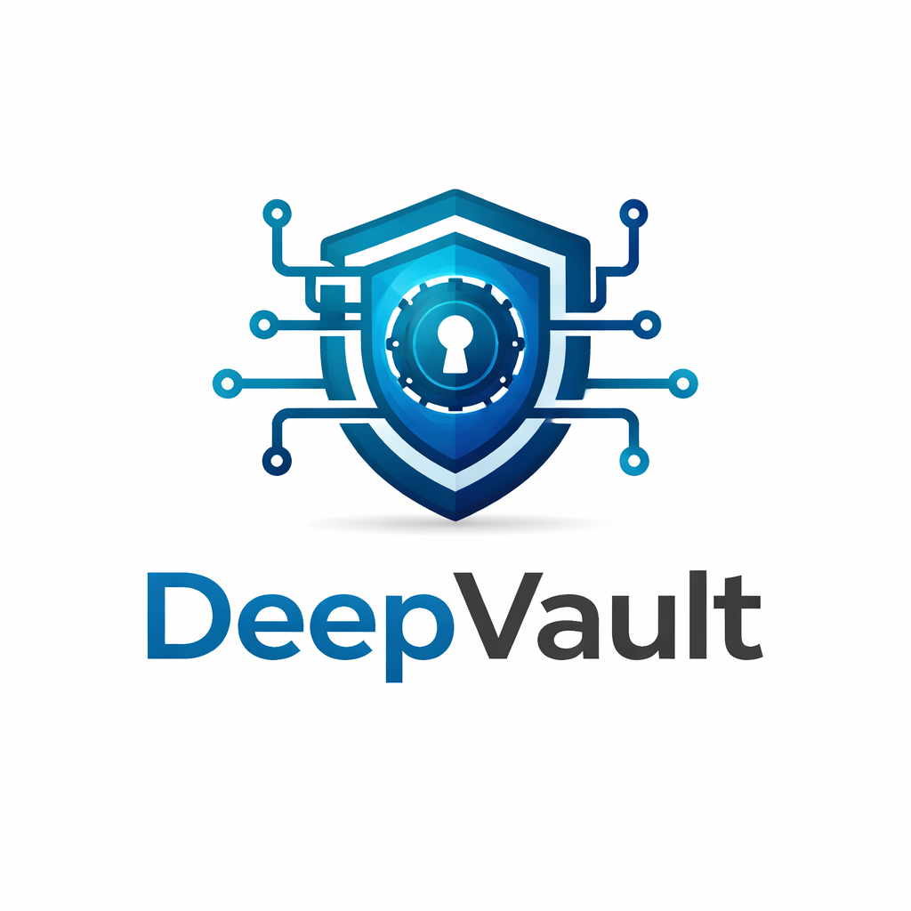

# DeepVault Nexus

<p align="center">
  
</p>

<p align="center">
  <a href="./LICENSE"></a>
  
  
  
  
  
</p>

DeepVault Nexus is the local command center for the DeepVault product family.
It is designed to help you validate the experience end to end before a hosted backend exists.

It gives you:

- `DeepVault - Navy` for browsing sources and inspecting documents
- `DeepVault - Bishop` for permission-aware grounded Q&A
- sync visibility for ingestion state, refresh timing, and provenance
- a mock corpus for fast local work
- a live corpus path for testing against real SharePoint exports

This repo is intentionally local-first:

- mock mode runs without Microsoft Graph
- live mode uses a browser-ready JSON export from your SharePoint sites
- the live export is generated from the Microsoft Graph / Entra settings in `.env.local`

## What You Can Test

- document discovery and source inspection
- grounded retrieval with source traces
- role-based visibility
- local ingestion snapshots
- live SharePoint export generation
- live corpus loading in the browser

## Requirements

- Node 22
- npm

## Install

1. Install dependencies:

   ```bash
   npm install
   ```

2. Create your local environment file:

   ```bash
   cp .env.exemple .env.local
   ```

3. Edit `.env.local` with your own values.

Keep real credentials and tenant data local. Do not commit `.env.local`.

## Quick Start

Run the local app with the bundled mock corpus:

```bash
npm run dev
```

Open the Vite URL shown in the terminal.

If you want to use the live corpus file in the browser:

```bash
VITE_DEEPVAULT_DATA_MODE=live npm run dev
```

That makes the app try to load `public/live-corpus.json`.
If the file is missing, the app falls back to the bundled mock corpus.

## Local Testing Guide

This is the fastest path for validating the product locally.

### 1. Start the app

```bash
npm run dev
```

Use this when you want to work with the bundled mock corpus.

### 2. Inspect sources in Navy

- use the site filter to narrow the corpus
- search for titles, tags, or keywords
- click a document card to inspect its metadata, summary, and excerpt

### 3. Ask Bishop

- switch to `DeepVault - Bishop`
- ask a grounded question about the corpus
- check the answer trace for sources, chunk count, token count, and latency

### 4. Check sync status

- switch to `Sync status`
- verify site counts, visible docs, and refresh metadata

### 5. Run the local snapshot generators

```bash
npm run ingest
npm run evaluate
```

These commands validate the local mock corpus pipeline and the deterministic baseline.

### 6. Run the full local check

```bash
npm run check
```

That runs lint, typecheck, tests, build, and the mock evaluation.

## Live Data Workflow

Live mode is for testing against real SharePoint content exported through Microsoft Graph.

### 1. Configure `.env.local`

The live exporter reads these settings from `.env.local`:

- `DEEPVAULT_ENTRA_AUTH_MODE`
- `DEEPVAULT_ENTRA_BASE_URL`
- `DEEPVAULT_ENTRA_TIMEOUT_SECONDS`
- `DEEPVAULT_ENTRA_SCOPES`
- `DEEPVAULT_ENTRA_SITES`
- `DEEPVAULT_PILOT_SITE_NAMES`
- `DEEPVAULT_ENTRA_APP_ID`
- `DEEPVAULT_ENTRA_TENANT_ID`
- `DEEPVAULT_ENTRA_SECRET_ID`
- `DEEPVAULT_ENTRA_SECRET_VALUE`
- `OPENAI_API_KEY`
- `GEMINI_API_KEY`

You can use [`.env.exemple`](./.env.exemple) as the starting point.

### 2. Generate the live corpus

```bash
npm run export:live
```

This:

- reads the Microsoft Graph and Entra settings from `.env.local`
- crawls the configured SharePoint sites
- writes `public/live-corpus.json`

If you want to validate the pipeline without hitting Graph:

```bash
npm run export:live -- --mode mock
```

### 3. Load the live corpus in the browser

```bash
VITE_DEEPVAULT_DATA_MODE=live npm run dev
```

The app loads `public/live-corpus.json` at runtime and shows the live corpus in the same UI.

### 4. Validate the live snapshot locally

```bash
npm run ingest:live -- --input public/live-corpus.json
npm run evaluate:live -- --input public/live-corpus.json
```

Those commands validate the generated live JSON as an input artifact.

## Validation

Recommended validation sequence:

```bash
npm run lint
npm run typecheck
npm run test
npm run build
npm run evaluate
npm run e2e
```

For live-data validation:

```bash
npm run export:live
npm run ingest:live -- --input public/live-corpus.json
npm run evaluate:live -- --input public/live-corpus.json
VITE_DEEPVAULT_DATA_MODE=live npm run dev
```

## Data Files

Generated local artifacts are ignored by Git:

- `public/live-corpus.json`
- `data/runtime/`
- `data/eval/*.live.json`

These files can contain exported business content and should remain local.

## Notes

- The app uses a deterministic retrieval abstraction in V1.
- Mock mode is the default.
- Live mode is opt-in and requires the exported corpus file.
- The repo keeps business content outside `.env`, so treat exported JSON as sensitive operational data.

## Troubleshooting

- If `npm run export:live` is slow, the current SharePoint crawl may be large.
- If the browser still shows the mock corpus in live mode, confirm that `public/live-corpus.json` exists.
- If the app does not switch to live data, make sure you started it with `VITE_DEEPVAULT_DATA_MODE=live`.
- If you want to reset the browser-side Playwright artifacts, delete `.playwright-cli/` locally. It is ignored by Git.
