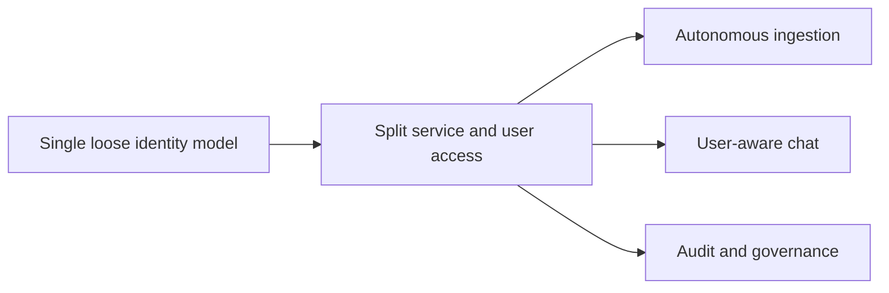

## adr_001_identity_and_access_model_for_sharepoint_knowledge_graph - Identity and access model for SharePoint knowledge graph
> Date: 2026-04-10
> Status: Proposed
> Drivers: Separate autonomous ingestion from user-aware chat access, preserve auditability, and keep future Teams integration governed.
> Related request: `logics/request/req_000_sharepoint_knowledge_graph_kickoff.md`
> Related backlog: `logics/backlog/item_004_teams_bot_chat_and_permissions.md`, `logics/backlog/item_012_teams_bot_channel_and_permissions.md`
> Related task: (none yet)
> Reminder: Keep the chat identity, ingestion identity, and permission checks aligned when the runtime model changes. Default to service identity for ingestion and user identity for chat.

# Overview
The platform should not use one identity for every concern.
Ingestion runs with a service identity that can read the configured SharePoint scope.
Chat access uses the current user identity and checks authorization before answering.
Teams should be a governed bot surface, not a fake human account.

# Context
The project needs to ingest SharePoint content without waiting on a human session.
At the same time, the future chat experience must respect Microsoft user rights before exposing answers.
Using one shared identity for both would blur ownership, auditing, and access control.

# Decision
Use a split identity model.
The ingestion pipeline runs with a service identity or app-only flow for SharePoint access.
The chat layer uses the active Microsoft user identity, then checks whether that user may query the relevant content before calling the LLM.
The Teams surface, when used, must be an official bot or app identity.

# Alternatives considered
- One app-only identity for everything
- One delegated human account for everything
- A fake human profile in Entra

# Consequences
- Better auditability and clearer responsibility boundaries
- More implementation work because ingestion and chat have different auth paths
- Permission checks become a first-class backend concern

# Migration and rollout
Start with the ingestion identity and read-only pilot scope.
Add the user-authenticated chat path once the permission model is stable.
Introduce Teams bot authentication after the core access checks are in place.

# Decision defaults
- Ingestion identity: service identity or app-only flow.
- Chat identity: active Microsoft user identity.
- Teams identity: official bot/app identity.
- Authorization timing: check permissions before calling the LLM.

# References
- `logics/request/req_000_sharepoint_knowledge_graph_kickoff.md`
# Follow-up work
- Build a permission-check service for chat access
- Define token refresh and secret storage rules
- Add Teams bot auth and identity mapping
