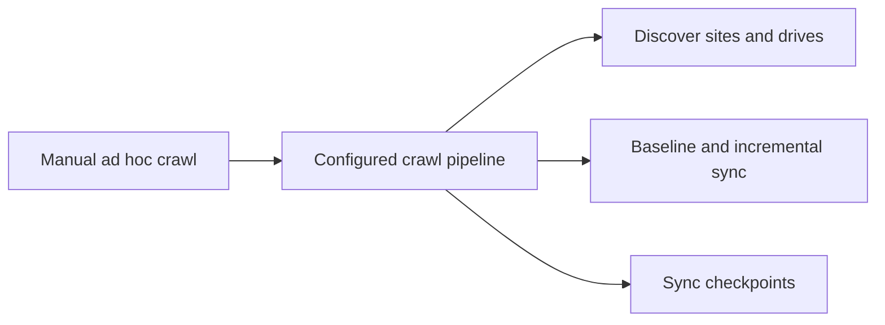

## adr_002_sharepoint_ingestion_and_sync_pipeline - SharePoint ingestion and sync pipeline
> Date: 2026-04-10
> Status: Proposed
> Drivers: Support one or more SharePoint sites, keep the pilot configurable, and allow both manual and scheduled refreshes.
> Related request: `logics/request/req_000_sharepoint_knowledge_graph_kickoff.md`
> Related backlog: `item_001_sharepoint_ingestion_and_sync_pipeline`
> Related task: (none yet)
> Reminder: Keep site discovery, crawl order, and sync behavior aligned with the pilot configuration. Default to incremental sync with manual refresh available. Reviewed during the 2026-04-10 release/doc sync.

# Overview
The system should discover the configured SharePoint sites and crawl them in a predictable order.
The first implementation should support a full baseline crawl and later incremental refreshes.
Manual refresh and scheduled sync both need to be available.
The pipeline should preserve checkpoints so the knowledge store can stay current.

# Context
The kickoff scope already includes two pilot sites and a configurable site list.
The data source spans sites, drives, lists, folders, and pages.
The system needs a repeatable way to ingest content without hard-coding site names into the application.

# Decision
Implement a Graph-driven ingestion pipeline that reads the pilot site list from configuration, discovers the relevant SharePoint surfaces, performs a baseline crawl, and supports both manual and scheduled refreshes.
Track sync state so later runs can process deltas instead of rebuilding everything.

# Alternatives considered
- Full rebuild on every run
- Event-driven sync only
- Hard-coded site names in code

# Consequences
- More operational logic than a simple crawler
- Better support for pilot updates and later scale-out
- Requires sync state storage and retry handling

# Migration and rollout
Start with the two pilot sites and a full baseline crawl.
Add incremental refresh once the first stable shape of the data model exists.
Expose a manual trigger before introducing scheduled automation.

# Decision defaults
- Crawl mode: full baseline crawl first.
- Default refresh: incremental.
- Manual control: available for validation and troubleshooting.
- Scheduling: conservative per-environment cadence.

# References
- `logics/request/req_000_sharepoint_knowledge_graph_kickoff.md`
- `logics/backlog/item_001_sharepoint_ingestion_and_sync_pipeline.md`
# Follow-up work
- Define sync state storage
- Implement crawl ordering and retries
- Add manual refresh and scheduler hooks
