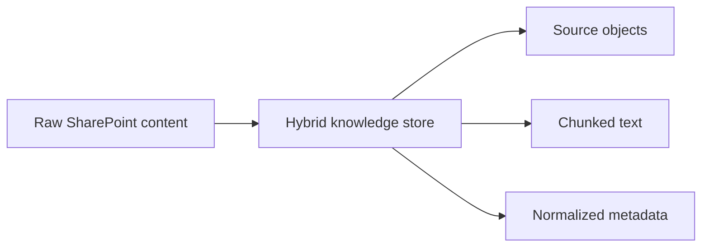

## adr_003_hybrid_knowledge_store_and_retrieval_model - Hybrid knowledge store and retrieval model
> Date: 2026-04-10
> Status: Proposed
> Drivers: Support document, list, page, and metadata indexing while keeping source traceability for future LLM answers.
> Related request: `logics/request/req_000_sharepoint_knowledge_graph_kickoff.md`
> Related backlog: `logics/backlog/item_002_hybrid_knowledge_store_and_retrieval.md`, `logics/backlog/item_009_local_chat_surface_and_answer_flow.md`, `logics/backlog/item_011_hosted_backend_core.md`
> Related task: (none yet)
> Reminder: Keep the storage model able to back citations, search, and future semantic retrieval.

# Overview
The knowledge layer should not be a single blob of text.
It should store source objects, normalized metadata, and chunked text for retrieval.
That makes the system usable for search, traceability, and future LLM citations.

# Context
The request calls for a hybrid knowledge base that can answer questions from SharePoint content.
The indexed material must include documents, lists, pages, and metadata, with links back to the original source.
A pure document store or pure vector store would make traceability and structured retrieval harder.

# Decision
Use a hybrid model with three layers:
source records for the original SharePoint objects, normalized metadata for filtering and navigation, and chunked text for retrieval.
Keep the latest version as the default source of truth.
Expose source links so each answer can be traced back to SharePoint.

# Alternatives considered
- Full text only
- Vector-only retrieval
- Graph only without chunked text

# Consequences
- Better answer grounding and user trust
- More pipeline work because extraction and chunking are separate concerns
- Easier to combine structured browsing with LLM retrieval later

# Migration and rollout
Start with documents and list items from the pilot sites.
Add page content and richer metadata after the baseline schema is stable.
Backfill the hybrid store from the first pilot crawl.

# References
- `logics/request/req_000_sharepoint_knowledge_graph_kickoff.md`

# Follow-up work
- Define storage schema for source objects and chunks
- Add ranking and citation fields
- Decide whether embeddings are stored now or later
