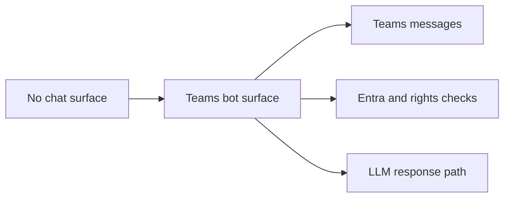

## adr_004_teams_bot_architecture_for_llm_chat - Teams bot architecture for LLM chat
> Date: 2026-04-10
> Status: Proposed
> Drivers: Deliver the chatbot through Teams, keep identity governed, and verify user access before invoking the LLM.
> Related request: `logics/request/req_000_sharepoint_knowledge_graph_kickoff.md`
> Related backlog: `logics/backlog/item_004_teams_bot_chat_and_permissions.md`, `logics/backlog/item_012_teams_bot_channel_and_permissions.md`
> Related task: (none yet)
> Reminder: Keep the bot identity, Teams payload handling, and rights checks aligned.

# Overview
The chat surface should be an official Teams bot rather than a fake user profile.
Teams delivers messages to the backend.
The backend validates the user, checks access, queries the knowledge layer, and posts the answer back to Teams.

# Context
The project needs a user-facing chat experience that can answer from the SharePoint knowledge base.
The user asked whether Teams could be used as the primary surface.
That is a good fit, but the bot must remain an official app identity to keep permissions and governance clear.

# Decision
Implement the first chatbot surface as a Teams bot.
Use Entra-backed identity to authenticate the bot and the user.
Before each answer, verify that the current user is allowed to access the requested content, then call the LLM and return the response in Teams.

# Alternatives considered
- Fake human profile in Entra
- Web chat only
- Direct LLM access without permission checks

# Consequences
- Stronger governance and auditability
- More setup work for bot registration and message routing
- Permission checks must be reliable before the bot becomes broadly usable

# Migration and rollout
Start with a small internal Teams channel or test tenant.
Validate authentication, access checks, and answer formatting before wider rollout.
Keep a web chat option open for later, but do not require it yet.

# References
- `logics/request/req_000_sharepoint_knowledge_graph_kickoff.md`

# Follow-up work
- Register the Teams app and bot
- Define message schema and response templates
- Add moderation, logging, and rate limiting
