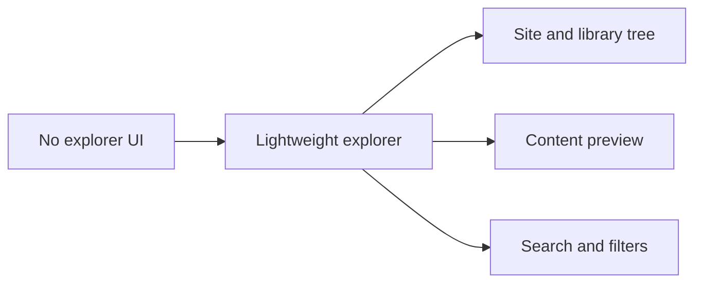

## adr_005_explorer_ui_for_sharepoint_navigation - Explorer UI for SharePoint navigation
> Date: 2026-04-10
> Status: Proposed
> Drivers: Give users a lightweight way to browse sites and content while validating ingestion quality.
> Related request: `logics/request/req_000_sharepoint_knowledge_graph_kickoff.md`
> Related backlog: `logics/backlog/item_003_explorer_ui_for_sharepoint_navigation.md`, `logics/backlog/item_008_local_explorer_shell_and_navigation.md`
> Related task: (none yet)
> Reminder: Keep the explorer small, navigable, and aligned with the current data model.

# Overview
The product should include a small explorer UI early.
It should show the SharePoint site tree, libraries, folders, lists, and content previews.
This UI will help validate the knowledge base before the chat layer becomes the main interface.

# Context
The request explicitly asks for a navigation surface.
Users need to inspect what the system ingests, what is available in each site, and how the content maps back to SharePoint.
That makes the explorer a practical product and debugging tool.

# Decision
Build a lightweight explorer UI focused on navigation and preview, not on administration.
The first version should cover sites, libraries, folders, lists, and quick content previews.
Search and filters can be added as part of the same surface if they remain simple.

# Alternatives considered
- Chat-only interface
- Full admin console
- No UI until the backend is finished

# Consequences
- Faster validation of the ingestion layer
- Better visibility into what the knowledge base contains
- Adds a frontend slice to the delivery plan

# Migration and rollout
Start with read-only navigation on the pilot sites.
Add preview and search after the basic tree view is stable.
Expand the explorer only when the underlying content model is reliable.

# References
- `logics/request/req_000_sharepoint_knowledge_graph_kickoff.md`

# Follow-up work
- Define explorer routes and API payloads
- Build tree navigation and preview components
- Add search and filtering later
