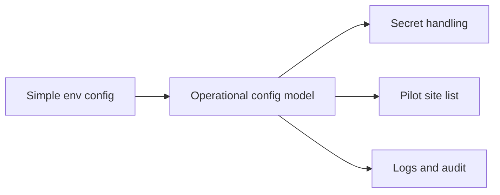

## adr_006_runtime_configuration_and_operations - Runtime configuration and operations
> Date: 2026-04-10
> Status: Proposed
> Drivers: Keep the pilot easy to change, protect secrets, and leave room for future scale and governance.
> Related request: `logics/request/req_000_sharepoint_knowledge_graph_kickoff.md`
> Related backlog: `logics/backlog/item_005_runtime_config_and_operations.md`, `logics/backlog/item_010_local_sync_status_and_operational_view.md`
> Related task: (none yet)
> Reminder: Revisit this decision when the pilot site list moves from a developer-managed setup to a user-managed setup.

# Overview
The first version should stay easy to operate.
Pilot sites can live in environment configuration at first.
Secrets should stay out of source control.
As the product grows, the site list and operational controls can move to a more durable store.

# Context
The request explicitly requires the pilot site list to be configurable.
The project also needs a clean way to manage API secrets, sync settings, and later operational concerns.
Using a simple, explicit setup first reduces early friction.

# Decision
Keep the first release configuration-driven through environment variables and secret-backed credentials.
Use the environment to define the pilot site list, auth mode, and operational defaults.
Do not hard-code site names or secrets into the application.

# Alternatives considered
- Hard-coded config in the app
- Database-only config from day one
- Secret store only with no visible pilot settings

# Consequences
- Simple pilot onboarding
- Easier local development and debugging
- Later migration will be needed once non-developers manage sites or sync settings

# Migration and rollout
Start with `.env`-based pilot configuration.
Move site management into a database or admin surface only when the operational need is proven.
Keep the current secret model compatible with that future migration.

# References
- `logics/request/req_000_sharepoint_knowledge_graph_kickoff.md`

# Follow-up work
- Define a canonical env schema
- Add config validation on startup
- Plan a future admin/config UI if site management becomes user-facing
