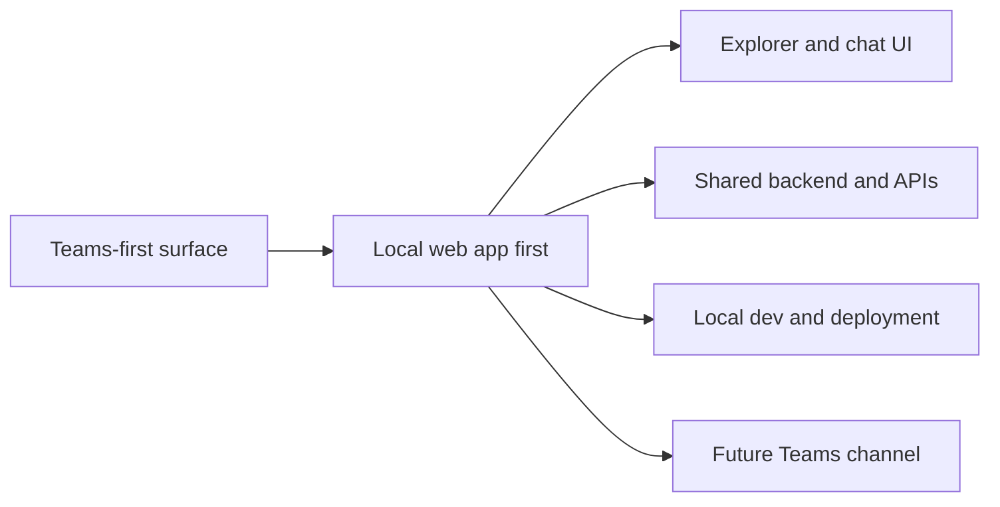

## adr_007_local_companion_app_architecture_for_explorer_and_chat - Local companion app architecture for explorer and chat
> Date: 2026-04-10
> Status: Proposed
> Drivers: Reduce Teams dependency for the first release, keep the explorer and chat experience under our control, and reuse the same backend for later channels.
> Related request: `logics/request/req_000_sharepoint_knowledge_graph_kickoff.md`
> Related backlog: `logics/backlog/item_006_local_companion_app_for_explorer_and_chat.md`
> Related task: (none yet)
> Reminder: Keep the local app, future Teams option, and shared backend aligned when the product surface changes.

# Overview
The first user-facing surface should be a local companion web app.
It will host the explorer, chat, and sync status in one place.
Teams remains a future integration channel, not a dependency for the first release.
The same backend should power all channels so the product can expand later without rework.

# Context
Teams is a valid future channel, but it adds friction to local development, iteration, and validation.
The product needs a fast feedback loop for the explorer and the chat experience before it is distributed into a tenant-wide channel.
The local web app can still authenticate through Entra and enforce the same permissions model as the eventual bot or channel integration.

# Decision
Use a local companion web app as the primary V1 surface.
Keep the explorer, chat, and status views in the same app so the user can move between navigation and questioning without context switching.
Keep Teams as a later channel that reuses the same backend, auth, and data contracts.

# Alternatives considered
- Teams bot first
- Web explorer without chat
- Separate explorer and chat applications

# Consequences
- Faster iteration and lower integration friction in V1
- Shared backend can support both the local app and later Teams integration
- The product still needs a clear auth boundary so user rights are enforced in the browser app too

# Migration and rollout
Start with the local app as the primary entry point for the pilot users.
Keep the backend contracts channel-agnostic.
When the product is ready, add Teams as an extra surface without rewriting ingestion or retrieval logic.

# References
- `logics/request/req_000_sharepoint_knowledge_graph_kickoff.md`
- `logics/backlog/item_006_local_companion_app_for_explorer_and_chat.md`

# Follow-up work
- Build the local app shell and route structure
- Wire explorer, chat, and sync status to shared backend endpoints
- Keep Teams integration as a later channel adapter
