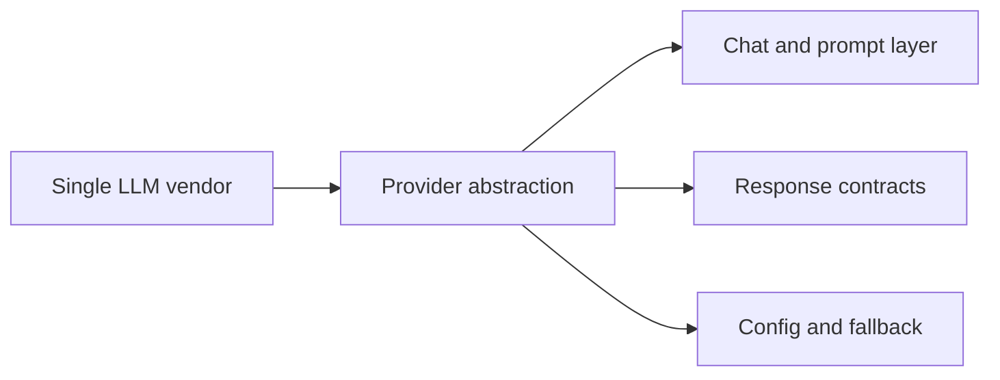

## adr_008_llm_provider_abstraction_for_openai_and_gemini - LLM provider abstraction for OpenAI and Gemini
> Date: 2026-04-10
> Status: Proposed
> Drivers: Keep the chat backend provider-agnostic, use the keys already configured in the environment, and allow quality or cost trade-offs without changing the UI.
> Related request: `logics/request/req_000_sharepoint_knowledge_graph_kickoff.md`
> Related backlog: `item_007_llm_provider_abstraction_for_openai_and_gemini`
> Related task: `logics/tasks/task_000_sharepoint_foundations_and_shared_contracts.md`, `logics/tasks/task_002_ingestion_sync_and_retrieval_hardening.md`, `logics/tasks/task_008_retrieval_evaluation_set_and_quality_gates.md`
> Reminder: Keep the provider contract stable so the local app can switch models without changing product behavior, using version-neutral wording. Default to OpenAI primary with Gemini fallback routing. Reviewed during the 2026-04-10 release/doc sync.

# Overview
The chat layer should call a provider abstraction instead of hard-coding a single LLM vendor.
OpenAI and Gemini are both valid providers for the project and can be selected through configuration.
The user-facing app should talk to one stable contract while the backend decides which provider handles the request.
This keeps the product flexible and lets the team compare quality, latency, and cost.

# Context
The environment already contains OpenAI and Gemini keys.
The product needs the freedom to switch providers or use a fallback without rewriting the local companion app.
The backend should normalize prompts, context, and responses so the UI stays independent of the chosen model.

# Decision
Use a provider abstraction for the chat backend.
OpenAI is the hard default primary provider. Gemini is the secondary fallback. The contract normalizes prompts, context, and responses so the UI never needs to change when the provider changes.

The backend must not switch providers silently. Every request must log which provider handled it. Fallback must be deliberate and auditable.

# Fallback policy
- Primary: OpenAI. Active unless overridden by `LLM_PROVIDER=gemini` environment variable.
- Secondary: Gemini. Used when `LLM_PROVIDER=gemini` is set, or when OpenAI returns a retryable error (HTTP 429, 503, or timeout after 10 seconds) and `LLM_FALLBACK_ENABLED=true` is set.
- Auto-switch behavior: if `LLM_FALLBACK_ENABLED=true`, the backend retries once with Gemini on transient OpenAI failure, then returns a structured error to the caller if Gemini also fails.
- Silent fallback: never. Every provider selection must appear in the run log.
- Cost or quality trade-off switch: manual only, via environment variable. No automatic quality-based switching in V1.

# Alternatives considered
- OpenAI only
- Gemini only
- Hard-coded provider selection in the UI

# Consequences
- Better resilience and vendor flexibility
- Slightly more backend complexity because prompts and responses must be normalized
- Easier product experimentation because model choice can change without UI changes
- Fallback audit trail makes provider behavior traceable in both local and hosted runtimes

# Migration and rollout
Start with OpenAI as primary. Keep Gemini configured but inactive by default. Enable `LLM_FALLBACK_ENABLED=true` only after verifying Gemini produces acceptable answers on the pilot corpus. Log provider usage on every request from day one.

# Decision defaults
- Primary provider: OpenAI (`LLM_PROVIDER=openai`).
- Secondary provider: Gemini (`LLM_PROVIDER=gemini`).
- Auto-fallback: disabled by default (`LLM_FALLBACK_ENABLED=false`).
- Fallback trigger when enabled: HTTP 429, 503, or timeout > 10 seconds on the primary.
- Contract rule: normalize prompts, context, and responses in the backend.
- Logging: provider name, model identifier, and latency logged on every request.

# References
- `logics/request/req_000_sharepoint_knowledge_graph_kickoff.md`
- `logics/backlog/item_007_llm_provider_abstraction_for_openai_and_gemini.md`
- `logics/tasks/task_000_sharepoint_foundations_and_shared_contracts.md`
- `logics/tasks/task_002_ingestion_sync_and_retrieval_hardening.md`
- `logics/tasks/task_008_retrieval_evaluation_set_and_quality_gates.md`
# Follow-up work
- Define the provider contract and response schema
- Add primary/fallback selection in the backend
- Measure quality and latency across OpenAI and Gemini against the pilot evaluation set
