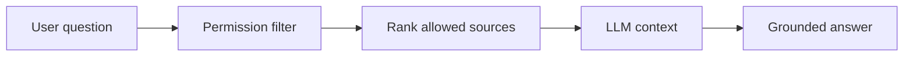

## adr_009_permission_aware_retrieval_and_source_filtering - Permission-aware retrieval and source filtering
> Date: 2026-04-10
> Status: Proposed
> Drivers: Prevent unauthorized SharePoint content from reaching the LLM context, keep chat answers aligned with Microsoft user rights, and preserve source trust.
> Related request: `logics/request/req_000_sharepoint_knowledge_graph_kickoff.md`
> Related backlog: `logics/backlog/item_002_hybrid_knowledge_store_and_retrieval.md`, `logics/backlog/item_004_teams_bot_chat_and_permissions.md`, `logics/backlog/item_006_local_companion_app_for_explorer_and_chat.md`
> Related task: (none yet)
> Reminder: Apply authorization before retrieval ranking so the LLM only sees permitted source material. Default to site-level allow lists first, then finer-grained scopes later.

# Overview
The retrieval layer should not rank or prompt with content unless the current user is allowed to see it.
Permissions must be checked before candidate chunks are assembled into the LLM context.
That keeps the chat experience trustworthy and reduces accidental disclosure risk.

# Context
The product now uses a local companion app for chat, with Teams later, and the user identity must be honored at answer time.
Ingestion can see more than an end user, so the retrieval layer needs its own authorization gate.
If filtering happens only at ingestion time, stale access assumptions could leak content later.

# Decision
Apply user authorization before retrieval ranking.
The backend should evaluate the current Microsoft identity against the site, library, list, or item scope being queried, then only pass allowed sources into ranking and prompt assembly.
If the system cannot verify access, it should fail closed and return a safe denial or a reduced answer, not best-effort hidden context.

# Alternatives considered
- Filter only at ingestion time
- Filter only after ranking
- Let the LLM infer access boundaries from metadata alone

# Consequences
- Stronger protection against accidental disclosure
- More backend complexity and a higher need for normalized permission data
- Chat answers become easier to audit because the allowed source set is explicit

# Migration and rollout
Start with site-level allow lists for the pilot sites.
Extend to library and list scope once the access mapping is stable.
Add finer-grained item-level filtering only if the pilot proves the need.

# Decision defaults
- Enforcement point: before retrieval ranking.
- Initial scope: site-level allow lists.
- Next step: library and list scope.
- Fail closed: yes, when access cannot be verified.

# References
- `logics/request/req_000_sharepoint_knowledge_graph_kickoff.md`
- `logics/architecture/adr_001_identity_and_access_model_for_sharepoint_knowledge_graph.md`
- `logics/architecture/adr_003_hybrid_knowledge_store_and_retrieval_model.md`

# Follow-up work
- Define the permission model shape used by the index
- Specify how denied content is logged for audit
- Decide how to handle partial access when a query spans mixed-scope sources
