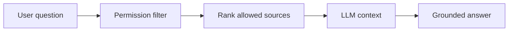

## adr_009_permission_aware_retrieval_and_source_filtering - Permission-aware retrieval and source filtering
> Date: 2026-04-10
> Status: Proposed
> Drivers: Prevent unauthorized SharePoint content from reaching the LLM context, keep chat answers aligned with Microsoft user rights, and preserve source trust.
> Related request: `logics/request/req_000_sharepoint_knowledge_graph_kickoff.md`
> Related backlog: `logics/backlog/item_002_hybrid_knowledge_store_and_retrieval.md`, `logics/backlog/item_004_teams_bot_chat_and_permissions.md`, `logics/backlog/item_006_local_companion_app_for_explorer_and_chat.md`
> Related task: (none yet)
> Reminder: Apply authorization before retrieval ranking so the LLM only sees permitted source material. Default to site-level allow lists first, then finer-grained scopes later.

# Overview
The retrieval layer should not rank or prompt with content unless the current user is allowed to see it.
Permissions must be checked before candidate chunks are assembled into the LLM context.
That keeps the chat experience trustworthy and reduces accidental disclosure risk.

# Context
The product now uses a local companion app for chat, with Teams later, and the user identity must be honored at answer time.
Ingestion can see more than an end user, so the retrieval layer needs its own authorization gate.
If filtering happens only at ingestion time, stale access assumptions could leak content later.

# Decision
Apply user authorization before retrieval ranking.
The backend evaluates the current Microsoft identity against the configured scope for each candidate source, then only passes allowed sources into ranking and prompt assembly.
If the system cannot verify access, it fails closed and returns a structured denial response, never best-effort hidden context.

# Permission scope mapping

SharePoint permissions are mapped to retrieval filters using a three-level hierarchy:

| SharePoint scope | Retrieval filter applied | V1 scope |
|---|---|---|
| Site | `site_id` allow list — user must belong to a site that is in the configured pilot list | Yes |
| Library / List | `container_id` scoped filter — user must have read access to the specific library or list | Yes |
| Item (file-level) | `item_id` explicit filter — per-item permission check against Graph | Deferred to post-V1 |

For V1, site-level and library-level filtering cover the pilot scope. Item-level is explicitly out of scope for V1 and will be addressed when the pilot surface grows.

# Permission cache strategy
- Permission state is cached per user session and site, not per individual query.
- Local runtime TTL: 5 minutes. After expiry, the backend re-validates against Graph before the next retrieval call.
- Hosted runtime TTL: 15 minutes. Same re-validation mechanism, longer TTL to reduce Graph API load in production.
- Cache invalidation: explicit cache flush on sign-in, sign-out, or manual refresh trigger.
- Inherited permissions: if a library inherits site permissions, the site-level check is sufficient. Broken inheritance (library with unique permissions) triggers a library-level check.

# Error and denial behavior
- Graph API unavailable at permission check time: fail closed. Return a structured `permission_check_failed` response to the caller. Do not serve stale cached results if the cache is expired.
- User not in any allowed site: return a `no_permitted_sources` response. Do not reveal which sites exist.
- Mixed-scope query (some sources permitted, some denied): serve only the permitted subset. Include a provenance note that the answer is based on accessible content only. Never surface which sources were excluded by name.
- Partial library access: include only the documents in the permitted containers. Log the exclusion count (not the excluded item IDs) in the audit trail.

# Alternatives considered
- Filter only at ingestion time
- Filter only after ranking
- Let the LLM infer access boundaries from metadata alone

# Consequences
- Stronger protection against accidental disclosure
- More backend complexity and a higher need for normalized permission data
- Chat answers become easier to audit because the allowed source set is explicit
- Item-level deferral means V1 does not cover scenarios where a site has some publicly-indexed but restricted files — this is acceptable for the pilot scope

# Migration and rollout
Start with site-level allow lists for the pilot sites.
Extend to library and list scope as part of V1 hardening.
Item-level filtering enters scope only after V1 is stable and the pilot shows the need.

# Decision defaults
- Enforcement point: before retrieval ranking.
- V1 scope: site-level and library-level allow lists.
- Item-level: deferred, explicitly out of V1 scope.
- Permission cache TTL: 5 minutes local, 15 minutes hosted.
- Fail closed: yes, on any unverifiable access state.
- Denial response: structured, never exposes restricted source names or IDs.

# References
- `logics/request/req_000_sharepoint_knowledge_graph_kickoff.md`
- `logics/architecture/adr_001_identity_and_access_model_for_sharepoint_knowledge_graph.md`
- `logics/architecture/adr_003_hybrid_knowledge_store_and_retrieval_model.md`
- `logics/specs/spec_005_deepvault_permission_mapping_and_retrieval_filters.md`

# Follow-up work
- Implement the permission cache with the TTLs defined above
- Add audit log entries for denied retrievals (exclusion count, not item IDs)
- Design item-level filtering when the pilot confirms the need
