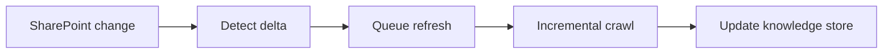

## adr_010_sharepoint_sync_orchestration_and_refresh_policy - SharePoint sync orchestration and refresh policy
> Date: 2026-04-10
> Status: Proposed
> Drivers: Keep pilot sites current without overloading Graph, support manual and scheduled refreshes, and make source changes observable.
> Related request: `logics/request/req_000_v0_bootstrap_and_initial_foundations.md`
> Related backlog: `logics/backlog/item_001_sharepoint_ingestion_and_sync_pipeline.md`, `logics/backlog/item_005_runtime_config_and_operations.md`
> Related task: (none yet)
> Reminder: Prefer incremental refreshes and stable change markers over repeated full crawls, using version-neutral wording. Default to daily incremental refresh plus manual refresh, driven by Azure Functions timer triggers. Reviewed during the 2026-04-10 release/doc sync.

# Overview
The SharePoint sync pipeline should be incremental by default.
The system should be able to run on demand, on a schedule, or as a targeted refresh for a specific site or library.
That keeps the knowledge store current without forcing expensive full reindexing every time.



# Context
The request calls for a pilot scope that can be updated through environment configuration.
The system will ingest multiple SharePoint sites and should keep them current as content changes.
Manual refresh is useful during development, while scheduled refresh matters for routine operations.

# Decision
Use incremental sync as the default policy.
The pipeline relies on stable change markers when available — item timestamps, ETags, or Graph delta-style behavior where supported.
Manual refresh remains available for troubleshooting and pilot validation.
The scheduled cadence is **daily incremental by default**. This is a fixed V1 default, not a tuning decision. It becomes configurable in V2 via environment variable once the pilot confirms the right frequency.

# Sync cadence policy

| Phase | Default cadence | Override mechanism |
|---|---|---|
| V1 local | Daily at 02:00 local time | Not configurable in V1 — change requires code |
| V2 hosted | Daily at 02:00 UTC | `SYNC_CADENCE_HOURS` env var (e.g. `SYNC_CADENCE_HOURS=12` for twice daily) |
| Manual refresh | Any time via API or CLI trigger | Always available in both phases |

The daily default is conservative and appropriate for the pilot corpus size. Do not tune cadence before the pilot completes at least 5 days of stable incremental runs.

# Retry and error behavior

| Error type | Behavior |
|---|---|
| Graph API 429 (rate limit) | Backoff with exponential delay, max 3 retries over 5 minutes, then mark the source as `sync_failed` and continue with other sources |
| Graph API 503 (service unavailable) | Same as 429 |
| Graph API 404 (site/item not found) | Mark source as `not_found`, do not retry, log for operator review |
| Partial page failure during crawl | Resume from last watermark on next run. Do not reindex already-processed pages. |
| Checkpoint corruption | Fall back to full crawl for that source only. Log the fallback as a `checkpoint_reset` event. |

# Alternatives considered
- Full reindex on every run
- Manual refresh only
- Near real-time sync for every source change

# Consequences
- Lower ingestion cost and less duplicate processing
- More implementation work to track per-source watermarks and retry state
- More predictable freshness behavior for the local companion app and future chat
- Explicit retry rules make Graph transient failures observable instead of silent

# Migration and rollout
Start with the pilot sites and a small set of content types.
Track per-source sync state so partial failures can resume safely.
After the pilot, use `SYNC_CADENCE_HOURS` to tune cadence before adding broader tenant coverage.

# Decision defaults
- Default policy: incremental sync.
- Default cadence: daily (every 24 hours). Fixed in V1, configurable via `SYNC_CADENCE_HOURS` in V2.
- Manual trigger: yes, always available via `POST /sync/trigger` (spec_007).
- Retry policy: exponential backoff, max 3 retries, mark `sync_failed` on exhaustion.
- Scheduler: Azure Functions timer trigger for hosted refresh jobs.
- CI/CD: GitHub Actions only for build and deployment automation, not for scheduled sync.

# Azure Functions timer trigger configuration

The daily sync is implemented as an Azure Functions timer trigger. The configuration is:

```json
{
  "schedule": "0 0 2 * * *"
}
```

This is a CRON expression meaning "02:00:00 UTC every day." The Azure Functions runtime always interprets CRON schedules in **UTC**. There is no tenant-specific timezone adjustment — UTC is the fixed reference for all environments.

For V2, `SYNC_CADENCE_HOURS` overrides the default schedule. The override is applied as an Azure Functions **application setting** (not an environment variable in the traditional sense):

| Setting name | Example value | Effect |
|---|---|---|
| `SYNC_CADENCE_HOURS` | `24` | Daily sync (default — same as the hardcoded CRON) |
| `SYNC_CADENCE_HOURS` | `12` | Twice-daily sync (02:00 UTC and 14:00 UTC) |
| `SYNC_CADENCE_HOURS` | `6` | Four times daily |

When `SYNC_CADENCE_HOURS` is set, the backend generates the CRON expression dynamically at startup and registers it with the Azure Functions host. If `SYNC_CADENCE_HOURS` is not set, the hardcoded default (`0 0 2 * * *`) is used.

`SYNC_CADENCE_HOURS` must be a positive integer divisor of 24 (1, 2, 3, 4, 6, 8, 12, 24). Values that do not divide 24 evenly are rejected at startup with a configuration error.

# References
- `logics/request/req_000_sharepoint_knowledge_graph_kickoff.md`
- `logics/backlog/item_001_sharepoint_ingestion_and_sync_pipeline.md`
- `logics/backlog/item_005_runtime_config_and_operations.md`
# Follow-up work
- Implement the per-source sync state model with watermarks and checkpoint fields
- Wire `SYNC_CADENCE_HOURS` into the Azure Functions timer trigger for V2
- Add sync run summary to the operator observability view
