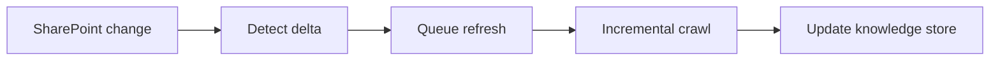

## adr_010_sharepoint_sync_orchestration_and_refresh_policy - SharePoint sync orchestration and refresh policy
> Date: 2026-04-10
> Status: Proposed
> Drivers: Keep pilot sites current without overloading Graph, support manual and scheduled refreshes, and make source changes observable.
> Related request: `logics/request/req_000_sharepoint_knowledge_graph_kickoff.md`
> Related backlog: `logics/backlog/item_001_sharepoint_ingestion_and_sync_pipeline.md`, `logics/backlog/item_005_runtime_config_and_operations.md`
> Related task: (none yet)
> Reminder: Prefer incremental refreshes and stable change markers over repeated full crawls, using version-neutral wording.

# Overview
The SharePoint sync pipeline should be incremental by default.
The system should be able to run on demand, on a schedule, or as a targeted refresh for a specific site or library.
That keeps the knowledge store current without forcing expensive full reindexing every time.

# Context
The request calls for a pilot scope that can be updated through environment configuration.
The system will ingest multiple SharePoint sites and should keep them current as content changes.
Manual refresh is useful during development, while scheduled refresh matters for routine operations.

# Decision
Use incremental sync as the default policy.
The pipeline should rely on stable change markers when available, such as item timestamps, ETags, or Graph delta-style behavior where supported.
Manual refresh should remain available for troubleshooting and pilot validation.
Scheduled refresh should be configurable per environment, with a conservative default cadence until the pilot proves the right frequency.

# Alternatives considered
- Full reindex on every run
- Manual refresh only
- Near real-time sync for every source change

# Consequences
- Lower ingestion cost and less duplicate processing
- More implementation work to track per-source watermarks and retry state
- More predictable freshness behavior for the local companion app and future chat

# Migration and rollout
Start with the pilot sites and a small set of content types.
Track per-source sync state so partial failures can resume safely.
After the pilot, tune cadence and scope before adding broader tenant coverage.

# References
- `logics/request/req_000_sharepoint_knowledge_graph_kickoff.md`
- `logics/architecture/adr_002_sharepoint_ingestion_and_sync_pipeline.md`
- `logics/architecture/adr_006_runtime_configuration_and_operations.md`

# Follow-up work
- Define the per-source sync state model
- Decide the default scheduled cadence for the hosted runtime
- Add retry and backoff rules for Graph errors
