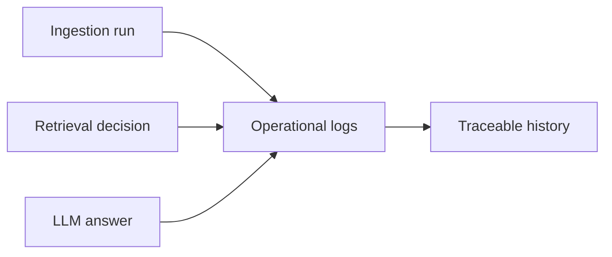

## adr_011_observability_audit_and_answer_traceability - Observability, audit, and answer traceability
> Date: 2026-04-10
> Status: Proposed
> Drivers: Make ingestion and chat behavior inspectable, preserve source provenance, and support debugging and governance.
> Related request: `logics/request/req_000_sharepoint_knowledge_graph_kickoff.md`
> Related backlog: `logics/backlog/item_005_runtime_config_and_operations.md`, `logics/backlog/item_006_local_companion_app_for_explorer_and_chat.md`, `logics/backlog/item_007_llm_provider_abstraction_for_openai_and_gemini.md`
> Related task: (none yet)
> Reminder: Keep observability useful but lightweight for V1.

# Overview
The platform should emit enough operational signal to explain what was ingested, what was refreshed, what was filtered, and how each answer was assembled.
That makes the system easier to debug and safer to trust.

# Context
The product combines SharePoint ingestion, permission-aware retrieval, and provider-agnostic chat.
Each of those layers can fail independently, so debugging requires traceability across the full path.
The local companion app should surface the most useful status, while the backend keeps the durable audit trail.

# Decision
Record a compact audit trail for ingestion runs, retrieval filters, provider choice, and answer provenance.
Expose the operational summary in the local companion app, but keep sensitive or verbose details in backend logs.
Each answer should be traceable to the source objects and retrieval filters that contributed to it.

# Alternatives considered
- No audit trail beyond generic server logs
- Full verbose tracing in the user interface
- Separate observability stack only after production launch

# Consequences
- Easier debugging and governance review
- More schema work to store provenance and run metadata
- Potential need for retention rules once usage grows

# Migration and rollout
Start with minimal structured logs for run status, provider choice, and source IDs.
Add answer provenance and retrieval filter details once the first pilot uses the chat path.
Introduce richer dashboards only if the pilot proves they are necessary.

# References
- `logics/request/req_000_sharepoint_knowledge_graph_kickoff.md`
- `logics/architecture/adr_006_runtime_configuration_and_operations.md`
- `logics/architecture/adr_008_llm_provider_abstraction_for_openai_and_gemini.md`

# Follow-up work
- Define the log schema for ingestion and retrieval events
- Decide which observability fields should be visible in the UI
- Add retention and redaction rules for sensitive traces
