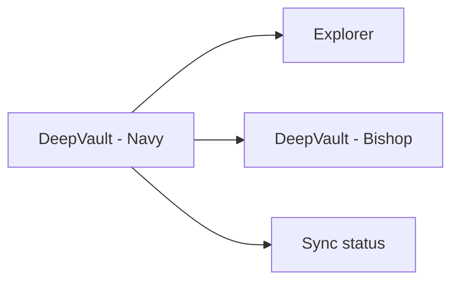

## adr_012_local_companion_runtime_for_explorer_and_chat - DeepVault - Navy runtime for explorer and chat
> Date: 2026-04-10
> Status: Proposed
> Drivers: Ship a fast local-only validation surface for the first pilot, avoid hosting and channel complexity, and keep the chatbot usable while the backend is still in development.
> Related request: `logics/request/req_000_sharepoint_knowledge_graph_kickoff.md`
> Related backlog: `logics/backlog/item_006_local_companion_app_for_explorer_and_chat.md`, `logics/backlog/item_008_local_explorer_shell_and_navigation.md`, `logics/backlog/item_009_local_chat_surface_and_answer_flow.md`, `logics/backlog/item_010_local_sync_status_and_operational_view.md`
> Related task: (none yet)
> Reminder: Keep `DeepVault - Navy` self-contained so it can be replaced cleanly by the hosted backend later. Default to a single local web runtime with minimal local auth and storage. For any UX/UI or frontend implementation work, use `logics/skills/logics-ui-steering/SKILL.md`.

# Overview
The local runtime should run as `DeepVault - Navy`.
`DeepVault - Navy` includes the explorer, the chat surface, and sync status in one place.
The chatbot should be able to answer using the local runtime and the same SharePoint retrieval contracts that the hosted backend will later reuse.

# Context
The product needs a usable surface before any hosted backend or Teams deployment exists.
A local runtime lets the team validate navigation, retrieval, answer quality, and permissions without waiting on infrastructure.
The local app also keeps the feedback loop short for iteration.

# Decision
Use a self-contained local runtime.
`DeepVault - Navy` owns the explorer UI, the chatbot surface, and the operational status views.
It may call local services or local-only adapters, but it should not require a hosted backend or Teams channel to validate the pilot.

# Alternatives considered
- Hosted backend from day one
- `DeepVault - Gordon` as the only chat surface
- Desktop-native application instead of a local web app

# Consequences
- Faster iteration and easier local debugging
- Lower operational complexity for the first pilot
- The runtime boundary must be kept clean so the hosted backend can be introduced without rewriting the UI contract

# Migration and rollout
Keep API boundaries stable between the local app and the backend contract.
When the hosted backend begins, move the backend behind a hosted service while keeping `DeepVault - Navy` as a client or test harness if useful.

# Decision defaults
- Runtime model: single local web service.
- Local storage: lightweight and local.
- Local auth: minimal Entra-backed auth.
- Hosted transition: keep the same contract and swap the backend behind it.

# References
- `logics/request/req_000_sharepoint_knowledge_graph_kickoff.md`
- `logics/product/prod_000_sharepoint_knowledge_graph_product_vision.md`
- `logics/architecture/adr_007_local_companion_app_architecture_for_explorer_and_chat.md`

# Follow-up work
- Define the local runtime process model and startup flow
- Decide whether local storage is embedded or file-based
- Define the minimum local auth model
