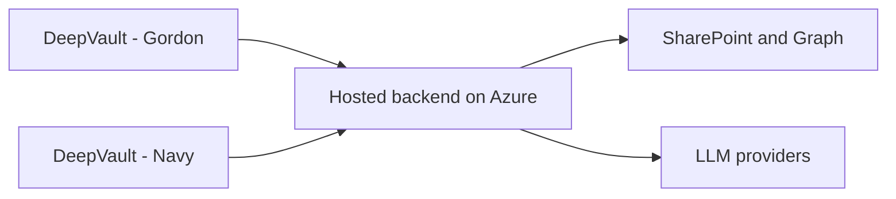

## adr_013_hosted_backend_and_teams_chat_channel - Hosted backend and Teams chat channel
> Date: 2026-04-10
> Status: Proposed
> Drivers: Move the product to a reusable backend service, support governed Microsoft identity at scale, make `DeepVault - Gordon` the primary chatbot channel, and keep the production runtime aligned with Azure-first hosting.
> Related request: `logics/request/req_000_sharepoint_knowledge_graph_kickoff.md`
> Related backlog: `logics/backlog/item_004_teams_bot_chat_and_permissions.md`, `logics/backlog/item_011_hosted_backend_core.md`, `logics/backlog/item_012_teams_bot_channel_and_permissions.md`
> Related task: (none yet)
> Reminder: Preserve the same retrieval and permission model when the runtime moves behind the hosted backend for `DeepVault - Gordon`.

# Overview
The runtime should move to a hosted backend service.
Azure is the preferred deployment target for that backend when the cost and operational burden stay reasonable.
The backend becomes the shared point for SharePoint ingestion, retrieval, permission checks, and LLM orchestration.
`DeepVault - Gordon` becomes the main chatbot surface, while `DeepVault - Navy` remains useful for testing and exploration.

# Context
The local runtime is great for validation, but it is not the long-term operational shape of the product.
A hosted backend gives the team one governed place to enforce access control, observe runs, and integrate multiple channels.
`DeepVault - Gordon` is the natural enterprise chat surface once the backend is stable.
Azure keeps the runtime close to Microsoft identity, storage, and secret-management services.

# Decision
Move the shared runtime to a hosted backend.
Route `DeepVault - Gordon` messages to that backend through an official bot/app identity.
Keep the same retrieval and permission checks that the local runtime used, but run them in the hosted service.
Prefer Azure for the hosted runtime unless a later cost or complexity check makes Render the better operational fallback.

# Alternatives considered
- Keep the chatbot local indefinitely
- Use a fake human Teams account
- Expose the backend only through a custom web app and never Teams

# Consequences
- Centralized governance, observability, and permissions
- More deployment and operations work than the local runtime
- The backend must stay channel-agnostic so Teams and any future surface share the same core logic
- Azure hosting should simplify Microsoft identity, secret storage, and enterprise operations

# Migration and rollout
Stabilize the local runtime and retrieval contracts first.
When the hosted phase starts, extract the shared services into the hosted backend and wire Teams to it.
Keep the local app as a companion surface for exploration and troubleshooting if it still adds value.
Deploy the hosted backend on Azure first; if cost or operational constraints become too high, move the same service shape to Render without changing the product contract.

# References
- `logics/request/req_000_sharepoint_knowledge_graph_kickoff.md`
- `logics/backlog/item_004_teams_bot_chat_and_permissions.md`
# Follow-up work
- Define the Azure resource split for backend, storage, and secrets
- Specify the `DeepVault - Gordon` bot registration and auth flow
- Decide whether the local app remains a supported client
