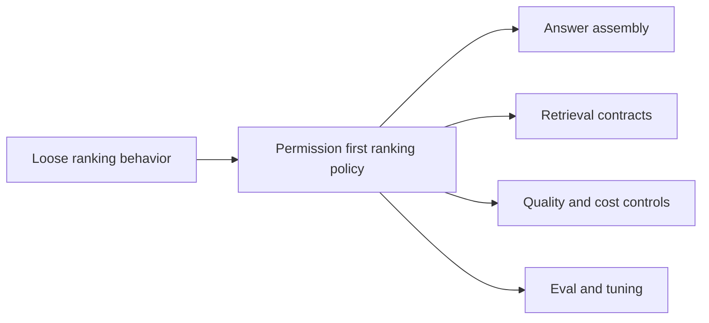

## adr_014_deepvault_retrieval_ranking_quality_and_cost_policy - DeepVault retrieval ranking quality and cost policy
> Date: 2026-04-10
> Status: Proposed
> Drivers: Keep retrieval permission-safe, make answer quality measurable, and keep token and inference cost under control as the corpus grows.
> Related request: `logics/request/req_000_sharepoint_knowledge_graph_kickoff.md`
> Related backlog: `logics/backlog/item_002_hybrid_knowledge_store_and_retrieval.md`, `logics/backlog/item_013_v2_operations_runbook_and_release_readiness.md`
> Related task: `logics/tasks/task_002_ingestion_sync_and_retrieval_hardening.md`, `logics/tasks/task_007_v2_operations_runbook_and_release_readiness.md`
> Reminder: Keep the ranking policy, cost guardrails, and quality thresholds aligned with the current retrieval design and pilot scope.

# Overview
Retrieval should rank permission-safe candidates using a predictable and bounded policy.
The policy should balance source type, freshness, structural metadata, and semantic relevance instead of relying on only one signal.
The answer flow should stay cost-aware so context assembly does not become open-ended as the corpus grows.

# Context
The corpus will grow from a small pilot to multiple sites and content types.
Without an explicit ranking policy, the system can become expensive, inconsistent, or difficult to explain.
We need the retrieval layer to stay trustworthy while still being tunable as quality feedback arrives.

# Decision
Filter by permission first, then rank by a small set of signal groups:
- structural source type and document shape
- freshness and change recency
- semantic relevance to the query
- traceability and source quality hints

Keep context assembly bounded and configurable so the answer flow can remain predictable in both local and hosted modes.
Treat ranking thresholds and token budgets as policy, not as ad hoc code paths.

# Alternatives considered
- Freshness-only ranking
- Pure semantic ranking
- Manual source ordering

# Consequences
- Answers should become easier to explain and compare.
- The team gets a repeatable way to tune retrieval behavior.
- Some queries may require explicit threshold tuning as new content types are added.

# Migration and rollout
- Start with the pilot sites and measure quality against a small evaluation set.
- Tune ranking weights only after the baseline is stable.
- Keep the policy configurable so the local and hosted runtimes can share the same logic.

# References
- `logics/product/prod_000_sharepoint_knowledge_graph_product_vision.md`
- `logics/product/prod_001_local_first_development_and_test_strategy.md`
- `logics/product/prod_002_hosted_production_strategy_with_teams_at_the_end.md`
- `logics/specs/spec_002_deepvault_bishop_chat_flow_and_answer_quality.md`
- `logics/specs/spec_003_deepvault_pilot_site_onboarding_and_retrieval_quality.md`
- `logics/backlog/item_002_hybrid_knowledge_store_and_retrieval.md`
- `logics/backlog/item_013_v2_operations_runbook_and_release_readiness.md`
- `logics/tasks/task_002_ingestion_sync_and_retrieval_hardening.md`
- `logics/tasks/task_007_v2_operations_runbook_and_release_readiness.md`
- `logics/architecture/adr_003_hybrid_knowledge_store_and_retrieval_model.md`
- `logics/architecture/adr_009_permission_aware_retrieval_and_source_filtering.md`
- `logics/architecture/adr_011_observability_audit_and_answer_traceability.md`

# Follow-up work
- Define a small retrieval evaluation set for the pilot.
- Capture the ranking weights and token budget policy in configuration.
- Revisit the policy when a new content type or site shape becomes common.
