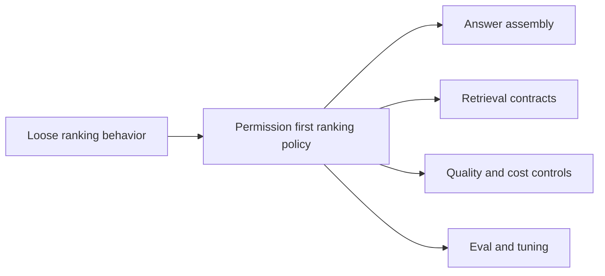

## adr_014_deepvault_retrieval_ranking_quality_and_cost_policy - DeepVault retrieval ranking quality and cost policy
> Date: 2026-04-10
> Status: Proposed
> Drivers: Keep retrieval permission-safe, make answer quality measurable, and keep token and inference cost under control as the corpus grows.
> Related request: `logics/request/req_001_v1_local_hardening_and_scope_evolution.md`
> Related backlog: `logics/backlog/item_002_hybrid_knowledge_store_and_retrieval.md`
> Related task: `logics/tasks/task_002_ingestion_sync_and_retrieval_hardening.md`, `logics/tasks/task_007_v2_operations_runbook_and_release_readiness.md`
> Reminder: Keep the ranking policy, cost guardrails, and quality thresholds aligned with the current retrieval design and pilot scope. Reviewed during the 2026-04-10 release/doc sync.

# Overview
Retrieval should rank permission-safe candidates using a predictable and bounded policy.
The policy should balance source type, freshness, structural metadata, and semantic relevance instead of relying on only one signal.
The answer flow should stay cost-aware so context assembly does not become open-ended as the corpus grows.



# Context
The corpus will grow from a small pilot to multiple sites and content types.
Without an explicit ranking policy, the system can become expensive, inconsistent, or difficult to explain.
We need the retrieval layer to stay trustworthy while still being tunable as quality feedback arrives.

# Decision
Filter by permission first, then rank by a weighted combination of four signal groups. Keep context assembly bounded by an explicit token budget. Treat all weights and budgets as policy defaults — tunable after baseline is established, not before.

# Ranking weights (V1 defaults)

| Signal group | Weight | Description |
|---|---|---|
| Semantic relevance | 40% | Cosine similarity between the query embedding and the chunk embedding |
| Structural source type | 30% | Documents > pages > list items > metadata-only entries. Structured documents from libraries score higher than loose list content. |
| Freshness | 20% | Last-modified recency. Content modified in the last 7 days scores full freshness. 7–30 days: 0.75. 30–90 days: 0.5. Older than 90 days: 0.25. |
| Traceability | 10% | Sources with a known author, library path, and content type score higher than sources with incomplete metadata. |

Tie-break: when two chunks have the same composite score, prefer the one with the more recent `last_modified` timestamp.

Permission gate always runs before scoring. Chunks from sources the user cannot access are removed from the candidate set entirely before weights are applied.

# Composite score formula

The composite score for each chunk is computed as a weighted sum of four normalized sub-scores, each in the range [0.0, 1.0]:

```
composite_score = (0.40 * semantic_score)
                + (0.30 * structural_score)
                + (0.20 * freshness_score)
                + (0.10 * traceability_score)
```

## Sub-score definitions

**semantic_score** — cosine similarity between the query embedding and the chunk embedding. Returned directly by the vector index (already in [0, 1] for normalized embeddings). Do not clip negative values — if cosine similarity is negative, the chunk should have been excluded by the minimum threshold before scoring.

**structural_score** — discrete value from `chunk.source_type_weight` (stored in the chunk file per spec_004):

| source_type | structural_score |
|---|---|
| `document` | 1.0 |
| `page` | 0.8 |
| `list` | 0.6 |
| metadata-only / unknown | 0.3 |

**freshness_score** — derived from `chunk.last_modified` relative to the current UTC time at query time:

| Age of last_modified | freshness_score |
|---|---|
| ≤ 7 days | 1.0 |
| 8–30 days | 0.75 |
| 31–90 days | 0.5 |
| > 90 days | 0.25 |

**traceability_score** — counts how many of the four traceability fields are non-null in the chunk:

| Non-null fields (author, library_path, content_type, display_name) | traceability_score |
|---|---|
| 4 of 4 | 1.0 |
| 3 of 4 | 0.75 |
| 2 of 4 | 0.5 |
| 1 of 4 | 0.25 |
| 0 of 4 | 0.0 |

## Minimum threshold

After computing `composite_score`, exclude any chunk where `composite_score < 0.35`. Apply this filter before the 20-chunk cap.

# Context assembly budget (V1 defaults)

| Parameter | Default value | Purpose |
|---|---|---|
| Max chunks in context | 20 | Bounds the number of source passages assembled into the LLM prompt |
| Max tokens per chunk | 512 | Each chunk extracted from a document is limited to 512 tokens |
| Chunk overlap | 64 tokens | Adjacent chunks share 64 tokens to preserve sentence continuity |
| Total context budget | 8,000 tokens | Hard ceiling for the full assembled context passed to the LLM. The prompt template and answer space are outside this budget. |
| Min chunk score threshold | 0.35 | Chunks with a composite score below 0.35 are excluded even if fewer than 20 chunks are assembled |

If context assembly reaches the token budget before 20 chunks, the lowest-scoring chunks are dropped first.

# Cost guardrails
- The context budget (8,000 tokens) is enforced before calling the LLM, not after.
- The backend must log the token count of each assembled context so cost can be tracked per run.
- Queries that consistently hit the ceiling should be investigated — they may indicate retrieval is returning too many low-relevance chunks.

# Alternatives considered
- Freshness-only ranking
- Pure semantic ranking
- Manual source ordering

# Consequences
- Answers should become easier to explain and compare.
- The team gets a repeatable way to tune retrieval behavior.
- Some queries may require explicit threshold tuning as new content types are added.
- Explicit weights make ranking auditable and comparable across pilot iterations.

# Migration and rollout
- Start with the pilot sites and measure quality against the evaluation set defined in `task_008`.
- Tune ranking weights only after the baseline is stable and at least 20 queries have been evaluated.
- Keep the policy configurable so the local and hosted runtimes can share the same logic.

# References
- `logics/request/req_000_sharepoint_knowledge_graph_kickoff.md`
- `logics/backlog/item_002_hybrid_knowledge_store_and_retrieval.md`
- `logics/tasks/task_002_ingestion_sync_and_retrieval_hardening.md`
- `logics/tasks/task_007_v2_operations_runbook_and_release_readiness.md`
# Follow-up work
- Run the evaluation set from `task_008` against V1 defaults and record scores.
- Capture weight and budget overrides in a config block so they can change without code.
- Revisit the policy when a new content type or site shape becomes common.
