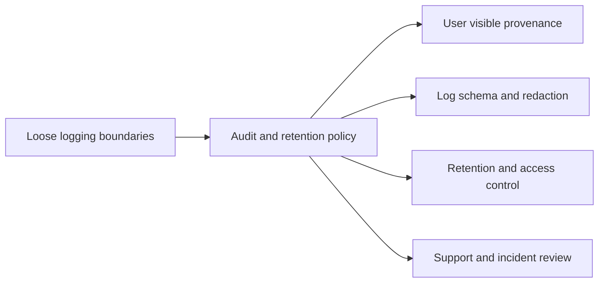

## adr_015_deepvault_security_audit_logging_and_retention_boundaries - DeepVault security audit logging and retention boundaries
> Date: 2026-04-10
> Status: Proposed
> Drivers: Preserve trust and debuggability without leaking secrets, personal data, or unnecessary content into logs and traces.
> Related request: `logics/request/req_000_sharepoint_knowledge_graph_kickoff.md`
> Related backlog: `logics/backlog/item_005_runtime_config_and_operations.md`, `logics/backlog/item_010_local_sync_status_and_operational_view.md`, `logics/backlog/item_013_v2_operations_runbook_and_release_readiness.md`
> Related task: `logics/tasks/task_003_hosted_backend_core_delivery.md`, `logics/tasks/task_007_v2_operations_runbook_and_release_readiness.md`
> Reminder: Keep audit boundaries, retention policy, and redaction rules aligned across the local and hosted runtimes.

# Overview
DeepVault needs a clear boundary between debug logging, durable audit, and user-visible provenance.
The product should explain what happened without exposing secrets, raw tokens, or unnecessary personal data.
Audit data should be useful in both the local and hosted runtimes, but the retention policy can differ by environment.

# Context
The product needs enough observability to debug ingestion, retrieval, and chat behavior.
At the same time, logs must not become a second content store for secrets or sensitive SharePoint material.
Teams, Azure, and local validation all introduce different visibility needs, so the boundary has to be explicit.

# Decision
Keep a minimal audit trail with:
- request and answer identifiers
- source identifiers and retrieval decisions
- permission outcome and channel context
- timestamps, environment, and runtime version

Keep secrets, raw tokens, and unnecessary raw content out of standard logs.
Keep debug logs separate from durable audit records.
Use shorter retention for local debug output and longer, governed retention for hosted audit data.

# Alternatives considered
- Log everything verbatim
- Keep no durable audit trail
- Rely only on user-visible traces

# Consequences
- Debugging stays possible without exposing more data than needed.
- The team must maintain a clear redaction and retention policy.
- Incident analysis becomes more structured and easier to audit.

# Migration and rollout
- Start with the current local runtime and hosted backend logs.
- Add durable audit storage and retention rules when the hosted runtime is ready.
- Make user-visible provenance a subset of the durable audit model rather than a separate ad hoc path.

# References
- `logics/product/prod_000_sharepoint_knowledge_graph_product_vision.md`
- `logics/product/prod_001_local_first_development_and_test_strategy.md`
- `logics/product/prod_002_hosted_production_strategy_with_teams_at_the_end.md`
- `logics/specs/spec_000_deepvault_navy_experience_and_state_matrix.md`
- `logics/specs/spec_001_deepvault_gordon_teams_channel_experience_and_rollout.md`
- `logics/specs/spec_002_deepvault_bishop_chat_flow_and_answer_quality.md`
- `logics/specs/spec_003_deepvault_pilot_site_onboarding_and_retrieval_quality.md`
- `logics/backlog/item_005_runtime_config_and_operations.md`
- `logics/backlog/item_010_local_sync_status_and_operational_view.md`
- `logics/backlog/item_013_v2_operations_runbook_and_release_readiness.md`
- `logics/tasks/task_003_hosted_backend_core_delivery.md`
- `logics/tasks/task_007_v2_operations_runbook_and_release_readiness.md`
- `logics/architecture/adr_011_observability_audit_and_answer_traceability.md`
- `logics/architecture/adr_013_hosted_backend_and_teams_chat_channel.md`

# Follow-up work
- Define the audit event schema and redaction rules.
- Decide which records are user visible versus backend only.
- Add environment-specific retention defaults for local and hosted runtimes.
