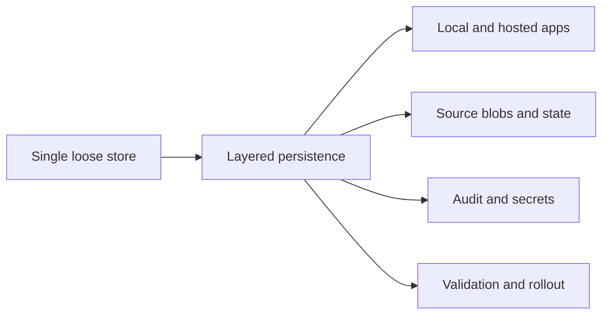

## adr_016_deepvault_persistence_and_storage_layout - DeepVault persistence and storage layout
> Date: 2026-04-10
> Status: Proposed
> Drivers: Keep the local and hosted runtimes simple, make derived content durable without duplicating SharePoint, and keep audit, secrets, and retrieval state in the right stores.
> Related request: `logics/request/req_001_v1_local_hardening_and_scope_evolution.md`
> Related backlog: `logics/backlog/item_001_sharepoint_ingestion_and_sync_pipeline.md`, `logics/backlog/item_002_hybrid_knowledge_store_and_retrieval.md`, `logics/backlog/item_005_runtime_config_and_operations.md`, `logics/backlog/item_013_v2_operations_runbook_and_release_readiness.md`
> Related task: `logics/tasks/task_002_ingestion_sync_and_retrieval_hardening.md`, `logics/tasks/task_003_hosted_backend_core_delivery.md`, `logics/tasks/task_007_v2_operations_runbook_and_release_readiness.md`
> Reminder: Keep the storage layout, derived data boundaries, and environment-specific persistence rules aligned with the current local and hosted runtime design. Reviewed during the 2026-04-10 release/doc sync.

# Overview
DeepVault should persist only the data it derives or needs to operate.
Source content remains in SharePoint; derived content, state, audit, and secrets live in separate storage layers.
The local runtime should stay lightweight, while the hosted runtime should use Azure-native managed services where possible.

# Context
The product needs to keep SharePoint as the source of truth while persisting enough derived data to make DeepVault fast and traceable.
If all state is mixed together, the system becomes hard to debug, expensive to operate, and risky to secure.
The local and hosted runtimes also have very different needs, so the storage layout must be explicit.

# Decision
Use a layered persistence model:
- SharePoint remains the source of truth.
- Blob/object storage keeps raw extracts, chunks, and derived content.
- A relational store keeps sync state, site configuration, checkpoints, and operational metadata.
- A search or vector engine keeps retrieval indexes and embeddings.
- Audit data is stored separately from application logs.
- Secrets live in Key Vault, never in code or routine logs.

For local development, prefer SQLite and local files for state and cached artifacts.
For hosted production, prefer Azure Blob Storage, Azure SQL or managed Postgres, Azure AI Search or an equivalent retrieval engine, Key Vault, and the logging stack already chosen for observability.

# Alternatives considered
- One large database for everything
- SharePoint-only storage with no derived state
- File-only local storage for both local and hosted runtimes

# Consequences
- The system becomes easier to reason about and secure.
- The team must manage several storage surfaces instead of one.
- Local validation can stay simple while production can scale independently.

# Migration and rollout
- Start local with SQLite and files, then map the same data boundaries onto Azure services for production.
- Migrate derived content and retrieval indexes independently from source SharePoint data.
- Keep audit and secret boundaries stable as the hosted backend is introduced.

# References
- `logics/request/req_000_sharepoint_knowledge_graph_kickoff.md`
- `logics/backlog/item_001_sharepoint_ingestion_and_sync_pipeline.md`
- `logics/backlog/item_002_hybrid_knowledge_store_and_retrieval.md`
- `logics/backlog/item_005_runtime_config_and_operations.md`
- `logics/backlog/item_013_v2_operations_runbook_and_release_readiness.md`
- `logics/tasks/task_002_ingestion_sync_and_retrieval_hardening.md`
- `logics/tasks/task_003_hosted_backend_core_delivery.md`
- `logics/tasks/task_007_v2_operations_runbook_and_release_readiness.md`
# Follow-up work
- Specify the exact Azure services for blobs, relational state, retrieval index, and audit.
- Define what is persisted locally versus only in hosted production.
- Document any migration steps needed when the retrieval engine changes.
