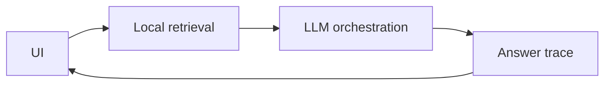
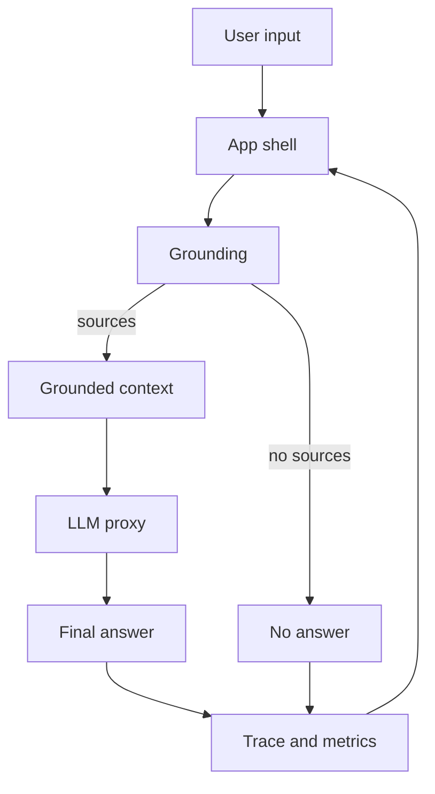

## adr_017_bishop_llm_orchestration_after_local_grounding - Bishop LLM orchestration after local grounding
> Date: 2026-04-10
> Status: Accepted
> Drivers: Keep grounding local, add a real LLM layer later, preserve permission checks, and keep Bishop testable.
> Related request: `req_008_bishop_llm_orchestration_after_local_grounding`, `req_015_architecture_robustness_and_product_improvements`
> Related backlog: `item_031_bishop_grounding_contract_and_response_shape`, `item_032_bishop_llm_orchestration_and_fallback`, `item_033_bishop_trace_status_and_evaluation_coverage`, `item_052_bishop_claude_api_integration`, `item_053_bishop_session_persistence_and_export`
> Related task: `task_014_bishop_llm_orchestration_delivery`, `task_021_bishop_intelligence_and_ux`
> Reminder: Update status, linked refs, decision rationale, consequences, migration plan, and follow-up work when you edit this doc.

# Overview
Keep document retrieval and permission filtering in the local DeepVault layer.
Add a Bishop orchestration layer above it for LLM calls, prompt assembly, and answer synthesis.
Do not call the LLM directly from the UI.
Preserve a local fallback so the app still works when the model layer is unavailable.
This changes the application layer, the orchestration contract, and deployment/observability boundaries.
The orchestration contract should keep the local grounding payload as the only context sent to the provider, and the provider response should remain a narrow answer payload with optional trace metrics.

# Context
Bishop currently uses local retrieval and deterministic synthesis to answer questions.
That keeps the app fast and testable, but it does not exercise a real model provider.
The next step is to introduce an actual LLM path without losing the local grounding guarantees.
The model should only see retrieved, permission-checked context, never the raw UI question alone.

# Decision
Keep `src/lib/deepvault.ts` as the grounding and retrieval boundary.
Add a dedicated Bishop orchestration layer, either in a backend endpoint or a client proxy, to build prompts and call the model.
Let the UI remain a thin interaction shell that collects the question and renders status, traces, and sources.
Use the local retrieval result as the only input to the LLM so permissions and grounding remain enforced before generation.
Keep a local fallback path so the app degrades gracefully when the model provider is unavailable.
The first implementation should use `@anthropic-ai/sdk` behind `ANTHROPIC_API_KEY` and a `VITE_BISHOP_MODEL` runtime setting.

# Alternatives considered
- Keep the current local answer synthesis only.
- Call the LLM directly from the UI.
- Let the LLM search the corpus without a grounding layer.

# Consequences
- The app gains a real model-backed response path, but also a new runtime dependency.
- Prompting, rate limiting, retries, and observability need to live outside the UI.
- Tests can split cleanly between retrieval guarantees and orchestration behavior.
- The local fallback preserves developer ergonomics and protects the app when provider access is missing.
- Prompt caching should keep the system prompt and grounded corpus context stable when possible, but the implementation must never bypass permission-aware retrieval.

# Migration and rollout
- First ship the orchestration behind a provider switch.
- Keep the current local synthesis as fallback while the LLM path is validated.
- Add contract tests for retrieval, permissions, answer-trace fields, session persistence, and export before broad rollout.
- Once stable, make the orchestration the default path and keep the local mode for development and disaster recovery.

# References
- [src/App.tsx](/Users/alexandreagostini/Documents/deepvault-nexus/src/App.tsx)
- [src/lib/deepvault.ts](/Users/alexandreagostini/Documents/deepvault-nexus/src/lib/deepvault.ts)
- [scripts/evaluate.ts](/Users/alexandreagostini/Documents/deepvault-nexus/scripts/evaluate.ts)

# Follow-up work
- Define the Bishop orchestration contract and provider boundary.
- Add a backend or proxy layer for the real LLM call.
- Extend evaluation to compare grounded retrieval against generated answers.
- Add rollout checks for latency, availability, and fallback behavior.
