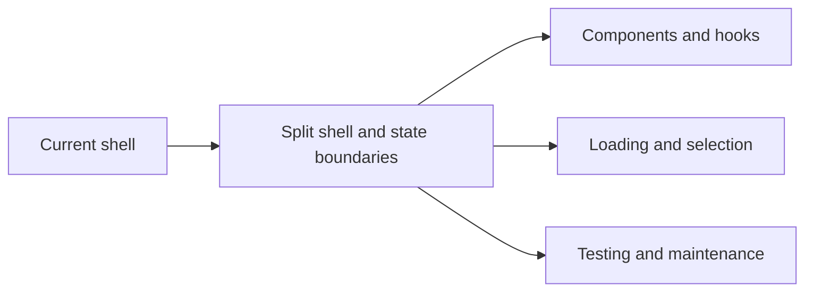

## adr_018_split_the_app_shell_and_ui_state_boundaries - Split the app shell and UI state boundaries
> Date: 2026-04-11
> Status: Proposed
> Drivers: Keep the React shell thin, isolate async loading from rendering, and make explorer and Bishop state easier to test.
> Related request: `logics/request/req_011_audit_de_dette_technique_et_cleanup_structurel.md`
> Related backlog: `logics/backlog/item_038_refactor_app_shell_and_ui_state.md`
> Related task: `logics/tasks/task_016_orchestrate_technical_debt_cleanup_waves.md`
> Reminder: Update status, linked refs, decision rationale, consequences, migration plan, and follow-up work when you edit this doc.

# Overview
Split the app shell into focused components and hooks while keeping the user experience and state model stable. Keep tab selection, corpus loading, and result rendering in clearly separated ownership zones. Let the shell orchestrate, but move view-specific logic next to the views.

# Context
`src/App.tsx` currently owns loading, navigation, document selection, message orchestration, and multiple panels. That coupling makes changes risky even though the app is healthy. The refactor should preserve behavior and improve maintainability without changing the product surface.

# Decision
Move shell-level state into focused hooks where practical, keep presentation in smaller components, and preserve the current tab and selection semantics. Do not introduce a state library unless a later slice proves it is necessary.

# Alternatives considered
- Keep the monolithic shell and add comments only.
- Introduce a global state library.

# Consequences
- Lower coupling and easier testing.
- More files, but each with a narrower responsibility.
- Some selectors and callbacks may move closer to the views they serve.

# Migration and rollout
- Extract one view boundary at a time.
- Keep the app functional after each extraction.
- Validate with the existing lint, typecheck, test, build, and e2e gates.

# References
- `logics/backlog/item_038_refactor_app_shell_and_ui_state.md`
- `logics/tasks/task_016_orchestrate_technical_debt_cleanup_waves.md`

# Follow-up work
- Refactor the shell components.
- Add or update tests for the split boundaries.
