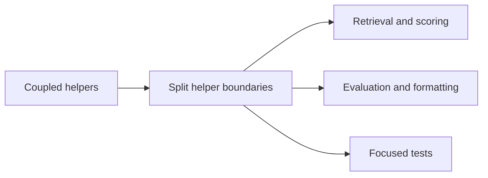

## adr_019_split_deepvault_retrieval_and_evaluation_helpers - Split DeepVault retrieval and evaluation helpers
> Date: 2026-04-11
> Status: Proposed
> Drivers: Keep retrieval tuning isolated from evaluation helpers, and make the scoring code easier to reason about and reuse.
> Related request: `logics/request/req_011_audit_de_dette_technique_et_cleanup_structurel.md`
> Related backlog: `logics/backlog/item_039_split_deepvault_retrieval_and_evaluation_helpers.md`
> Related task: `logics/tasks/task_016_orchestrate_technical_debt_cleanup_waves.md`
> Reminder: Update status, linked refs, decision rationale, consequences, migration plan, and follow-up work when you edit this doc.

# Overview
Split the DeepVault helper module into retrieval, scoring, grounding, evaluation, and formatting boundaries. Keep the public corpus behavior stable while making each concern independently testable and easier to tune.

# Context
`src/lib/deepvault.ts` currently mixes query scoring, permission checks, answer assembly, evaluation rows, and formatting. That makes ranking policy changes and test coverage harder to isolate. The intent is a modular split, not a behavior change.

# Decision
Separate the helper responsibilities into stable, small modules. Keep the public APIs available through thin wrappers if needed, so the app and scripts do not need to change all at once.

# Alternatives considered
- Keep all helpers in one file and add more comments.
- Split only the test helpers and leave retrieval logic coupled.

# Consequences
- Easier ranking and evaluation maintenance.
- Smaller modules will reduce accidental cross-coupling.
- Slightly more import surface and a bit more file overhead.

# Migration and rollout
- Move pure helpers first.
- Keep compatibility exports until callers are migrated.
- Validate with the existing deepvault and corpus tests.

# References
- `logics/backlog/item_039_split_deepvault_retrieval_and_evaluation_helpers.md`
- `logics/tasks/task_016_orchestrate_technical_debt_cleanup_waves.md`

# Follow-up work
- Split the module into cohesive files.
- Update or add tests around the new seams.
