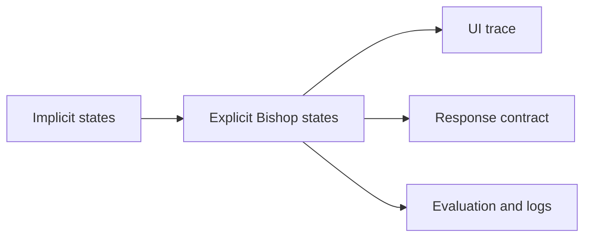

## adr_020_clarify_bishop_orchestration_states_and_response_contract - Clarify Bishop orchestration states and response contract
> Date: 2026-04-11
> Status: Proposed
> Drivers: Make grounded-only, fallback, and remote orchestration states explicit so answer traces and evaluations stay trustworthy.
> Related request: `logics/request/req_011_audit_de_dette_technique_et_cleanup_structurel.md`
> Related backlog: `logics/backlog/item_040_clarify_bishop_orchestration_contract.md`
> Related task: `logics/tasks/task_016_orchestrate_technical_debt_cleanup_waves.md`
> Reminder: Update status, linked refs, decision rationale, consequences, migration plan, and follow-up work when you edit this doc.

# Overview
Make Bishop orchestration states explicit and stable. Preserve the local fallback path, but separate it from grounded-only and remote outcomes so the UI, tests, and evaluation traces can tell them apart.

# Context
`src/lib/bishop.ts` currently returns a blended orchestration result that is practical but ambiguous. The UI and tests infer too much from defaults. The contract needs to be clearer before any remote orchestration path expands.

# Decision
Use explicit outcome states and carry those states through the orchestration result. Keep the fallback answer available, but make the provenance of that answer visible in the contract.

# Alternatives considered
- Keep a single blended status and rely on UI conventions.
- Expose remote orchestration only and remove fallback.

# Consequences
- Better traceability in the answer panel and evaluation runs.
- More explicit status handling in the code.
- Slightly more complex result types, but less ambiguity.

# Migration and rollout
- Update tests before changing the contract implementation.
- Keep fallback behavior stable during rollout.
- Validate UI traces and remote orchestration paths after each change.

# References
- `logics/backlog/item_040_clarify_bishop_orchestration_contract.md`
- `logics/tasks/task_016_orchestrate_technical_debt_cleanup_waves.md`

# Follow-up work
- Update Bishop orchestration helpers.
- Adjust UI trace rendering if needed.
