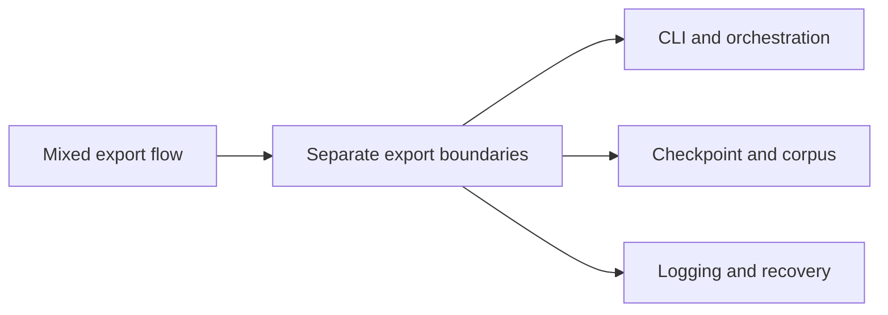

## adr_021_harden_live_export_and_checkpoint_boundaries - Harden live export and checkpoint boundaries
> Date: 2026-04-11
> Status: Proposed
> Drivers: Make live export, checkpointing, and resume behavior easier to reason about and safer to operate.
> Related request: `logics/request/req_011_audit_de_dette_technique_et_cleanup_structurel.md`
> Related backlog: `logics/backlog/item_041_harden_live_export_and_checkpoint_handling.md`
> Related task: `logics/tasks/task_016_orchestrate_technical_debt_cleanup_waves.md`
> Reminder: Update status, linked refs, decision rationale, consequences, migration plan, and follow-up work when you edit this doc.

# Overview
Separate CLI parsing, Graph auth, export execution, checkpoint persistence, and summary output. Keep mock and live modes intact, but make resume and failure handling operationally explicit.

# Context
`scripts/export-live.ts` and `scripts/deepvault-graph.ts` are currently functional but tightly coupled. The code should be easier to audit when checkpoint resume, partial failures, or environment validation evolve.

# Decision
Keep the export flow modular enough that auth, export, and persistence can evolve independently. Preserve the current artifacts, but make operational boundaries explicit.

# Alternatives considered
- Keep the current monolith and add more logging.
- Remove checkpoints and require full re-runs.

# Consequences
- Easier diagnosis of failed exports.
- Clearer path for resume and checkpoint improvements.
- Slightly more script structure and some refactor overhead.

# Migration and rollout
- Refactor the flow in small steps and keep the output artifact format stable.
- Add or update tests for resume and failure cases.
- Validate the mock export path alongside live-safe checks.

# References
- `logics/backlog/item_041_harden_live_export_and_checkpoint_handling.md`
- `logics/tasks/task_016_orchestrate_technical_debt_cleanup_waves.md`

# Follow-up work
- Split the script orchestration and persistence concerns.
- Add coverage for checkpoint and resume behavior.
