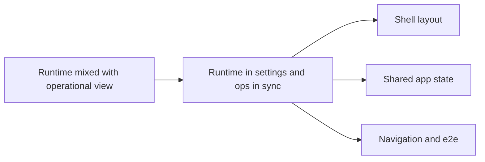

## adr_022_separate_runtime_controls_from_sync_operations - Separate runtime controls from sync operations
> Date: 2026-04-13
> Status: Accepted
> Drivers: Keep the shared runtime scope easy to find, keep Sync status focused on observability and job progress, and avoid split-screen clutter while preserving the existing state model.
> Related request: `req_003_nexus_v1_1_ui_and_product_polish`
> Related backlog: `item_020_compact_live_state_and_sync_panels`, `item_045_move_runtime_under_sync_status`
> Related task: (none yet)
> Reminder: Update status, linked refs, decision rationale, consequences, migration plan, and follow-up work when you edit this doc.

# Overview
Keep app-wide runtime controls in `Settings` and keep sync operations inside `Sync status`.
Treat `Settings` as the canonical place for role, provider, and site scope, while `Sync status` stays the place where users inspect state, refresh behavior, and the streamed job console.
Use a stacked shell layout so the control surface reads as one vertical flow instead of a split workspace.
The implementation should preserve current behavior and only change where the controls live.

# Context
The shell now has a stronger product shape: users see onboarding, compact status, and a dedicated operations console.
The old split-screen treatment made the runtime controls feel detached from the rest of the product and left too little room for the status surface.
The app already has one shared state model, so the boundary should change at the component level rather than by introducing a new store or route.
The goal is to keep the control path obvious without changing the meaning of the controls.

# Decision
Keep role, provider, and site scope in `Settings`.
Keep sync refresh, ingest, evaluation, and progress streaming in `Sync status`.
Render the sync operational surface as a vertical stack under the status panel instead of a separate right-hand split pane.
Preserve the current state hooks and job runner behavior; only relocate the UI ownership.

# Alternatives considered
- Keep runtime controls inside `Sync status`.
- Create a separate operations page for jobs and refresh actions.
- Keep the old split-screen panel layout and only compress the spacing.

# Consequences
- `Settings` becomes the canonical place for app-wide execution context.
- `Sync status` becomes easier to scan because the visual focus stays on status, metrics, and the console.
- The shell is less fragmented on desktop and does not require horizontal scanning to find runtime controls.
- Tests and selectors need to follow the new ownership split, but the data flow stays the same.

# Migration and rollout
- Move the runtime panel first, then verify the sync console still reads as the operational center.
- Keep the shared app model unchanged so Explorer, Bishop, and Sync status continue to read from the same scope.
- Update app and e2e tests to open `Settings` for runtime changes and `Sync status` for operational checks.
- Validate with lint, typecheck, unit tests, build, evaluate, and e2e before release.

# References
- `logics/request/req_003_nexus_v1_1_ui_and_product_polish.md`
- `logics/backlog/item_020_compact_live_state_and_sync_panels.md`
- `logics/backlog/item_045_move_runtime_under_sync_status.md`
- `logics/product/prod_004_nexus_v1_1_0_product_direction_and_release_pulse.md`

# Follow-up work
- Keep the Settings / Sync status ownership split stable for the release.
- Decide whether future releases need a dedicated operations dashboard or should keep the stacked shell pattern.
