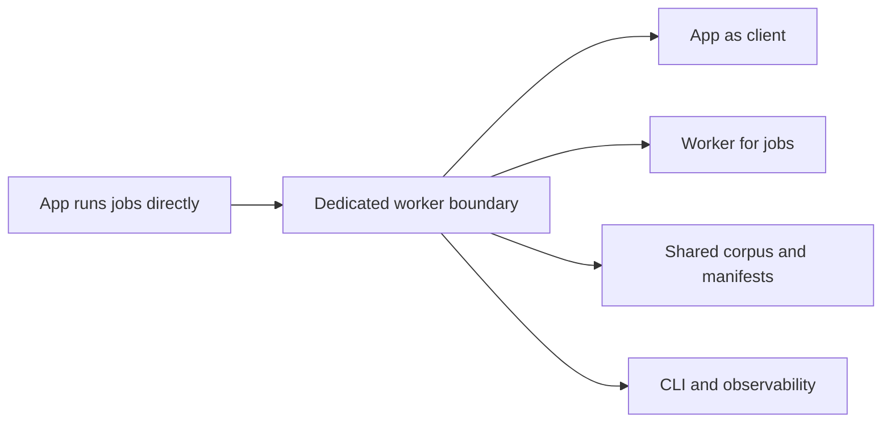

## adr_023_split_execution_runtime_from_the_app_and_share_corpus_artifacts - Split execution runtime from the app and share corpus artifacts
> Date: 2026-04-14
> Status: Proposed
> Drivers: Make ingestion, live export, and evaluate run on a dedicated worker while the app becomes a client of shared corpus artifacts, run history, and config. Keep the worker operable from both CLI and web app, and allow the worker endpoint or host to be configured when it runs on another machine. Preserve explicit control, security, versioning, and audit boundaries so the split stays operable.
> Related request: `logics/request/req_017_implement_the_full_app_worker_corpus_and_shell_plan.md`
> Related backlog: `logics/backlog/item_059_establish_worker_boundary_and_cli_parity_with_shared_corpus_artifacts.md`
> Related task: `logics/tasks/task_027_establish_worker_boundary_and_cli_parity_with_shared_corpus_artifacts.md`
> Reminder: Update status, linked refs, decision rationale, consequences, migration plan, and follow-up work when you edit this doc.

# Overview
Move execution-heavy workflows off the app and into a dedicated worker boundary.
The app should read shared corpus artifacts, inspect run history, and launch or observe work, but not own the long-running execution lifecycle.
The worker should own ingestion, live export, resume, and evaluate, writing checkpoints, manifests, and shared corpus output to explicit storage.
The same worker should be triggerable from the CLI and from the web app.
The app must be able to point at a local worker or a remote worker by configuration.
The shared corpus should be a versioned JSON artifact that the worker publishes and the app reads.

# Context
The current app launches ingestion, live export, and evaluate from local scripts. That is workable for a single-machine development loop, but it couples the UI to the execution runtime and makes a future Docker or remote-worker split harder.

The operational direction now needs to support:
- a dedicated machine or container for long-running jobs,
- a shared corpus that the app can read independently,
- a shared configuration contract for app and CLI entrypoints,
- durable checkpoints, manifests, and run history,
- a configurable worker link so the app can talk to a local worker or a worker on another machine,
- explicit retry and resume behavior that is not hidden inside the UI.

Worker connection settings:
- `workerMode` with values `local` or `remote`,
- `workerUrl` for the remote endpoint,
- `workerToken` or equivalent shared secret for control traffic,
- `workerTimeoutSeconds`,
- `workerFallbackMode` with values `read_only`, `block`, or `none`.

Precedence:
- explicit UI or CLI overrides win,
- then persisted local settings,
- then environment variables,
- then built-in defaults.

The split also needs operational guardrails:
- the app must authenticate to the worker,
- the control protocol must be stable enough for both web and CLI clients,
- the job model must be explicit and shared,
- artifact schemas must be versioned,
- long-running jobs need clear concurrency rules,
- historical artifacts need a retention policy,
- the app must have a clear fallback story when a remote worker is unavailable,
- the worker should own writes while the app remains primarily a reader and controller,
- audit data must say who launched a job, from which client, and with which effective config.

Worker security and transport:
- local worker control may use a shared secret or local trust boundary,
- remote worker control must use authenticated HTTPS,
- the app must not send secrets or corpus payloads in logs,
- the worker must reject unauthenticated or cross-version control requests,
- the transport choice should be explicit in config, not inferred implicitly.

The shared corpus model should follow these rules:
- the corpus is a versioned JSON artifact with a mandatory schema version,
- documents and sync state live inside the corpus artifact in a stable, read-friendly shape,
- the worker writes to a temporary or staged artifact first, then publishes a validated corpus atomically,
- the app reads the last published valid corpus only,
- if the worker is remote or unavailable, the app can continue in read-only mode from the last published corpus,
- if no valid corpus is available, the app shows an explicit empty or error state instead of guessing.

App fallback policy:
- Worker reachable and corpus valid: app uses live worker state and the latest published corpus.
- Worker unreachable but a published corpus exists: app switches to read-only mode and shows the last published corpus plus an offline banner.
- Worker unreachable and no published corpus exists: app shows an explicit error state and does not guess at corpus freshness.
- Worker reachable but corpus version incompatible: app shows a compatibility error and does not silently downgrade.
- The app never writes corpus artifacts directly.
- The app never fabricates a new corpus when the worker is unavailable.
- Read-only mode must still allow browsing, history inspection, and previously published manifests when available.

Minimal corpus shape:
- `schemaVersion`
- `generatedAt`
- `source`
- `defaultUserRole`
- `providers`
- `sites`
- `syncRuns`
- `documents`

Minimal document shape:
- `id`
- `siteId`
- `kind`
- `title`
- `path`
- `webUrl`
- `author`
- `updatedAt`
- `summary`
- `directAnswer`
- `content`
- `tags`
- `access`
- `source`
- `schemaVersion` if the document payload itself becomes independently versioned later

Optional document extensions:
- `siteName`
- `parentPath`
- `heading`
- `sectionPath`
- `libraryName`
- `sourceUrl`
- `contentHash`
- `lastModifiedDateTime`
- `createdDateTime`
- `chunkCount`
- `chunkMetadata`
- `permissionScope`
- `retrievalSignals`
- `sourceTitle`
- `sourceType`

Minimal sync run shape:
- `id`
- `kind`
- `status`
- `startedAt`
- `finishedAt`
- `durationMs`
- `progress`
- `total`
- `processed`
- `skipped`
- `ingested`
- `checkpointRef`
- `source`
- `notes`
- `schemaVersion` if the run payload itself becomes independently versioned later

Optional sync run extensions:
- `workerId`
- `workerVersion`
- `triggeredBy`
- `triggerSource`
- `configVersion`
- `configHash`
- `corpusVersion`
- `manifestVersion`
- `errorCode`
- `errorMessage`
- `retryCount`
- `resumeFrom`
- `skippedReasons`
- `throughput`
- `etaSeconds`

The app may treat additional fields as optional, but it must be able to rely on the shape above for core reading, filtering, and traceability.

The worker boundary also reduces the risk that the app becomes a second source of truth for runtime state.

# Scope and Non-goals
Scope:
- split execution from the app,
- keep the worker controllable from both CLI and web app,
- share corpus, checkpoints, and manifests,
- support local and remote worker targets,
- preserve read-only app access when the worker is unavailable.

Non-goals:
- no distributed queue at first,
- no mandatory central database for the control plane,
- no write path from the app to corpus artifacts,
- no non-JSON corpus format in the first version,
- no multi-worker scheduler before the single-worker split is stable.

# Operating Model
Concurrency:
- one long-running job at a time per worker for ingestion, live export, and resume,
- evaluate may run separately only if it does not write the same shared artifacts,
- the worker must refuse or explicitly queue conflicting jobs; silent overlap is not allowed.

System states:
- worker reachable or unreachable,
- corpus published, stale, or incompatible,
- app live, read-only fallback, or explicit error.

Job states:
- queued,
- running,
- completed,
- failed,
- cancelled,
- rejected.

Artifact ownership:
- worker owns corpus, checkpoints, manifests, telemetry, and execution state,
- app owns UI state, local preferences, and worker connection settings,
- CLI acts only as a client and does not own persistent job data.

Retention:
- corpus publication stays latest-only by default,
- manifests and job history are kept for a bounded recent window,
- old checkpoints and transient artifacts may be purged once they are no longer needed for resume or audit.

# Decision
Adopt a split architecture:
- The app becomes a client and control surface.
- Ingestion, live export, resume, and evaluate execute in a dedicated worker runtime.
- The worker writes shared artifacts: corpus output, checkpoints, run manifests, telemetry, and status summaries.
- The app reads those shared artifacts and exposes them through UI, history, and inspection views.
- The worker is the only writer of the shared corpus artifact.
- The app reads the shared corpus in read-only mode.
- CLI entrypoints remain valid and become first-class operational entrypoints for the worker.
- The worker remains controllable through both CLI and web app paths.
- The app can be configured to target a worker on another machine or in another container.
- The app authenticates to the worker before starting, observing, or cancelling jobs.
- The worker exposes a stable control API or equivalent bridge for job lifecycle, health, and manifest retrieval.
- The job and artifact schemas carry a version so the app can reject or migrate incompatible payloads.
- The worker should enforce explicit concurrency rules for long-running jobs.
- The app should treat the shared corpus and run artifacts as read-mostly data.
- The control plane should support audit metadata for actor, client, worker, and effective config.
- The preferred control protocol is HTTP for job lifecycle and SSE for live job events.
- The CLI is a client of the worker API, not a separate execution path.
- The web app is also a client of the same API and subscribes to the event stream for live updates.

Minimum HTTP surface:
- `GET /health` for liveness and version info
- `GET /config/effective` for the effective runtime config
- `POST /jobs` to start a job
- `GET /jobs/:id` to read job state
- `POST /jobs/:id/cancel` to cancel a running job
- `GET /jobs/:id/manifest` to fetch the structured run manifest
- `GET /jobs/:id/events` for SSE live updates

This keeps the execution path reusable in Docker or on a dedicated machine, while preserving a local-first path for development.

# Alternatives considered
- Keep the app as the primary execution runtime and expand the current script-based model.
- Move everything to a remote service immediately and remove local script entrypoints.
- Use only a queue without a shared artifact contract.

# Consequences
- The app no longer needs to own long-running execution state.
- Checkpoints, manifests, and shared corpus output become explicit artifacts instead of incidental script outputs.
- The UI can focus on inspection and orchestration rather than process management.
- The worker boundary adds some deployment and coordination complexity, but it makes Docker and dedicated-machine execution much cleaner.
- Shared config and artifact contracts become mandatory, not optional.
- The control plane must support worker endpoint configuration, discovery, and health checks.
- Remote worker access introduces security and transport requirements that the current local-only flow does not need.
- The app becomes dependent on the worker contract and must handle unavailable or incompatible worker versions explicitly.
- The worker API must provide clear endpoints for health, job creation, job status, cancel, manifest retrieval, and event streaming.
- The app can continue to function in read-only mode from the last published corpus if the worker is unreachable.
- Corpus publication must be atomic or effectively atomic so the app never reads a half-written corpus.
- Corpus, manifest, and checkpoint schema versions must be aligned enough for the app to decide whether a payload is compatible.
- The worker should keep only a bounded recent history of manifests and checkpoints by default.
- The worker connection mode and fallback policy must be explicit in config, not inferred.
- Schema evolution policy:
  - incompatible corpus or manifest versions are rejected by default,
  - version bridges or migrations are explicit worker responsibilities,
  - the app never guesses or auto-downgrades across incompatible versions,
  - the app may continue in read-only mode only if the last published corpus version is compatible.
- Default retention policy:
  - keep the latest published corpus only,
  - keep the last 20 manifests,
  - keep the last 20 checkpoints or the last 30 days, whichever is more useful for resume and audit,
  - purge transient telemetry once it has been summarized into a manifest unless a longer retention is explicitly configured.

# Migration and rollout
- Keep the current scripts as the worker entrypoints first, so the execution logic stays intact while the boundary is introduced.
- Add a shared configuration contract and persisted local config before moving execution off the app surface.
- Add structured manifests and run-history reading before redirecting the app to the worker artifacts.
- Define the worker connection settings early so the app can point at local or remote execution without changing the job model.
- Add the HTTP API and SSE event stream before wiring the app and CLI to the remote worker boundary.
- Introduce a stable worker API or CLI bridge only after the artifacts and state model are reliable.
- Preserve the current local-first developer path during the transition.
- Add authentication and transport hardening before enabling remote worker use beyond trusted local networks.
- Introduce schema version checks before the app relies on manifests or checkpoints produced by another worker version.
- Roll out concurrency limits and retention rules before the worker is used as a shared team service.
- Implement staged publication for the corpus before the app starts reading from the worker boundary.
- Define default retention windows for corpus publication, manifests, checkpoints, and telemetry before the worker is treated as a shared service.

# References
- `logics/product/prod_005_split_sync_status_into_dedicated_operations_screens.md`
- `logics/product/prod_008_make_ingestion_and_live_export_operable_across_app_and_cli.md`

# Follow-up work
- Define the worker deployment shape for Docker and dedicated-machine execution.
- Specify the shared corpus artifact layout and manifest schema.
- Define the HTTP control API, SSE event stream, and CLI client commands for launching and monitoring worker jobs.
- Define configurable worker connection settings for local and remote targets.
- Define the worker connection precedence and fallback behavior.
- Define authentication and transport security for worker control traffic.
- Define the shared job model and state transitions.
- Define the exact request and response payloads for the HTTP endpoints above.
- Define the corpus schema, versioning rule, and staged publication flow.
- Define the read-only app fallback when the worker is unavailable.
- Define artifact and checkpoint schema versioning rules.
- Define concurrency, retention, and fallback behavior for the worker boundary.
- Define the optional extension fields for richer metadata and retrieval ranking.
- Define the minimal sync-run fields that the app needs for history, telemetry, and resume visibility.
- Define the offline banner and compatibility error copy for the app fallback states.
- Define the exact user-facing system states for reachable, fallback, stale, and incompatible modes.
- Define the default retention window for manifests, checkpoints, and telemetry.
- Define the schema evolution and migration policy for incompatible corpus or manifest versions.
- Define the worker authentication model for local trust and remote HTTPS operation.
- Split app-side inspection features from worker-side execution features in the backlog.
