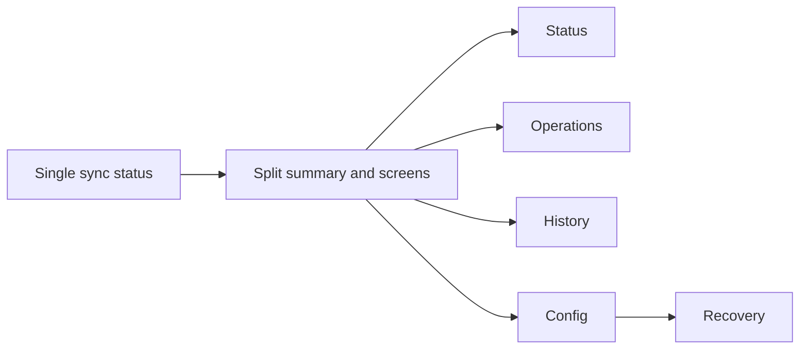

## adr_024_split_sync_status_into_dedicated_operations_screens - Split Sync Status into dedicated operations screens
> Date: 2026-04-14
> Status: Proposed
> Drivers: Reduce panel overload, preserve a concise summary surface, make operational screens first-class, keep state terminology consistent across the app.
> Related request: `logics/request/req_017_implement_the_full_app_worker_corpus_and_shell_plan.md`
> Related backlog: `logics/backlog/item_060_split_sync_status_into_dedicated_operations_screens.md`
> Related task: `logics/tasks/task_028_split_sync_status_into_dedicated_operations_screens.md`
> Reminder: Update status, linked refs, decision rationale, consequences, migration plan, and follow-up work when you edit this doc. Decisions resolved: routes first, with Recovery grouped under Config.

# Overview
Split the current Sync Status experience into a concise summary plus dedicated screens for operations, history, and config, with recovery grouped under config.
Keep the summary surface as the first stop for health and current job state.
Move run control, manifest inspection, configuration, and error recovery into focused areas.
Preserve a shared state model and consistent labels across the app shell.

# Context
The current Sync Status surface is overloaded and mixes summary state, live controls, telemetry, checkpoint information, and recovery concerns.
Operators need a lightweight place to check system health plus dedicated places to launch jobs, inspect runs, validate config, and resolve errors without making recovery its own top-level navigation stop.
This decision is structural to the app shell and navigation, but it does not change worker behavior or corpus contracts.
The same split should support the UI path for a local worker as well as the remote-worker direction defined in ADR 023.

# Decision
Keep Sync Status as a concise summary screen.
Introduce dedicated first-class screens for:
- Operations: launch, resume, cancel, and live telemetry.
- History: run list, manifest inspection, and past state.
- Config: worker connection, effective config, CLI parity, and recovery guidance.
Use the same state vocabulary across screens so the app feels like one system rather than several disconnected panels.

# Alternatives considered
- Keep everything inside a single Sync Status screen.
- Split only some details into expandable sections inside the current panel.
- Use modal dialogs for history, config, or recovery instead of dedicated screens.

# Consequences
- The app becomes easier to scan and less visually overloaded during active runs.
- Operators get clearer entry points for control and audit, while recovery stays close to worker configuration.
- The UI needs more routes or view states and more shared state coordination.
- Navigation labels and empty/error states must stay consistent, or the split will feel fragmented.

# Migration and rollout
- Keep the current Sync Status screen as the summary entry point while the new screens are introduced.
- Extract operations, history, config, and recovery incrementally so the UI stays usable during the transition.
- Add or update tests for the visible state transitions, navigation, and summary-to-detail handoff.
- Preserve deep links or equivalent shortcuts when individual screens are introduced.

# References
- `logics/product/prod_005_split_sync_status_into_dedicated_operations_screens.md`

# Follow-up work
- Use routes for the first implementation so the summary screen, operations, history, and config have stable deep links.
- Keep the screen ordering as Status, Operations, History, and Config, with Recovery nested under Config.
- Align the screen split with the existing app shell and the Sync panel summary.
- Add UI tests that prove the summary screen and the dedicated screens stay in sync.
