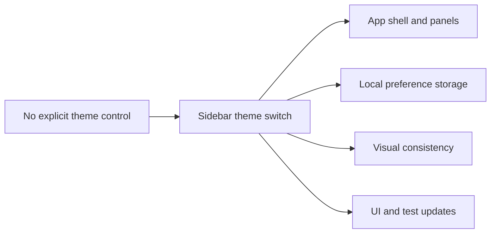

## adr_025_add_a_discrete_light_and_dark_theme_switch_with_persisted_shell_mode - Add a discrete light and dark theme switch with persisted shell mode
> Date: 2026-04-14
> Status: Proposed
> Drivers: Keep the shell visually compact, persist the user's appearance preference locally, apply the theme consistently across the app, and avoid backend dependency.
> Related request: (none yet)
> Related backlog: (none yet)
> Related task: (none yet)
> Reminder: Update status, linked refs, decision rationale, consequences, migration plan, and follow-up work when you edit this doc.

# Overview
Add a discrete light and dark theme switch to the sidebar and store the user's preference locally.
Apply the selected theme at the app shell root so panels, modals, and navigation all read from the same mode.
Default from system appearance only when no user preference exists yet, then keep the persisted choice authoritative.
Keep the control low in the sidebar so it stays visually secondary to primary navigation.

# Context
The app already has a compact shell with a sidebar, panels, and modal surfaces that rely on shared CSS variables.
Users need a low-friction way to switch between light and dark modes without turning the sidebar into a settings form.
The theme choice should survive reloads and should not require backend sync or account-level persistence.
The control also needs to remain consistent with the local-first runtime model used elsewhere in the app.

# Decision
Persist a single user theme preference locally, using the app shell as the source of truth for the active mode.
Render the theme control as a discreet sidebar affordance rather than a global settings page item.
Apply the selected theme through root-level shell state or a root attribute so all surfaces update together.
Treat system appearance as a first-load fallback only, not as a continuously overriding source of truth.

# Alternatives considered
- Use a checkbox or dropdown in settings.
- Follow system appearance automatically at all times.
- Persist the preference on the backend or in account state.

# Consequences
- The app needs a small amount of startup hydration for the persisted theme.
- The shell must keep theme tokens consistent across panels, modals, and navigation.
- The implementation stays local-first and does not add backend coupling.
- Tests should cover persistence, initial mode selection, and shell-wide styling consistency.

# Migration and rollout
- Introduce the persisted theme preference in the shell state layer.
- Wire the sidebar control to the shared theme state.
- Roll the styling tokens across the shell so every surface consumes the same mode.
- Add regression tests for reload persistence and cross-surface application.

# References
- `logics/architecture/adr_022_separate_runtime_controls_from_sync_operations.md`

# Follow-up work
- Decide whether the initial fallback should honor system appearance once or keep a simple app default.
- Verify the existing shell tokens cover every modal and panel surface.
- Add automated coverage for persisted mode, first-load fallback, and shell-wide styling.
