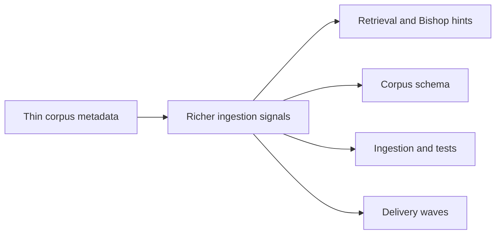

## adr_026_improve_ingestion_metadata_and_chunking_for_bishop_hints - Improve ingestion metadata and chunking for Bishop hints
> Date: 2026-04-14
> Status: Proposed
> Drivers: Preserve richer source context during ingestion, improve retrieval relevance, reduce generic Bishop hints, and keep the pipeline local-first and permission-aware.
> Related request: `logics/request/req_017_implement_the_full_app_worker_corpus_and_shell_plan.md`
> Related backlog: `logics/backlog/item_062_improve_corpus_metadata_chunking_and_bishop_hints.md`, `logics/backlog/item_067_lock_corpus_metadata_contract_and_required_fields.md`
> Related task: `logics/tasks/task_030_improve_corpus_metadata_chunking_and_bishop_hints.md`, `logics/tasks/task_035_lock_corpus_metadata_contract_and_required_fields.md`
> Reminder: Update status, linked refs, decision rationale, consequences, migration plan, and follow-up work when you edit this doc.

# Overview
Enrich ingestion so the corpus carries more document structure, source context, and chunk traceability.
Preserve heading and section context in chunks so retrieval can point back to the right passage.
Feed Bishop hints from the richer corpus signal so weak-answer guidance is less generic and more actionable.
Keep the change additive so the current local-first and permission-aware pipeline stays intact.

# Context
The current retrieval path can be too shallow for vague or underspecified questions.
When the corpus contains the right content but not enough structural metadata, sources can rank poorly and Bishop can fall back to generic improvement hints.
This decision should improve the shape of the corpus without changing the source-of-truth model, the permission model, or the local-first behavior.
The metadata additions also need to stay compatible with the broader corpus and storage decisions already established in ADR 003, ADR 016, and ADR 023.

# Decision
Add richer structural metadata during ingestion, including source location and section-aware context where available.
Preserve heading and section lineage in chunk metadata so retrieval and hint generation can reason about where a chunk came from.
Use the richer corpus signal to drive Bishop hints so weak-answer guidance can suggest more useful follow-up context.
Keep the changes additive and versioned so older corpus data can still be interpreted safely.

# Alternatives considered
- Leave the corpus shape minimal and continue relying on generic hints.
- Move the retrieval-quality logic into Bishop alone without improving ingestion metadata.
- Introduce a separate derived store just for hint generation.

# Consequences
- The corpus becomes slightly richer and more expressive, which improves retrieval quality.
- Ingestion and tests gain some extra shape and validation work.
- The hinting layer becomes more actionable because it can inspect more meaningful source signals.
- The new fields must remain backward-compatible and additive.

# Migration and rollout
- Add the new metadata fields in an additive schema version.
- Keep older corpus data readable while new runs start producing richer chunks and hints.
- Validate the new fields through retrieval and Bishop hint tests before broad rollout.
- Roll out the ingestion updates before relying on the richer signals in any downstream surface.

# References
- `logics/architecture/adr_003_hybrid_knowledge_store_and_retrieval_model.md`
- `logics/architecture/adr_016_deepvault_persistence_and_storage_layout.md`
- `logics/architecture/adr_023_split_execution_runtime_from_the_app_and_share_corpus_artifacts.md`

# Follow-up work
- Decide which metadata fields are mandatory versus optional in the first wave.
- Add or update tests for corpus loading, retrieval relevance, and Bishop hint generation.
- Confirm the chunk metadata remains compact enough for the current storage and retrieval layout.
