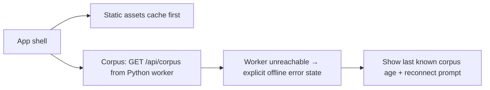

## adr_027_pwa_cache_and_offline_fallback_strategy - PWA cache and offline fallback strategy
> Date: 2026-04-18
> Status: Accepted
> Drivers: Keep the app installable, preserve a predictable offline experience, and avoid ambiguity now that corpus data is served by the Python FastAPI worker instead of bundled in the browser.
> Related request: `logics/request/req_016_pwa_install_and_offline_first.md`, `logics/request/req_020_host_nexus_as_a_shared_multi_user_web_application.md`
> Related backlog: `logics/backlog/item_055_pwa_vite_plugin_and_workbox_setup.md`, `logics/backlog/item_058_pwa_offline_cache_and_mock_fallback.md`, `logics/backlog/item_082_corpus_endpoint_and_browser_bundle_cleanup.md`
> Related task: `logics/tasks/task_022_pwa_progressive_web_app_delivery.md`, `logics/tasks/task_042_orchestrate_python_worker_foundation_and_runtime_migration.md`
> Reminder: Keep the service worker strategy, worker-backed corpus loading, and user-facing offline recovery signals aligned as the runtime model changes.

# Overview
The PWA should stay fast and installable without making corpus freshness ambiguous.
Static assets can be cached aggressively because they are versioned by the build.
Corpus data is served by the Python FastAPI worker via `GET /api/corpus` — it is not bundled in the browser and cannot be cached as a static asset.
When the worker is unreachable, the app shows an explicit offline state and does not fall back to stale data silently.

> **Important update (2026-04-18):** The bundled mock corpus fallback described in the original decision is superseded by `adr_035_python_fastapi_as_the_worker_runtime`. The browser no longer bundles any corpus. The offline fallback to a mock corpus is no longer applicable.

# Context
The current PWA work adds installability, update prompts, and offline behavior to a local-first app.
That app serves two very different data classes:
- versioned static assets produced by the build,
- corpus data served dynamically by the Python FastAPI worker.

With `adr_035`, the browser is a pure UI client — it holds no bundled corpus and no scoring logic. The corpus always comes from the worker. This eliminates the mock fallback mode but simplifies the offline contract: the worker is either reachable or not.

# Decision
Use `CacheFirst` for static assets and generated build artifacts.
Do not cache the corpus endpoint — `GET /api/corpus` is always network-first. The browser holds the last fetched corpus in memory for the session only.
If the worker is unreachable at startup or during a refresh:
- Show an explicit offline indicator with the last known corpus timestamp.
- Do not fall back to stale data silently.
- Provide a visible reconnect action.
Do not bundle any corpus in the static build for hosted mode. The local development mode uses the Python worker locally (mock corpus served by the worker, not bundled in the browser).

# Alternatives considered
- Cache everything with `CacheFirst`, including corpus data.
- Disable live corpus caching entirely.
- Keep offline support out of scope and require network access for every mode.
- ~~Fall back to the bundled mock corpus when offline~~ — superseded; no bundled corpus exists in the browser.

# Consequences
- Static assets stay fast and reliable offline.
- Corpus freshness is always explicit — the browser knows exactly when it last fetched the corpus.
- No ambiguity about whether the user is seeing live or mock data — the worker is the only source.
- True offline use of corpus data is not supported; the worker must be reachable. This is acceptable for a corporate SharePoint tool on a local network.
- The UI must clearly communicate when the worker is unreachable and show the last corpus fetch time.

# Migration and rollout
- Add Workbox caching rules for static assets only.
- Remove the corpus chunk from the Workbox precache manifest — it is a network resource, not a build artifact.
- Remove the offline mock corpus fallback path from the PWA service worker.
- Add UI coverage for the offline error state: corpus age indicator and reconnect prompt.
- Validate the behavior: worker unreachable → explicit error state shown; worker recovers → corpus reloads without full page refresh.

# References
- `logics/product/prod_001_local_first_development_and_test_strategy.md`
- `logics/request/req_016_pwa_install_and_offline_first.md`
- `logics/backlog/item_055_pwa_vite_plugin_and_workbox_setup.md`
- `logics/backlog/item_058_pwa_offline_cache_and_mock_fallback.md`
- `logics/tasks/task_022_pwa_progressive_web_app_delivery.md`

# Follow-up work
- Revisit the live corpus cache window if a future worker/runtime design introduces stronger cache invalidation guarantees.
- Keep the offline indicator explicit if additional fallback states are introduced later.
