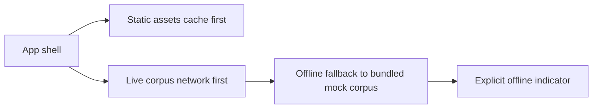

## adr_027_pwa_cache_and_offline_fallback_strategy - PWA cache and offline fallback strategy
> Date: 2026-04-16
> Status: Accepted
> Drivers: Keep the app installable, preserve a predictable offline experience, and avoid hiding stale live corpus data behind an opaque cache policy.
> Related request: `logics/request/req_016_pwa_install_and_offline_first.md`
> Related backlog: `logics/backlog/item_055_pwa_vite_plugin_and_workbox_setup.md`, `logics/backlog/item_058_pwa_offline_cache_and_mock_fallback.md`
> Related task: `logics/tasks/task_022_pwa_progressive_web_app_delivery.md`
> Reminder: Keep the service worker strategy, offline fallback behavior, and user-facing recovery signals aligned when the runtime model changes.

# Overview
The PWA should stay fast and installable without making live corpus freshness ambiguous.
Static assets can be cached aggressively because they are versioned by the build.
Live corpus data should stay network-first so the app does not quietly answer from stale remote data when the operator expects current state.
When the network is unavailable, the app should fall back to the bundled mock corpus and make that downgrade explicit.

# Context
The current PWA work adds installability, update prompts, and offline behavior to a local-first app.
That app serves two very different data classes:
- versioned static assets produced by the build,
- live corpus data that may change independently of the bundle.

Treating both classes with the same cache policy would blur the operator contract.
The app should remain usable offline, but it should not imply that cached live corpus data is as trustworthy as the bundled mock dataset.

# Decision
Use `CacheFirst` for static assets and generated build artifacts.
Use `NetworkFirst` for the live corpus endpoint with a short timeout and bounded cache.
Do not promise a full offline live mode.
If the app cannot reach live corpus data while offline, fall back to the bundled mock corpus and show an explicit offline indicator.

# Alternatives considered
- Cache everything with `CacheFirst`, including live corpus data.
- Disable live corpus caching entirely.
- Keep offline support out of scope and require network access for every mode.

# Consequences
- Static assets stay fast and reliable offline.
- Live corpus freshness remains easier to reason about because the network stays authoritative.
- Offline mode remains useful through the bundled mock corpus rather than an unbounded stale live cache.
- The UI must clearly communicate when the app is using the mock fallback.

# Migration and rollout
- Add Workbox caching rules for static assets and the live corpus endpoint.
- Keep the live corpus cache bounded and time-limited.
- Add UI coverage for the offline fallback indicator.
- Validate the behavior with automated offline tests before treating the PWA flow as done.

# References
- `logics/product/prod_001_local_first_development_and_test_strategy.md`
- `logics/request/req_016_pwa_install_and_offline_first.md`
- `logics/backlog/item_055_pwa_vite_plugin_and_workbox_setup.md`
- `logics/backlog/item_058_pwa_offline_cache_and_mock_fallback.md`
- `logics/tasks/task_022_pwa_progressive_web_app_delivery.md`

# Follow-up work
- Revisit the live corpus cache window if a future worker/runtime design introduces stronger cache invalidation guarantees.
- Keep the offline indicator explicit if additional fallback states are introduced later.
