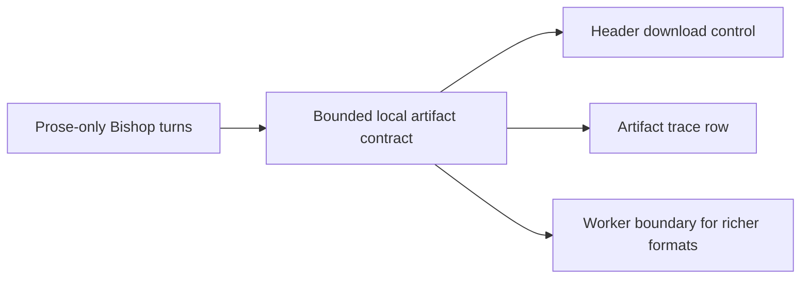

## adr_028_bound_bishop_generated_artifact_response_and_download_contract - Bound Bishop generated artifact response and download contract
> Date: 2026-04-17
> Status: Accepted
> Drivers: Let Bishop return a downloadable file inside the same grounded turn without turning the app into a general document runtime.
> Related request: (none yet)
> Related backlog: `logics/backlog/item_068_deliver_bishop_first_wave_generated_artifact_contract.md`
> Related task: `logics/tasks/task_036_orchestrate_bishop_generated_document_artifacts.md`
> Reminder: Update status, linked refs, decision rationale, consequences, migration plan, and follow-up work when you edit this doc.

# Overview
Bishop needs a bounded artifact contract that fits the existing local-first chat surface. The first shipped path should package the final grounded answer into a downloadable browser artifact for a small set of text-like formats, while making unsupported formats and invalid artifact payloads explicit in the same turn.

# Context
The existing Bishop orchestration contract returned text, sources, and trace metadata. There was no stable way to say "a file is ready", "this requested format is unsupported", or "the remote payload was malformed". The UI therefore could not offer a safe `Download` action or keep answer provenance aligned with file generation.

# Decision
- Extend the Bishop response shape with optional `artifact`, `artifactStatus`, and `artifactNotice` fields.
- Keep the artifact optional and treat it as a complement to the normal Bishop answer, never as a replacement.
- Limit the first shipped formats to `.txt`, `.md`, `.json`, and `.csv`.
- Generate the first-wave artifact locally from the final grounded answer and source metadata when the user intent explicitly requests a file.
- Expose `Download` in two places when an artifact is ready:
  - in the Bishop message header before the confidence and improvement pills,
  - in a dedicated `Artifact` row under `Confidence` in the right-side trace panel.
- Surface explicit non-ready states with `artifactStatus`:
  - `none`
  - `ready`
  - `unsupported_format`
  - `generation_failed`
- Treat invalid remote artifact payloads as `generation_failed` instead of guessing.
- Keep richer or heavier document formats such as `.docx`, `.pdf`, and `.xlsx` outside the in-app path and behind a later worker-backed contract.

# Alternatives considered
- Add a generic file-generation tool path immediately for any format.
- Hide artifact generation inside the answer text and let the UI infer whether a file exists.
- Require all artifact generation, even `.txt`, to go through a worker before shipping anything.

# Consequences
- The app gains a stable user-facing download contract without broadening into arbitrary document editing.
- Artifact generation stays cheap and local for the first wave.
- The result shape becomes slightly larger, but answer-state ambiguity drops sharply.
- CSV and JSON outputs are intentionally bounded and derived from the grounded answer path rather than from unconstrained free-form generation.

# Migration and rollout
- Update the response contract types before wiring UI controls.
- Add explicit artifact validation before trusting any remote payload.
- Keep answer-only turns unchanged when no artifact intent is present.
- Lock richer-format follow-up behind a worker-boundary item instead of growing the in-app path ad hoc.

# References
- `logics/backlog/item_068_deliver_bishop_first_wave_generated_artifact_contract.md`
- `logics/specs/spec_007_bishop_generated_artifact_response_and_download_contract.md`
- `logics/tasks/task_036_orchestrate_bishop_generated_document_artifacts.md`

# Follow-up work
- Define the worker-backed contract for `.docx`, `.pdf`, `.xlsx`, or larger outputs.
- Decide whether remote Bishop endpoints should eventually return full artifact payloads or only structured artifact plans.
