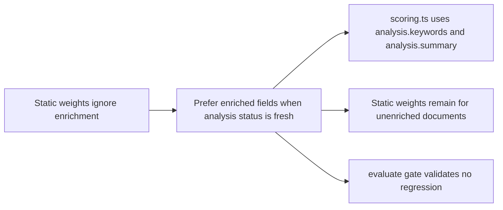

## adr_032_integrate_analyze_enrichment_fields_into_bishop_retrieval_scoring - Integrate analyze enrichment fields into Bishop retrieval scoring

> Date: 2026-04-18
> Status: Proposed
> Drivers: Close the loop between the analyze pipeline and Bishop answer quality by feeding enriched fields into retrieval scoring without breaking the static-weight fallback for unenriched documents.
> Related request: `logics/request/req_019_post_v1_3_consolidation_enrichment_loop_ci_and_configuration_portability.md`
> Related backlog: `logics/backlog/item_077_integrate_analyze_enrichment_into_bishop_scoring.md`
> Related task: `logics/tasks/task_041_orchestrate_post_v1_3_consolidation_enrichment_ci_and_configuration_portability.md`
> Reminder: Update status, linked refs, decision rationale, consequences, migration plan, and follow-up work when you edit this doc.

# Overview

The `analyze` pipeline enriches each document with an AI summary, extracted keywords, and a confidence score. These fields are stored in artifacts but not yet consumed by retrieval. `scoring.ts` uses static weights that treat enriched and unenriched documents identically. This ADR decides how enriched fields enter the scoring path and what the fallback behavior is for documents that have not been analyzed.

# Context

- `adr_029` established that retrieval should prefer `analysis.summary`, `analysis.sections`, and `analysis.keywords` only when the analysis status is fresh enough to trust — but the actual scoring integration was deferred.
- `scoring.ts` currently applies fixed weights: title=8, summary=6, content=4, tags=5, path=2. These weights do not account for whether a document's summary came from raw extraction or from an AI enrichment pass.
- `publish-analyzed-corpus` produces a corpus where enriched documents carry an `analysis` block with `status`, `summary`, `keywords`, and `confidence`. The confidence score is a provider-backed signal about extraction quality.
- Documents without an analysis block, or with a status other than a fresh analyzed state, should fall back to the existing static-weight path unchanged.

# Decision

- When a document carries an `analysis` block with a fresh status and a confidence score above a minimum threshold, prefer `analysis.summary` over the raw corpus summary field for scoring and prefer `analysis.keywords` over the raw tags field.
- Apply a confidence multiplier to the computed score of enriched documents so that a high-confidence analyzed document ranks above an equivalent unenriched one at the same keyword match level.
- The confidence multiplier is additive and bounded to avoid over-boosting: a document with max confidence should rank meaningfully higher than its unenriched equivalent but should not dominate results purely on enrichment status.
- Keep the static-weight path fully intact for documents without an analysis block or with a non-fresh analysis status. Enrichment is a signal boost, not a prerequisite for retrieval.
- Document the multiplier and threshold values in `scoring.ts` with explicit inline comments so the weighting rationale is visible without reading this ADR.
- The evaluate gate must pass after the change: no regression on baseline mock retrieval quality.

# Alternatives considered

- **Ignore enrichment in scoring entirely**: simple but wastes the investment in the analyze pipeline; does not close the quality loop.
- **Replace static weights with a fully dynamic enrichment-driven model**: too much complexity for the first integration; loses the deterministic fallback guarantee.
- **Use enrichment as a filter rather than a boost**: excludes unenriched documents from some results, which would break retrieval for corpora that have not been analyzed.

# Consequences

- Bishop answer quality improves for corpora that have been analyzed, especially for documents with weak raw extraction but strong AI summaries.
- Unenriched corpora continue to work exactly as before — the static-weight path is unchanged.
- The scoring module becomes slightly more complex but the enrichment branch is explicitly conditional and testable in isolation.
- The evaluate gate provides a regression safety net to catch any unintended ranking changes on the mock baseline.

# Migration and rollout

- Validate that the `confidence` field and enriched fields are present and stable in a published analyzed corpus before modifying scoring.
- Add three-case unit tests (unenriched, high-confidence, low-confidence) before changing the production scoring path.
- Run `npm run evaluate` against the mock baseline after the change to confirm no regression.
- Keep the confidence threshold and multiplier as named constants in `scoring.ts` so they can be adjusted without hunting for magic numbers.

# References

- `logics/architecture/adr_014_deepvault_retrieval_ranking_quality_and_cost_policy.md`
- `logics/architecture/adr_029_bound_post_ingest_analysis_contract_and_runtime_output.md`
- `logics/product/prod_010_add_a_post_ingest_ai_analysis_command_for_corpus_enrichment.md`

# Follow-up work

- Consider surfacing the enrichment status of a document in the Explorer card or Artifacts panel so operators know which sources have been boosted.
- Re-evaluate the confidence threshold and multiplier after the first real corpus analyze run to calibrate against actual provider-backed scores.
