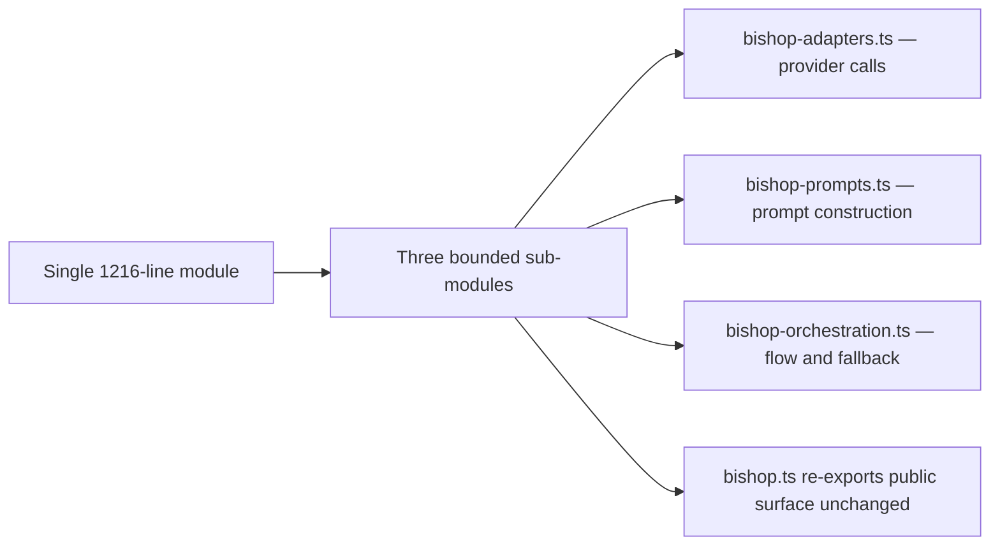

## adr_033_split_bishop_ts_into_bounded_sub_modules - Split bishop.ts into bounded sub-modules

> Date: 2026-04-18
> Status: Superseded
> Drivers: Resolve the 1216-line CONTRIBUTING.md violation in bishop.ts and make provider adapters, prompt construction, and orchestration independently testable without changing the public contract.
> Related request: `logics/request/req_018_post_v1_3_code_quality_security_and_maintainability_audit.md`
> Related backlog: `logics/backlog/item_072_split_bishop_into_bounded_sub_modules.md`
> Related task: `logics/tasks/task_040_orchestrate_post_v1_3_code_quality_security_and_maintainability_audit.md`
> Superseded by: `logics/architecture/adr_035_python_fastapi_as_the_worker_runtime.md` — bishop.ts is removed from the browser bundle entirely; all bishop orchestration moves to the Python FastAPI worker. A TypeScript split is no longer needed.
> Reminder: This ADR is superseded. Do not implement the split described here. Refer to adr_035 for the current direction.

# Overview

`src/lib/bishop.ts` at 1216 lines mixes provider adapters, prompt building, orchestration flow, and fallback logic in a single module. This ADR decides how to split it into bounded sub-modules while keeping the public surface unchanged so no import in the rest of the codebase needs to be updated.

# Context

- `src/lib/bishop.ts` formally violates the CONTRIBUTING.md rule of less than 1000 lines per file.
- The file currently contains: OpenAI, Gemini, and Anthropic adapter calls; grounding and context assembly; prompt template construction; the main orchestration flow; fallback and error handling; and type definitions.
- These concerns are coupled but separable. The orchestration flow imports adapter results; adapters do not call each other; prompt construction is called by orchestration with assembled context.
- `adr_020` already clarified the Bishop orchestration states and response contract — the split must preserve that contract without reopening it.
- `src/lib/index.ts` is the barrel that exposes public exports to the rest of the app; the split must not break any existing import path.

# Decision

- Split `bishop.ts` into three sub-modules:
  - `bishop-adapters.ts`: provider-specific API call logic for OpenAI, Gemini, and Anthropic; takes a fully assembled prompt and returns a raw provider response.
  - `bishop-prompts.ts`: prompt template construction, context assembly from grounded documents, and system/user message formatting.
  - `bishop-orchestration.ts`: the main orchestration flow, fallback chain, status propagation, and error handling; calls into adapters and prompts.
- Keep `bishop.ts` as a thin re-export barrel that forwards all public types and the main orchestration entry point so no import path outside `src/lib/` changes.
- Type definitions shared across the three modules live in `bishop-orchestration.ts` or a co-located `bishop-types.ts` if the shared surface grows large enough to warrant it.
- No new public API is introduced; the split is purely structural.

# Alternatives considered

- **Split by provider** (one file per LLM provider): isolates adapters but scatters orchestration and prompt logic; harder to follow the execution path.
- **Extract only prompts**: reduces the file to ~800 lines but does not resolve the violation long-term as orchestration grows.
- **Keep a single file**: simplest but violates the established size rule and makes the execution path harder to trace and test in isolation.

# Consequences

- Each of the three concerns becomes independently testable: adapter tests can mock provider responses; prompt tests can assert on assembled message shapes; orchestration tests can stub both.
- `bishop.ts` remains a stable import target for the rest of the codebase — zero import churn.
- The split creates a natural boundary for future changes: adding a new provider only touches `bishop-adapters.ts`; changing prompt structure only touches `bishop-prompts.ts`.
- Slightly more files to navigate, but each file has a single clear purpose.

# Migration and rollout

- Confirm existing bishop unit tests pass without modification after the split — they are the regression safety net.
- Move types progressively: start with adapter types, then prompt types, then orchestration types.
- Update `src/lib/index.ts` barrel only after the split is stable and tests pass.
- Do not change the orchestration contract (states, response shape) during this split — `adr_020` governs that surface separately.

# References

- `logics/architecture/adr_020_clarify_bishop_orchestration_states_and_response_contract.md`
- `logics/architecture/adr_017_bishop_llm_orchestration_after_local_grounding.md`

# Follow-up work

- Once the split lands, consider adding focused adapter-level tests for each provider to complement the existing integration-level bishop tests.
- Revisit whether `bishop-types.ts` is warranted once the split is in place and the shared type surface is visible.
