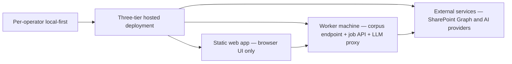

## adr_034_nexus_hosted_deployment_topology_and_multi_user_access_model - Nexus hosted deployment topology and multi-user access model

> Date: 2026-04-18
> Status: Accepted
> Drivers: Move Nexus from a per-operator local tool to a shared hosted web application with a single corpus, server-side secrets, and a dedicated worker machine — without breaking the local development path or the worker boundary contract from adr_023.
> Related request: `logics/request/req_020_host_nexus_as_a_shared_multi_user_web_application.md`
> Related backlog: `logics/backlog/item_080_python_fastapi_worker_foundation.md`, `logics/backlog/item_081_port_scoring_to_python_worker.md`, `logics/backlog/item_082_corpus_endpoint_and_browser_bundle_cleanup.md`, `logics/backlog/item_083_bishop_proxy_endpoint.md`, `logics/backlog/item_084_job_execution_in_python_worker.md`, `logics/backlog/item_085_entra_sso_msal_and_worker_token_validation.md`, `logics/backlog/item_086_operator_allowlist_and_access_log.md`, `logics/backlog/item_087_hosted_mode_ui.md`, `logics/backlog/item_088_docker_compose_deployment_package.md`
> Related task: `logics/tasks/task_042_orchestrate_python_worker_foundation_and_runtime_migration.md`, `logics/tasks/task_043_orchestrate_hosted_auth_access_and_deployment.md`
> Reminder: Update status, linked refs, decision rationale, consequences, migration plan, and follow-up work when you edit this doc. Decisions here extend adr_023 (worker boundary) and adr_013 (hosted backend direction) to cover the specific Nexus web app deployment and multi-user access model.

# Overview

Define the deployment topology and access model for Nexus running as a shared hosted web application.
The current local-first model has each operator running their own browser instance against their own corpus. The target model has a single shared Nexus URL, a single shared corpus served by the worker machine, and LLM calls proxied server-side so no secrets reach the browser.
This ADR covers how these three tiers fit together, what each tier owns, how authentication works, and what changes in the browser compared to the local model.

# Context

- `adr_023` established the app/worker split: the app is a client, the worker owns job execution and corpus publication. The worker already exposes an HTTP API with job lifecycle, health, and SSE event streaming.
- `adr_013` established that the runtime should eventually move to a hosted backend. It targeted Azure and the Teams/Gordon channel. This ADR is a more immediate and concrete step: hosting the Nexus web app itself without requiring Teams.
- `adr_016` established layered persistence: local SQLite and files for development, Azure services for production. The hosted deployment described here is the practical first production step.
- In the current state, the browser does several things it should not do in a multi-user hosted model: it stores API keys in localStorage, it makes LLM API calls directly, it loads the corpus from a bundled file or a static JSON, and it manages all configuration per session.
- The worker machine is the right unit to host because it already owns the corpus, the jobs, and the runtime configuration. Extending it to serve the corpus via HTTP and proxy LLM calls is a bounded, low-risk extension of the existing contract.

# Decision

Adopt a three-tier deployment model:

**Tier 1 — Static web app (browser)**
- The Nexus React build is deployed as a static bundle served by Caddy on the worker machine (or by an equivalent static host that preserves the same `/api/*` reverse-proxy contract).
- The browser is a pure UI client: it renders Explorer, Bishop, Artifacts, Sync, and Settings; it fetches the corpus from the worker endpoint at startup; it sends Bishop queries to the worker proxy; it subscribes to job SSE events.
- The browser stores only non-secret user preferences in localStorage: theme, panel layout, collapsed sections. No API keys, no Entra secrets, no worker tokens are stored in the browser.
- In hosted mode, the Settings panel hides or disables API key input fields. The worker connection URL is set at build time via an environment variable (`VITE_WORKER_URL`) or via a runtime config endpoint.

**Tier 2 — Worker machine (shared backend)**
- The worker machine runs two Docker containers managed by `docker-compose`: a Caddy container serving the static Nexus build and proxying `/api/*`, and a Python FastAPI worker container handling the API. Caddy proxies all `/api/*` requests to the worker container — one port exposed (80/443), automatic HTTPS, no CORS configuration needed.
- The hosted deployment assumes HTTPS via the shared Caddy origin for non-localhost URLs. The first wave does not document or support an alternate Nginx path in parallel.
- The worker container is a Python FastAPI service (`worker/main.py`) and owns:
  - **Corpus serving**: `GET /api/corpus` returns the last published versioned corpus JSON. All browsers fetch this at startup and on explicit refresh.
  - **Job execution**: `POST /api/jobs`, `GET /api/jobs/:id`, `GET /api/jobs/:id/events` (SSE) for ingest, analyze, evaluate, and export-live — replaces the existing Node.js CLI scripts.
  - **LLM proxy**: `POST /api/bishop/query` receives a Bishop query from the browser, performs local corpus grounding on the worker using `worker/scoring.py`, calls the LLM provider using server-side environment variables, and returns the structured response.
  - **Artifact serving**: `GET /api/artifacts` and `GET /api/artifacts/:id` for operator-only artifact inspection.
  - **Health**: `GET /api/health` for liveness and version info.
  - **Config mode**: `GET /api/config/mode` returns the browser-facing runtime projection `{ mode, workerVersion, corpusVersion, isOperator, features }`.
- API keys (OpenAI, Gemini, Anthropic) and Entra credentials are server-side environment variables on the worker machine. They are never returned to the browser.
- The worker authenticates browser requests using Entra token validation (JWKS-based, `worker/auth.py`) for team member access, and checks the `oid` claim against `OPERATOR_ALLOWLIST` for job control endpoints.
- The worker auth/runtime config stays intentionally narrow in the first wave: `ENTRA_TENANT_ID`, `ENTRA_CLIENT_ID`, `WORKER_AUTH_ENABLED`, and `OPERATOR_ALLOWLIST` are the required hosted auth controls.
- See `adr_035_python_fastapi_as_the_worker_runtime` for the full rationale behind the Python FastAPI choice.

**Tier 3 — External services**
- SharePoint and Microsoft Graph API: called only by the worker machine during ingest and export-live.
- AI providers (OpenAI, Gemini, Anthropic): called only by the worker machine from the LLM proxy endpoint.
- No browser ever calls SharePoint or AI providers directly in a hosted deployment.

# Authentication and access model

**Team member access (read):**
- The hosted Nexus app is protected by Entra SSO. Unauthenticated requests are redirected to the Entra login flow.
- After successful login, the browser holds an Entra access token. All requests to the worker include this token in the `Authorization` header.
- The worker validates the token on each request. A valid token grants read access to the team-member surface: corpus fetch, Bishop proxy, and Sync history.
- Team members cannot trigger job execution or access worker configuration.

**Operator access (read + job control):**
- Operators authenticate the same way via Entra SSO.
- Job control endpoints (`POST /api/jobs`, `POST /api/jobs/:id/cancel`) additionally require operator access derived from the validated Entra token.
- In the first wave, operator access is implemented as a simple allowlist of Entra object IDs in the worker configuration rather than a full RBAC system.
- The browser does not derive operator status from token inspection. It consumes a worker-returned runtime/operator flag and uses that only to decide which hosted UI surfaces are rendered.

**Local development mode (unchanged):**
- `WORKER_MODE=local` disables SSO, serves the mock corpus from the local Python worker, and keeps the browser talking to the worker through the Vite `/api` proxy.
- No Entra token is required. API keys remain a local-development concern only; hosted mode removes them from the browser entirely.
- The local mode is the default for `npm run dev` and for CI test runs.

# What changes in the browser compared to the local model

| Concern | Local model (current) | Hosted model |
|---|---|---|
| Corpus source | Bundled `corpus.ts` or static `live-corpus.json` | `GET /api/corpus` from worker |
| API keys | `localStorage` | Server-side env vars on worker |
| Bishop LLM calls | Browser → AI provider directly | Browser → worker proxy → AI provider |
| Settings | All in `localStorage` | Non-secret preferences only in `localStorage` |
| Auth | None | Entra SSO token |
| Worker URL | `localhost` or configured remote | Set via `VITE_WORKER_URL` at build time |
| Job control | All users can trigger | `OPERATOR_ALLOWLIST` gate on worker |
| Offline fallback | Mock corpus bundled | Last published corpus from worker cache; explicit error if unavailable |

# New worker endpoints

Beyond the existing `adr_023` API surface, the hosted model requires:

- `GET /api/corpus` — returns the last published versioned corpus JSON; requires a valid Entra token in hosted mode; supports `ETag` / `If-None-Match` for efficient browser caching.
- `POST /api/bishop/query` — receives `{ question, role, history }` from the browser; performs grounding locally; calls the configured LLM provider; returns the structured Bishop response including sources, confidence, and status; requires a valid Entra token in hosted mode.
- `GET /api/config/mode` — returns the canonical runtime projection for the browser, including `{ mode, workerVersion, corpusVersion, isOperator, features }`, so the browser can adapt its UI without inferring privileged state from token inspection.

# Corpus serving model

- The worker publishes a versioned corpus JSON to `data/runtime/corpus-published.json` after each successful ingest or analyze run (as per `adr_023`).
- `GET /api/corpus` reads and streams this file. The response includes a `schemaVersion` and a `generatedAt` timestamp.
- The browser caches the corpus in memory for the session. An explicit refresh (corpus version change detected via `ETag` or a worker push notification) triggers a reload.
- If the worker is unreachable, the browser shows an explicit offline state and does not fall back to a stale in-memory corpus silently — it shows the last known corpus age and a reconnect prompt.
- The corpus is never written by the browser. Only the worker publishes it.

# State ownership model

The hosted model deliberately does not share all state in the same way. To avoid browser/worker drift, each state family has one owner and one source of truth.

| State family | Owner | Persistence | Shared? | Access surface |
|---|---|---|---|---|
| Published corpus | Worker | `data/runtime/corpus-published.json` | Yes | `GET /api/corpus` |
| Job lifecycle, manifests, checkpoints | Worker | `data/runtime/` | Yes | `POST /api/jobs`, `GET /api/jobs/:id`, `GET /api/jobs/:id/events`, operator CLI |
| Artifacts runtime state | Worker | `data/runtime/` | Yes, operator-only | `GET /api/artifacts*`, operator CLI |
| Runtime config exposed to UI | Worker | Env vars + derived runtime state | Yes, limited projection only | `GET /api/config/mode` and related runtime endpoints |
| Access logs / audit trail | Worker | Worker-managed files or structured store | Shared operationally | Worker logs and operator surfaces |
| Bishop answer generation | Worker | Derived at request time | Shared behavior, not shared UI history | `POST /api/bishop/query`, worker CLI |
| Bishop conversation history shown in the UI | Browser by default in first wave | Browser memory / optional local storage | No | Browser UI only |
| Theme, layout, panel collapse, non-secret preferences | Browser | `localStorage` | No | Browser UI only |
| Secrets (API keys, Entra config, operator allowlist) | Worker | Server-side env/config only | No | Worker only |

First-wave rule:
- shared business state lives on the worker and is persisted under `data/runtime/` or server-side config.
- local user comfort state stays in the browser.
- the browser never becomes the source of truth for shared corpus, jobs, artifacts, or secrets.
- if a new shared state category is needed later (for example shared Bishop history), it should get an explicit worker-owned persistence model rather than reusing browser storage.

Supporting conventions:
- runtime artifacts live under `data/runtime/` with `corpus-published.json`, `jobs/<jobId>.json`, `jobs/<jobId>.events.jsonl`, `manifests/`, and `artifacts/` as the canonical first-wave layout.
- canonical job statuses are `queued`, `running`, `succeeded`, `failed`, and `cancelled`.
- `jobId` uses UUID v4 and timestamps use ISO 8601 UTC.
- worker error responses use a stable JSON envelope with `error.code`, `error.message`, and optional `error.details`.

# LLM proxy model

- The browser sends `POST /api/bishop/query` with the question, user role, and conversation history.
- The worker performs the same grounding logic as the current browser-side Bishop orchestration: corpus search, document ranking, context assembly.
- The worker calls the LLM provider (selected by the server-side `BISHOP_PROVIDER` env var) with the assembled prompt and the server-side API key.
- The worker returns the full Bishop response shape as defined in `adr_020`: answer, sources, confidence, status, trace.
- Streaming responses (if needed for UX) can be forwarded as SSE from the proxy endpoint in a later wave.
- The bishop orchestration and LLM adapter logic is implemented in `worker/bishop.py` (Python FastAPI worker). The TypeScript `bishop.ts` is removed from the browser bundle. See `adr_035`.

# Impact on req_018 and req_019

- **item_072** (split bishop.ts): **Cancelled** (`adr_035`) — bishop.ts is removed from the browser entirely; the LLM proxy is implemented directly in `worker/bishop.py`.
- **item_073** (reduce app-shell): no direct impact, but a leaner shell adapts more easily to hosted-mode UI changes (hiding API key inputs, showing the Entra login state).
- **item_074** (localStorage warning + schema validation): remains valuable during the transition period; in full hosted mode, the API key inputs are hidden and the warning is not shown.
- **item_076** (lazy mock corpus): **Cancelled** (`adr_035`) — no corpus is bundled in the browser in any mode. The browser always fetches from the Python worker (`GET /api/corpus`).
- **item_077** (enrichment → scoring): unchanged — scoring runs on the worker where the corpus is grounded.
- **item_078** (GitHub Actions CI): validates the hosted build; should also run a worker smoke test.
- **item_079** (config export/import): becomes the operator onboarding tool — exports local settings for migration to the worker machine's server-side env vars.

# Alternatives considered

- **Keep local-first indefinitely and share via VPN**: simpler, but forces every team member to install and maintain the full local environment. Not viable for broad team access.
- **Use Azure as the backend (per adr_013)**: a valid long-term direction but out of scope for this wave — no Azure planned. The local network machine is the right first hosted step.
- **Docker Compose on the same Windows machine**: the chosen approach — two containers (`caddy` and `worker`) on the same machine, same network address, Caddy proxies `/api/*` to the Python FastAPI worker container. `docker-compose up -d` starts everything; `docker-compose restart worker` updates the worker without touching Caddy.
- **Caddy over Nginx**: Caddy handles HTTPS automatically (self-signed or ACME) with minimal configuration — important because Entra redirect URIs may require HTTPS for non-localhost URLs.
- **Windows runtime path**: standardize the first-wave bind mount on `C:\\deepvault-nexus\\data\\runtime` so operator docs, screenshots, and restart procedures all point to the same persisted location.
- **Separate machines for static and API**: acceptable if the local network topology calls for it, but not required — same machine is the default.
- **Python FastAPI over Node.js**: see `adr_035` for the full rationale. Python eliminates the browser-side duplication problem and gives a richer AI/ML library ecosystem.

# Consequences

- Team members get immediate access to the shared corpus and Bishop without any local setup.
- The security model improves substantially: no API keys in the browser, no secrets in localStorage, Entra SSO enforced at the app boundary.
- The worker machine becomes a team dependency: if it is unavailable, all users see the offline state. Reliability expectations must be set accordingly.
- Bishop latency increases slightly because LLM calls now go through the worker proxy instead of directly from the browser. This is acceptable given the security benefit.
- The deployment process gains complexity: the worker machine must be provisioned, configured with secrets, and kept running. Docker Compose on Windows addresses this cleanly — `docker-compose up -d` on startup, `docker-compose restart worker` for updates.
- The local development mode is preserved completely: developers continue to use `npm run dev` with no SSO and a local mock corpus.
- The browser codebase needs to be aware of the deployment mode at runtime (`hosted` vs `local`) and adapt its UI accordingly — this is a bounded browser-side change, not a re-architecture.
- The first hosted wave is not a transactional multi-writer system. It relies on worker-owned published snapshots and persisted runtime files rather than a shared ACID database.

# Migration and rollout

1. Extract the bishop.ts LLM orchestration into the worker as a proxy endpoint (`POST /api/bishop/query`). This is the hardest step because it moves production behavior server-side; `adr_035` supersedes the old TypeScript split and makes the direct Python migration the target.
2. Add `GET /api/corpus` to the worker API and update the browser's corpus loading to fetch from this endpoint instead of loading from a static file or a bundled import.
3. Add Entra token validation middleware to the worker. Keep it behind a feature flag (`WORKER_AUTH_ENABLED`) so the transition does not break local development.
4. Add `GET /api/config/mode` so the browser can detect hosted mode and adapt the UI (hide API key inputs, show login state).
5. Deploy the Nexus static build to a static host pointing at the worker machine URL.
6. Provision the worker machine with server-side environment variables for all API keys and Entra credentials.
7. Enable Entra SSO on the hosted app. Run a team pilot with a small group of users before broader rollout.
8. After the pilot is stable, deprecate the per-operator localStorage API key storage path in the hosted environment.

# References

- `logics/architecture/adr_013_hosted_backend_and_teams_chat_channel.md`
- `logics/architecture/adr_016_deepvault_persistence_and_storage_layout.md`
- `logics/architecture/adr_020_clarify_bishop_orchestration_states_and_response_contract.md`
- `logics/architecture/adr_023_split_execution_runtime_from_the_app_and_share_corpus_artifacts.md`
- `logics/architecture/adr_033_split_bishop_ts_into_bounded_sub_modules.md`
- `logics/product/prod_014_host_nexus_as_a_shared_multi_user_web_application.md`

# Resolved decisions

- **Infrastructure**: No Azure. The worker machine is a local network machine. Caddy on the same machine serves the static Nexus build and proxies `/api/*` to the Python FastAPI worker. Both can run on the same machine or, if needed, as separate machines on the same network.
- **Operator access model**: Entra object ID allowlist in the worker config file (Option A). No custom Entra role claims. Simple to provision and revoke by editing the config.
- **Artifacts panel in hosted mode**: Restricted to operators. Team members access Explorer, Bishop, and Sync (read-only job history) only.
- **Bishop proxy streaming**: Full response after processing is acceptable in the first wave. SSE streaming from the proxy endpoint is deferred.
- **Config export filename**: `deepvault-config-YYYY-MM-DD.json` with a timestamp to support versioned backups.

# Follow-up work

- ~~Entra app registration, MSAL browser integration, token validation, and operator provisioning~~ **Done** — delivered by `item_085`, `item_086`, `item_087`. See `logics/product/prod_015_user_authentication_and_access_management.md` for the full design record.
- ~~Define `docker-compose.yml` and operator runbook~~ **Done** — delivered by `item_088`: `docker-compose.yml`, `Caddyfile`, `.env.example`, `.dockerignore`, and `docs/deployment-guide.md` are committed. Windows startup automation documented in the runbook.
- ~~Define the migration guide for operators moving their local settings to server-side env vars~~ **Done** — `docs/deployment-guide.md` covers the full operator onboarding workflow.
- Define the corpus `ETag` and cache invalidation strategy so browsers know when to refetch without polling. (Future wave.)
- Define the monitoring baseline for the worker machine: `GET /health` polling interval, corpus staleness alerting, error rate logging. (Future wave.)
- Revisit `adr_013` (Azure + Gordon) once the first hosted wave is stable if the team wants to scale beyond the local network. (Future wave.)
