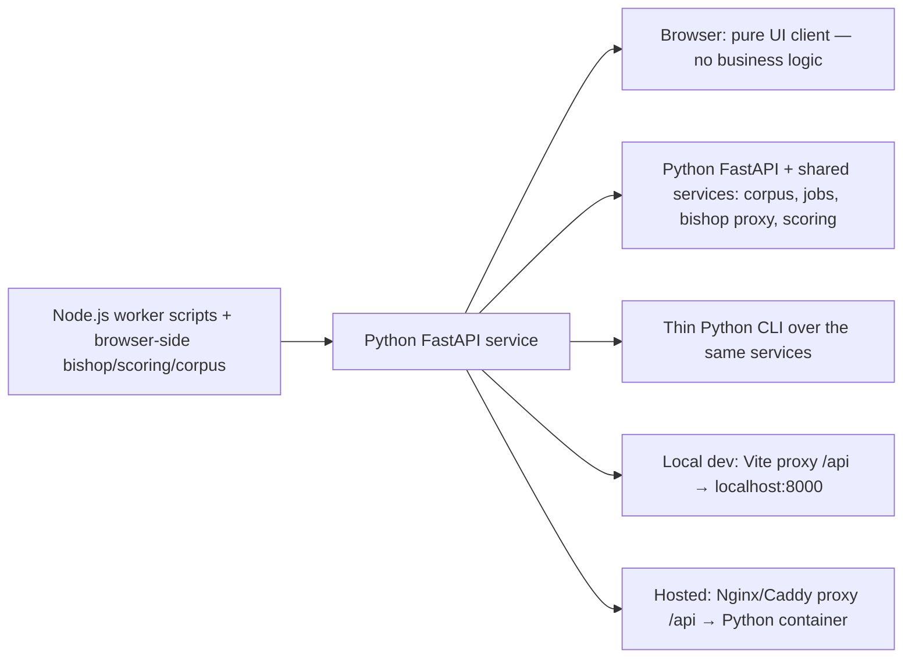

## adr_035_python_fastapi_as_the_worker_runtime - Python FastAPI as the worker runtime

> Date: 2026-04-18
> Status: Accepted
> Drivers: Eliminate the browser-side business logic duplication that would arise from a hosted deployment, replace the Node.js worker scripts with a unified Python FastAPI service, and make the browser a pure UI client in both local and hosted modes.
> Related request: `logics/request/req_020_host_nexus_as_a_shared_multi_user_web_application.md`
> Related backlog: `logics/backlog/item_080_python_fastapi_worker_foundation.md`, `logics/backlog/item_081_port_scoring_to_python_worker.md`, `logics/backlog/item_082_corpus_endpoint_and_browser_bundle_cleanup.md`, `logics/backlog/item_083_bishop_proxy_endpoint.md`, `logics/backlog/item_084_job_execution_in_python_worker.md`, `logics/backlog/item_085_entra_sso_msal_and_worker_token_validation.md`, `logics/backlog/item_086_operator_allowlist_and_access_log.md`, `logics/backlog/item_087_hosted_mode_ui.md`, `logics/backlog/item_088_docker_compose_deployment_package.md`
> Related task: `logics/tasks/task_042_orchestrate_python_worker_foundation_and_runtime_migration.md`, `logics/tasks/task_043_orchestrate_hosted_auth_access_and_deployment.md`
> Supersedes: `logics/architecture/adr_033_split_bishop_ts_into_bounded_sub_modules.md` (bishop logic moves to Python, TypeScript split is no longer needed)
> Reminder: Update status, linked refs, decision rationale, consequences, migration plan, and follow-up work when you edit this doc.

# Overview

Replace the Node.js worker scripts and browser-side business logic (bishop orchestration, scoring, corpus publication) with a single Python FastAPI service that runs in both local development and hosted deployment modes.
The browser becomes a pure UI client that fetches the corpus, sends Bishop queries, and subscribes to job events — it holds no scoring logic, no LLM adapter code, and no bundled corpus.
The same worker-owned backend capabilities remain operable from a thin CLI that reuses the same Python services as the HTTP layer, so developer and operator flows do not depend on the browser UI.
This is the architectural foundation for `req_020` (hosted multi-user deployment) and resolves the duplication problem that would arise from maintaining the same logic in TypeScript (browser) and any server-side runtime simultaneously.



# Context

- The existing worker is a set of Node.js scripts (ingest, analyze, evaluate, export-live) invoked via CLI. They are not an HTTP server — they publish results to `data/runtime/` and exit.
- In the local model, the browser imports `scoring.ts`, `bishop.ts`, and `deepvault.ts` directly and calls LLM providers from the browser using localStorage API keys.
- The hosted deployment plan (`adr_034`) requires moving bishop orchestration, scoring, and corpus serving to a shared server so API keys never reach the browser and all users see the same corpus.
- Implementing the hosted worker in Node.js would mean maintaining the same logic in two runtimes (TypeScript in the browser for local dev, Node.js on the server for hosted). Removing the browser-side logic entirely and having the local dev mode also use a Python worker eliminates this duplication.
- Replacing the Node.js scripts with HTTP only would still leave an operator and developer ergonomics gap for smoke tests, admin actions, and CI. The worker should therefore keep a first-party CLI, but as a thin wrapper over the same services rather than as a separate runtime path.
- Python is the better fit for the worker runtime:
  - The AI/ML ecosystem (LLM clients, text processing, scoring) is richer in Python.
  - FastAPI gives a clean async HTTP server with OpenAPI docs, JWKS validation middleware, and SSE support out of the box.
  - Docker images for Python are well-maintained and run cleanly on Windows via Docker Desktop + WSL2.
  - The existing Node.js worker scripts can be rewritten in Python without loss of functionality — they are data pipeline scripts, not UI code.
  - The first implementation stack is intentionally narrow: `fastapi`, `uvicorn[standard]`, `httpx`, `pydantic-settings`, `python-jose[cryptography]`, `sse-starlette`, `pytest`, and `pytest-asyncio`.

# Decision

**Adopt Python FastAPI as the single worker runtime for all non-frontend logic.**

**Expose worker-owned backend capabilities through two thin interfaces over the same Python services:**
- FastAPI for browser/runtime access.
- A first-party Python CLI for developer/operator flows, smoke tests, CI, and admin operations.
- No business logic is duplicated between HTTP handlers and CLI commands; both call the same service layer.

**What moves to Python:**
- Corpus serving: `GET /api/corpus` — reads and returns the published corpus JSON.
- Job execution: `POST /api/jobs` (ingest, analyze, evaluate, export-live) — replaces the existing Node.js CLI scripts.
- Bishop orchestration: `POST /api/bishop/query` — performs local grounding, calls the LLM provider using server-side env vars, returns the structured response.
- Scoring: the document ranking and enrichment scoring logic from `scoring.ts` moves to `worker/scoring.py`.
- Scoring parity is functional rather than bit-perfect: the Python port should preserve the same operational ranking behavior for standard queries without freezing the exact floating-point path of the TypeScript implementation.
- The first-wave enrichment tuning is fixed at a confidence threshold of `0.7` and a bounded final-score bonus capped at `+15%`.
- Health: `GET /api/health` — liveness and version info.
- Config mode: `GET /api/config/mode` — returns the canonical runtime projection for the browser, including `mode`, `workerVersion`, `corpusVersion`, `isOperator`, and `features`.

**Minimum CLI parity expected in the worker:**
- `worker health`
- `worker config-mode`
- `worker corpus show`
- `worker corpus validate`
- `worker bishop query --question "..."`
- `worker jobs run ingest|analyze|evaluate|export-live`
- `worker jobs status <id>`

**What stays in TypeScript (browser only):**
- All React UI components and panel logic.
- MSAL browser integration and Entra token handling.
- UI state management (corpus display, Bishop conversation, job progress rendering).
- Settings panel (non-secret preferences only in hosted mode).

**What is removed from the browser bundle entirely:**
- `src/lib/bishop.ts` and all sub-modules — the browser sends `POST /api/bishop/query` instead of calling LLM providers directly.
- `src/lib/scoring.ts` — scoring runs in Python on the worker.
- `src/lib/deepvault.ts` (SharePoint/Graph integration) — only the worker calls SharePoint.
- `src/data/corpus.ts` (bundled mock corpus) — no corpus is bundled; the browser always fetches from the worker.

**Local development mode:**
- Developers run the Python FastAPI worker locally (`uvicorn worker.main:app --reload` or `docker compose up worker`).
- Vite is configured with a dev proxy: all `/api/*` requests are forwarded to `http://localhost:8000`.
- The local worker serves a mock corpus from `data/mock/corpus.json` when `WORKER_MODE=local` is set.
- No SSO or Entra token is required in local mode — the auth middleware is bypassed by `WORKER_AUTH_ENABLED=false`.
- `npm run dev` starts Vite as before; the Python worker is a separate process (or a `docker compose up worker` invocation).

**Hosted deployment mode:**
- Docker Compose on Windows (Docker Desktop + WSL2): two containers — `caddy` (static Nexus build + `/api/*` proxy) and `worker` (Python FastAPI).
- The `data/runtime/` directory is a bind mount to a Windows host path so corpus data persists across container restarts.
- API keys and Entra credentials are server-side environment variables in the worker container (`.env` file, not in the image).
- Caddy handles HTTPS automatically (self-signed or ACME) — no manual certificate management needed.

# Local development workflow

```
┌─ Developer machine ─────────────────────────────────────────────────┐
│                                                                       │
│  npm run dev                    uvicorn worker.main:app --reload      │
│  Vite (port 5173)               Python FastAPI (port 8000)           │
│         │                                │                            │
│         │  /api/* → proxy               │                            │
│         └──────────────────────────────►│                            │
│                                          │ WORKER_MODE=local          │
│                                          │ WORKER_AUTH_ENABLED=false  │
│                                          │ data/mock/corpus.json      │
└─────────────────────────────────────────────────────────────────────┘
```

The Vite dev server config:
```typescript
// vite.config.ts
server: {
  proxy: {
    '/api': 'http://localhost:8000'
  }
}
```

# Hosted deployment topology

```
Team browsers (any browser on local network)
        │
        ▼
[ Windows machine — Docker Compose ]
  ├── caddy container (port 80/443)
  │     ├── /           → serves /dist (Nexus static build)
  │     └── /api/*      → reverse proxy → worker container
  │
  └── worker container (Python FastAPI, internal port 8000)
        ├── GET /api/health
        ├── GET /api/config/mode
        ├── GET /api/corpus
        ├── POST /api/bishop/query
        ├── POST /api/jobs
        ├── GET /api/jobs/:id
        ├── GET /api/jobs/:id/events  (SSE)
        ├── GET /api/artifacts
        │
        ├── .env: OPENAI_API_KEY, GEMINI_API_KEY, ANTHROPIC_API_KEY
        ├── .env: ENTRA_TENANT_ID, ENTRA_CLIENT_ID
        ├── .env: OPERATOR_ALLOWLIST, WORKER_AUTH_ENABLED=true
        └── volume: ./data/runtime/ (bind mount to Windows host path)
```

# Python project structure

```
worker/
  app/
    main.py            # FastAPI app, middleware, router registration
    config.py          # Settings via pydantic-settings (reads env vars)
    models.py          # Shared request/response models
    errors.py          # Standard error envelope helpers
    routes/
      health.py
      config_mode.py
      corpus.py
      bishop.py
      jobs.py
      artifacts.py
    services/
      corpus_service.py
      scoring_service.py
      bishop_service.py
      jobs_service.py
      deepvault_service.py
    auth/
      token_validation.py
      operator_gate.py
    infra/
      runtime_store.py
      access_log.py
  cli/
    main.py            # CLI entrypoint
    commands/
      health.py
      config_mode.py
      corpus.py
      bishop.py
      jobs.py
  tests/
  requirements.txt     # fastapi, uvicorn, httpx, pydantic-settings, msal, ...
  Dockerfile           # Python 3.12 slim image
```

# Runtime artifact model

The first worker wave uses a deterministic file-backed runtime layout under `data/runtime/`:

```
data/runtime/
  corpus-published.json
  jobs/
    <jobId>.json
    <jobId>.events.jsonl
  manifests/
  artifacts/
```

Rules:
- `corpus-published.json` is the source of truth for the published shared corpus.
- `jobs/<jobId>.json` is the source of truth for job status and summary metadata.
- `jobs/<jobId>.events.jsonl` is the append-only event stream backing SSE replay/debug when needed.
- `manifests/` and `artifacts/` hold worker-produced runtime outputs; they are not browser-owned.

# Contract conventions

**Corpus versioning**
- `corpusVersion` is derived from `generatedAt` plus a short content hash of the published corpus artifact.
- The HTTP `ETag` is derived from the published corpus content hash.
- Browsers treat the worker-returned `corpusVersion` and `ETag` as authoritative.
- Timestamps use ISO 8601 UTC, for example `2026-04-18T14:32:05Z`.

**Job lifecycle**
- Canonical statuses: `queued`, `running`, `succeeded`, `failed`, `cancelled`.
- `jobId` is a UUID v4.
- `POST /api/jobs` returns the created job id and the current status.
- `GET /api/jobs/:id` returns status, timestamps, type, and a result summary.
- `GET /api/jobs/:id/events` emits structured SSE progress events from the persisted job event stream.
- First-wave retention is simple: job metadata and event logs are kept until an explicit cleanup policy is introduced in a later wave.

**Config mode payload**
- `GET /api/config/mode` is the canonical runtime projection for the browser.
- `workerVersion` comes from a single worker-owned version source (`worker/VERSION` in the initial implementation).
- First-wave shape:

```json
{
  "mode": "local|hosted",
  "workerVersion": "string",
  "corpusVersion": "string|null",
  "isOperator": true,
  "features": {
    "authEnabled": true
  }
}
```

**Error envelope**
- Worker endpoints use a standard JSON error shape:

```json
{
  "error": {
    "code": "forbidden",
    "message": "Human-readable summary",
    "details": {}
  }
}
```

- `code` is stable for UI logic and logging.
- `message` is user-readable.
- `details` is optional structured context for debugging.
- First-wave error codes include `unauthorized`, `forbidden`, `not_found`, `invalid_request`, `worker_unavailable`, `provider_error`, and `job_failed`.

# Impact on existing items

- **item_072** (split bishop.ts): Cancelled. `bishop.ts` is removed from the browser entirely, not split. See item_072 status update.
- **item_076** (lazy mock corpus): Cancelled. No bundled corpus exists in the browser — the corpus always comes from the worker. See item_076 status update.
- **item_073** (reduce app-shell.tsx): Still valid — the shell is a UI concern unaffected by this decision.
- **item_074** (localStorage hardening): Partially superseded for hosted mode (API key inputs are hidden), but the warning remains useful for local dev. Still valid.
- **item_075** (error boundaries + health check): Still valid — the health check pings the Python worker; error boundaries are a UI concern.
- **item_077** (enrichment scoring): The scoring logic is now implemented in `worker/scoring.py` instead of updating `scoring.ts`. Item remains in scope; implementation language changes.
- **item_078** (GitHub Actions CI): Still valid — CI validates the Vite build and should also run a Python worker smoke test.
- **item_079** (config export/import): Still valid — the export JSON captures local settings that operators migrate to the worker `.env` file.
- **adr_033** (split bishop.ts): Superseded. The TypeScript split is no longer needed because `bishop.ts` is removed from the browser bundle.
- **adr_027** (PWA offline fallback): Partially superseded — the bundled mock corpus fallback is no longer applicable. Offline mode shows an explicit error state when the worker is unreachable. Static assets remain cached as before.

# Alternatives considered

- **Keep Node.js for the worker, split bishop.ts into a shared module**: requires building a Node.js HTTP server and duplicating the TypeScript logic across browser and server contexts. More complex and harder to maintain.
- **Keep browser-side logic for local dev, Python only for hosted**: introduces the duplication problem — two implementations of the same scoring and orchestration logic. Rejected.
- **Keep Node.js, run as HTTP server**: viable but Python is a better fit for the AI/data pipeline work, and FastAPI gives SSE and async support with less boilerplate.
- **Deno**: interesting but limited ecosystem for the AI/ML libraries needed; Docker image quality is lower than CPython.

# Consequences

- **Positive**: One implementation of scoring, grounding, and Bishop orchestration — no drift between browser-side and server-side versions.
- **Positive**: Operator and developer workflows remain scriptable without the browser UI because the worker exposes a supported CLI over the same services.
- **Positive**: API keys never appear in the browser, in any mode — the browser is a pure UI client from day one.
- **Positive**: No bundled corpus in the browser bundle — the initial bundle is smaller and there is no stale mock data risk.
- **Positive**: Python's AI library ecosystem (httpx, tiktoken, langchain if needed) is richer than the Node.js equivalent.
- **Positive**: Shared business state now has a single owner: the worker. The browser keeps only local UI state, which reduces drift and zombie runtime paths.
- **Negative**: Local development requires running a Python process alongside Vite. Developers need Python 3.12+ and either `uvicorn` or Docker Desktop.
- **Negative**: The existing Node.js worker scripts must be rewritten in Python. This is a non-trivial migration for the ingest and analyze pipelines.
- **Neutral**: The browser TypeScript codebase shrinks significantly (bishop.ts, scoring.ts, deepvault.ts removed). The React/UI surface is unchanged.
- **Neutral**: The worker now owns both HTTP and CLI surfaces, so project structure should keep a clear separation between routes/commands and shared services.
- **Neutral**: The first worker-backed persistence model is snapshot/file-oriented (`data/runtime/`), not a transactional multi-writer store.

# Migration plan

1. Create the Python FastAPI project structure (`worker/` directory) with the shared service layer, `GET /api/health`, `GET /api/config/mode`, and a minimal CLI entrypoint for `health` and `config-mode`.
2. Port `scoring.ts` → `worker/scoring.py`. Add unit tests. This is the lowest-risk first step since scoring is a pure function.
3. Port the analyze enrichment integration (`adr_032`) to `worker/scoring.py` — enrichment scoring lands in Python from the start.
4. Port `bishop.ts` orchestration and LLM adapters → `worker/bishop.py`. Implement `POST /api/bishop/query`. Add integration tests.
5. Implement `GET /api/corpus` in `worker/corpus.py`. Update the browser to fetch from the worker instead of loading `corpus.ts`.
6. Port the Node.js ingest, analyze, evaluate, and export-live scripts → `worker/jobs.py` with SSE streaming on `GET /api/jobs/:id/events`, and keep equivalent CLI invocation paths over the same job services.
7. Remove `src/lib/bishop.ts`, `src/lib/scoring.ts`, `src/lib/deepvault.ts`, and `src/data/corpus.ts` from the browser bundle.
8. Configure Vite dev proxy (`/api → localhost:8000`). Update local development docs.
9. Add Entra token validation middleware (`worker/auth.py`) behind `WORKER_AUTH_ENABLED` flag.
10. Build Docker images and validate the full Docker Compose stack locally before the hosted pilot.

# Legacy removal rule

The migration explicitly forbids long-lived duplicate runtime paths.

- A legacy browser or Node.js runtime path may coexist only during the active migration wave that replaces it.
- A wave is not considered complete until the replaced path is either removed from the runtime path or clearly marked obsolete and disconnected from active execution.
- The worker becomes the only source of truth for shared runtime behavior as each wave closes.

# References

- `logics/architecture/adr_023_split_execution_runtime_from_the_app_and_share_corpus_artifacts.md`
- `logics/architecture/adr_034_nexus_hosted_deployment_topology_and_multi_user_access_model.md`
- `logics/architecture/adr_032_integrate_analyze_enrichment_fields_into_bishop_retrieval_scoring.md`
- `logics/architecture/adr_027_pwa_cache_and_offline_fallback_strategy.md`
- `logics/request/req_020_host_nexus_as_a_shared_multi_user_web_application.md`
- `logics/request/req_018_post_v1_3_code_quality_security_and_maintainability_audit.md`

# Follow-up work

- Define `worker/requirements.txt` with pinned versions and document the local dev setup steps (Python version, virtual env, how to run alongside Vite).
- Define the mock corpus format for local mode (`data/mock/corpus.json`) and the worker env var that selects it.
- Update `adr_027` to reflect the new offline behavior (no bundled corpus fallback; explicit error state when worker unreachable).
- Update `adr_033` status to Superseded.
- Update `adr_034` to replace Node.js references with Python FastAPI.
- Create the `docker-compose.yml` configuration with Caddy and worker containers, volume mounts, and env file wiring.
- Define the CI pipeline changes: add a Python worker build and smoke test step to the GitHub Actions workflow.
