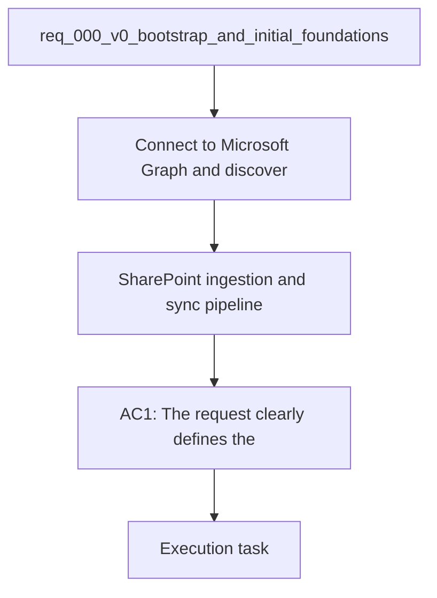

## item_001_v1_sharepoint_ingestion_and_sync_pipeline - V1 — SharePoint ingestion and sync pipeline
> From version: 0.0.1
> Schema version: 1.0
> Status: Done
> Understanding: 100%
> Confidence: 100%
> Progress: 100%
> Complexity: High
> Theme: General
> Reminder: Update status/understanding/confidence/progress and linked request/task references when you edit this doc.

# Problem
- Connect to Microsoft Graph and discover the initial SharePoint sites, libraries, and lists.
- Navigate SharePoint content and extract useful metadata and documents from selected spaces.
- Build a durable knowledge store from collected SharePoint content.
- Prepare the data layer so an LLM agent can answer questions from the indexed knowledge base.
- Define how the system should sync, refresh, and filter content as SharePoint changes.
- Allow the pilot site list to be updated through environment configuration.
- This project starts from a working Microsoft Graph connection against the tenant and a verified SharePoint site structure.
- Validated context so far:

# Scope
- In: one coherent delivery slice from the source request.
- Out: unrelated sibling slices that should stay in separate backlog items instead of widening this doc.

# Acceptance criteria
- AC1: The request clearly defines the SharePoint ingestion and knowledge-base kickoff goal.
- AC2: The request identifies the initial Microsoft Graph surfaces needed for site discovery and content listing.
- AC3: The request states the intended end state of an LLM-ready knowledge store.
- AC4: The request captures the main open scope decisions needed before backlog grooming.
- AC5: The pilot site list is explicitly configurable so new SharePoint sites can be added without code changes.
- AC6: The request records the intended priority order across documents, lists, pages, and metadata.
- AC7: The request acknowledges the future Microsoft account-based user rights model.
- AC8: The request defines the first explorer UI as a required part of the product direction.
- AC9: The request captures the hybrid ingestion and chunked retrieval model for the knowledge base.
- AC10: The request explicitly allows a Teams bot-based chatbot path with Entra-backed identity and permission checks.

# AC Traceability
- AC1 -> Scope: The request clearly defines the SharePoint ingestion and knowledge-base kickoff goal.. Proof: capture validation evidence in this doc.
- AC2 -> Scope: The request identifies the initial Microsoft Graph surfaces needed for site discovery and content listing.. Proof: capture validation evidence in this doc.
- AC3 -> Scope: The request states the intended end state of an LLM-ready knowledge store.. Proof: capture validation evidence in this doc.
- AC4 -> Scope: The request captures the main open scope decisions needed before backlog grooming.. Proof: capture validation evidence in this doc.
- AC5 -> Scope: The pilot site list is explicitly configurable so new SharePoint sites can be added without code changes.. Proof: capture validation evidence in this doc.
- AC6 -> Scope: The request records the intended priority order across documents, lists, pages, and metadata.. Proof: capture validation evidence in this doc.
- AC7 -> Scope: The request acknowledges the future Microsoft account-based user rights model.. Proof: capture validation evidence in this doc.
- AC8 -> Scope: The request defines the first explorer UI as a required part of the product direction.. Proof: capture validation evidence in this doc.
- AC9 -> Scope: The request captures the hybrid ingestion and chunked retrieval model for the knowledge base.. Proof: capture validation evidence in this doc.
- AC10 -> Scope: The request explicitly allows a Teams bot-based chatbot path with Entra-backed identity and permission checks.. Proof: capture validation evidence in this doc.

# Decision framing
- Product framing: Required
- Product signals: navigation and discoverability, experience scope
- Product follow-up: Create or link a product brief before implementation moves deeper into delivery.
- Architecture framing: Required
- Architecture signals: data model and persistence, state and sync, security and identity
- Architecture follow-up: Create or link an architecture decision before irreversible implementation work starts.

# Links
- Product brief(s): `prod_000_sharepoint_knowledge_graph_product_vision`
- Architecture decision(s): `adr_001_identity_and_access_model_for_sharepoint_knowledge_graph`, `adr_002_sharepoint_ingestion_and_sync_pipeline`, `adr_003_hybrid_knowledge_store_and_retrieval_model`, `adr_004_teams_bot_architecture_for_llm_chat`, `adr_005_explorer_ui_for_sharepoint_navigation`, `adr_006_runtime_configuration_and_operations`, `adr_010_sharepoint_sync_orchestration_and_refresh_policy`
- Request: `req_000_v0_bootstrap_and_initial_foundations`
- Primary task(s): `task_XXX_example`

# AI Context
- Summary: Kickoff request for a SharePoint knowledge graph and retrieval tool built on Microsoft Graph.
- Keywords: microsoft graph, sharepoint, knowledge graph, ingestion, retrieval, llm
- Use when: Use when framing the first delivery slice for SharePoint discovery, indexing, and question answering.
- Skip when: Skip when the work is about unrelated app features or a later delivery stage.
# References
- `logics/skills/logics-ui-steering/SKILL.md`

# Priority
- Impact:
- Urgency:

# Notes
- Derived from request `req_000_v0_bootstrap_and_initial_foundations`.
- Source file: `logics/request/req_000_v0_bootstrap_and_initial_foundations.md`.
- Keep this backlog item as one bounded delivery slice; create sibling backlog items for the remaining request coverage instead of widening this doc.
- Request context seeded into this backlog item from `logics/request/req_000_v0_bootstrap_and_initial_foundations.md`.
