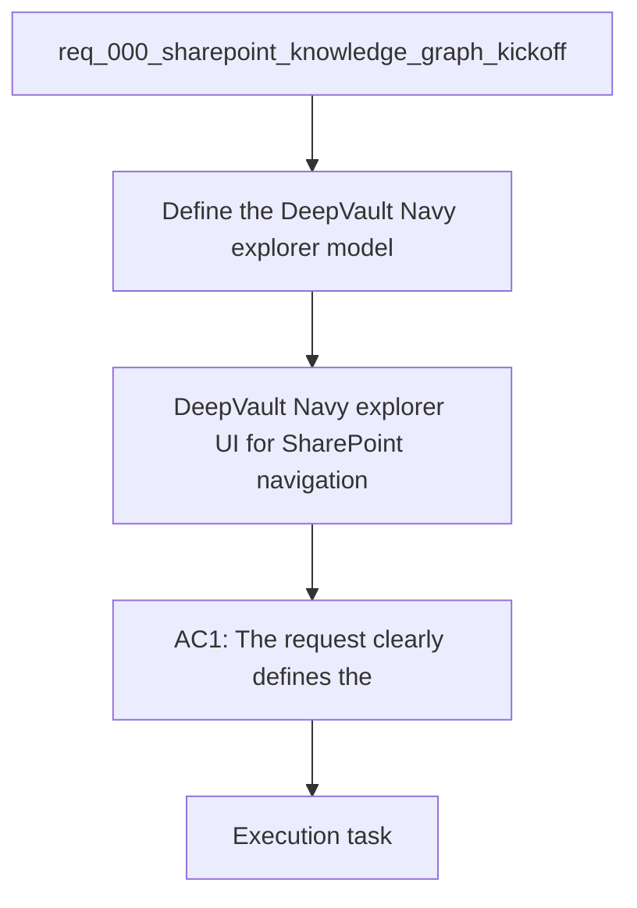

## item_003_explorer_ui_for_sharepoint_navigation - DeepVault - Navy explorer UI for SharePoint navigation
> From version: 0.0.1
> Schema version: 1.0
> Status: Ready
> Understanding: 99%
> Confidence: 95%
> Progress: 1%
> Complexity: High
> Theme: General
> Reminder: Update status/understanding/confidence/progress, linked request/task references, and DeepVault/Navy naming when you edit this doc.

# Problem
- Define the SharePoint explorer navigation model for sites, libraries, folders, lists, and documents in `DeepVault - Navy`.
- Keep navigation behavior consistent between `DeepVault - Navy` and future hosted surfaces.
- Clarify the metadata, routing, and detail-context patterns the explorer should expose.

# Scope
- In: the reusable explorer navigation contract, hierarchy, breadcrumbs, detail panes, and source-link behavior.
- In: the rules that make the explorer readable across local and future hosted shells.
- Out: the local shell implementation, chat, sync, hosted backend work, and Teams integration.

# Acceptance criteria
- AC1: The explorer navigation model clearly covers sites, libraries, folders, lists, and documents.
- AC2: The explorer defines enough hierarchy and detail context to validate pilot content.
- AC3: The navigation contract is reusable across `DeepVault - Navy` and later hosted surfaces.

# AC Traceability
- AC1 -> Scope: The reusable explorer navigation contract, hierarchy, breadcrumbs, detail panes, and source-link behavior.. Proof: capture validation evidence in this doc.
- AC2 -> Scope: The rules that make the explorer readable across local and future hosted shells.. Proof: capture validation evidence in this doc.
- AC3 -> Scope: The local shell implementation, chat, sync, hosted backend work, and Teams integration are out of scope here.. Proof: capture validation evidence in this doc.

# Decision framing
- Product framing: Required
- Product signals: navigation and discoverability, experience scope
- Product follow-up: Create or link a product brief before implementation moves deeper into delivery.
- Architecture framing: Required
- Architecture signals: data model and persistence, state and sync, security and identity
- Architecture follow-up: Create or link an architecture decision before irreversible implementation work starts.

# Links
- Product brief(s): `prod_000_sharepoint_knowledge_graph_product_vision`
- Architecture decision(s): `adr_001_identity_and_access_model_for_sharepoint_knowledge_graph`, `adr_002_sharepoint_ingestion_and_sync_pipeline`, `adr_003_hybrid_knowledge_store_and_retrieval_model`, `adr_004_teams_bot_architecture_for_llm_chat`, `adr_005_explorer_ui_for_sharepoint_navigation`, `adr_006_runtime_configuration_and_operations`
- Request: `req_000_sharepoint_knowledge_graph_kickoff`
- Related backlog: `item_008_local_explorer_shell_and_navigation`
- Primary task(s): `task_XXX_example`

# AI Context
- Summary: DeepVault - Navy explorer navigation model for SharePoint sites, libraries, folders, lists, and documents.
- Keywords: explorer, navigation, sharepoint, hierarchy, detail context
- Use when: Use when defining the reusable `DeepVault - Navy` contract across local and hosted surfaces.
- Skip when: Skip when the work is about local shell implementation, chat, or sync.
# References
- `logics/skills/logics-ui-steering/SKILL.md`

# Priority
- Impact:
- Urgency:

# Notes
- Derived from request `req_000_sharepoint_knowledge_graph_kickoff`.
- Source file: `logics/request/req_000_sharepoint_knowledge_graph_kickoff.md`.
- Keep this backlog item as one bounded delivery slice; create sibling backlog items for the remaining request coverage instead of widening this doc.
- Request context seeded into this backlog item from `logics/request/req_000_sharepoint_knowledge_graph_kickoff.md`.
