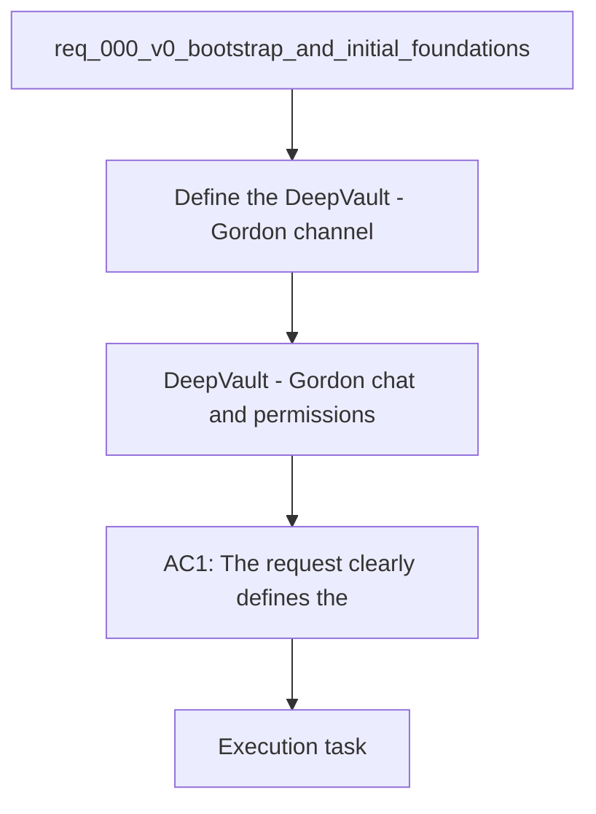

## item_004_v2_teams_bot_chat_and_permissions - V2 — DeepVault - Gordon chat and permissions
> From version: 0.0.3
> Schema version: 1.0
> Status: Ready
> Understanding: 99%
> Confidence: 95%
> Progress: 0%
> Complexity: High
> Theme: General
> Reminder: Update status/understanding/confidence/progress, linked request/task references, and DeepVault/Gordon naming when you edit this doc. For any UX/UI or frontend implementation work, use `logics/skills/logics-ui-steering/SKILL.md`.

# Problem
- Define the `DeepVault - Gordon` channel governance and permission model after the backend is hosted.
- Keep the enterprise chat surface governed through Microsoft identity and the shared retrieval model.
- Separate the policy and channel rules from the concrete bot packaging work.

# Scope
- In: channel policy, identity mapping, and permission rules for `DeepVault - Gordon`.
- In: the hosted backend integration contract that `DeepVault - Gordon` must respect.
- In: the requirements that keep Teams aligned with the permission-aware retrieval model.
- Out: Teams bot packaging, tenant distribution, and local runtime work.

# Acceptance criteria
- AC1: The request clearly defines the SharePoint ingestion and knowledge-base kickoff goal.
- AC2: The request identifies the initial Microsoft Graph surfaces needed for site discovery and content listing.
- AC3: The request states the intended end state of an LLM-ready knowledge store.
- AC4: The request captures the main open scope decisions needed before backlog grooming.
- AC5: The pilot site list is explicitly configurable so new SharePoint sites can be added without code changes.
- AC6: The request records the intended priority order across documents, lists, pages, and metadata.
- AC7: The request acknowledges the future Microsoft account-based user rights model.
- AC8: The request defines the first explorer UI as a required part of the product direction.
- AC9: The request captures the hybrid ingestion and chunked retrieval model for the knowledge base.
- AC10: The request explicitly allows a Teams bot-based chatbot path with Entra-backed identity and permission checks.

# AC Traceability
- AC1 -> Scope: The request clearly defines the SharePoint ingestion and knowledge-base kickoff goal.. Proof: capture validation evidence in this doc.
- AC2 -> Scope: The request identifies the initial Microsoft Graph surfaces needed for site discovery and content listing.. Proof: capture validation evidence in this doc.
- AC3 -> Scope: The request states the intended end state of an LLM-ready knowledge store.. Proof: capture validation evidence in this doc.
- AC4 -> Scope: The request captures the main open scope decisions needed before backlog grooming.. Proof: capture validation evidence in this doc.
- AC5 -> Scope: The pilot site list is explicitly configurable so new SharePoint sites can be added without code changes.. Proof: capture validation evidence in this doc.
- AC6 -> Scope: The request records the intended priority order across documents, lists, pages, and metadata.. Proof: capture validation evidence in this doc.
- AC7 -> Scope: The request acknowledges the future Microsoft account-based user rights model.. Proof: capture validation evidence in this doc.
- AC8 -> Scope: The request defines the first explorer UI as a required part of the product direction.. Proof: capture validation evidence in this doc.
- AC9 -> Scope: The request captures the hybrid ingestion and chunked retrieval model for the knowledge base.. Proof: capture validation evidence in this doc.
- AC10 -> Scope: The request explicitly allows a Teams bot-based chatbot path with Entra-backed identity and permission checks.. Proof: capture validation evidence in this doc.

# Decision framing
- Product framing: Required
- Product signals: enterprise channel, governed chatbot, user permissions
- Product follow-up: Keep the product brief aligned with the hosted backend and Teams channel direction.
- Architecture framing: Required
- Architecture signals: bot auth, hosted backend contract, permission-aware retrieval
- Architecture follow-up: Keep the hosted backend and Teams ADR current as the channel matures.

# Links
- Product brief(s): `prod_000_sharepoint_knowledge_graph_product_vision`
- Architecture decision(s): `adr_001_identity_and_access_model_for_sharepoint_knowledge_graph`, `adr_002_sharepoint_ingestion_and_sync_pipeline`, `adr_003_hybrid_knowledge_store_and_retrieval_model`, `adr_004_teams_bot_architecture_for_llm_chat`, `adr_005_explorer_ui_for_sharepoint_navigation`, `adr_006_runtime_configuration_and_operations`, `adr_009_permission_aware_retrieval_and_source_filtering`, `adr_013_hosted_backend_and_teams_chat_channel`
- Related backlog: `logics/backlog/item_011_hosted_backend_core.md`, `logics/backlog/item_012_teams_bot_channel_and_permissions.md`
- Request: `req_000_v0_bootstrap_and_initial_foundations`
- Primary task(s): `task_XXX_example`

# AI Context
- Summary: DeepVault - Gordon channel governance and permission model for the chatbot.
- Keywords: teams, permissions, identity, governance, chatbot, hosted backend
- Use when: Use when defining the `DeepVault - Gordon` policy and channel rules.
- Skip when: Skip when the work is about packaging or implementation details.
# References
- `logics/skills/logics-ui-steering/SKILL.md`

# Priority
- Impact:
- Urgency:

# Notes
- Derived from request `req_000_v0_bootstrap_and_initial_foundations`.
- Source file: `logics/request/req_000_v0_bootstrap_and_initial_foundations.md`.
- Keep this backlog item as one bounded delivery slice; create sibling backlog items for the remaining request coverage instead of widening this doc.
- Request context seeded into this backlog item from `logics/request/req_000_v0_bootstrap_and_initial_foundations.md`.
