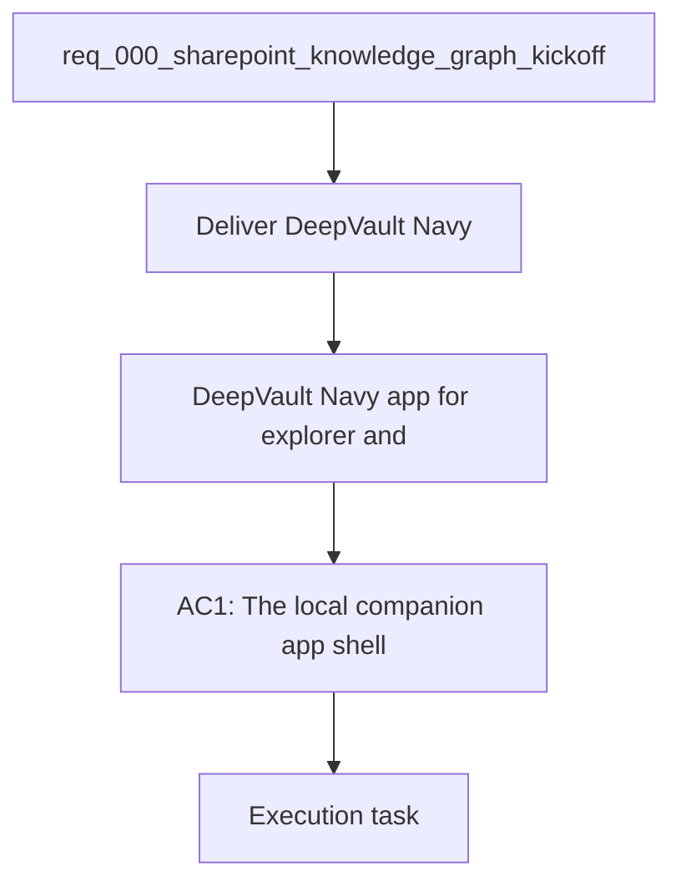

## item_006_local_companion_app_for_explorer_and_chat - DeepVault - Navy app for explorer and chat
> From version: 0.0.2
> Schema version: 1.0
> Status: Ready
> Understanding: 96%
> Confidence: 92%
> Progress: 1%
> Complexity: High
> Theme: General
> Reminder: Keep this slice focused on `DeepVault - Navy` and avoid drifting into later `DeepVault - Gordon` integration work.

# Problem
- Deliver the `DeepVault - Navy` shell that hosts the explorer, chat, and sync views for the DeepVault project.
- The shell is the shared local runtime container before the feature slices are implemented independently.

# Scope
- In: one `DeepVault - Navy` web app shell with routing, layout, and a shared runtime contract.
- In: the placeholder app structure that the explorer, chat, and sync slices plug into.
- Out: the feature slices themselves, Teams app packaging, tenant distribution, hosted backend migration, and other later integrations.

# Acceptance criteria
- AC1: The `DeepVault - Navy` shell exposes routing and layout that the feature slices can reuse.
- AC2: The shell remains local-first and does not require `DeepVault - Gordon` packaging to validate the pilot.
- AC3: The shell provides a stable container for the explorer, chat, and sync slices.

# AC Traceability
- AC1 -> Scope: In: one local web app shell with routing, layout, and a shared runtime contract. Proof: capture validation evidence in this doc.
- AC2 -> Scope: Out: the feature slices themselves, Teams app packaging, tenant distribution, hosted backend migration, and other later integrations. Proof: capture validation evidence in this doc.
- AC3 -> Scope: In: the placeholder app structure that the explorer, chat, and sync slices plug into. Proof: capture validation evidence in this doc.

# Decision framing
- Product framing: Required
- Product signals: local shell, shared layout, local runtime boundary
- Product follow-up: Keep the product brief aligned with the local shell direction.
- Architecture framing: Required
- Architecture signals: browser auth, shared shell contract, local runtime boundary
- Architecture follow-up: Keep the local runtime ADR current as the shell evolves.

# Links
- Product brief(s): `logics/product/prod_000_sharepoint_knowledge_graph_product_vision.md`
- Architecture decision(s): `logics/architecture/adr_007_local_companion_app_architecture_for_explorer_and_chat.md`, `logics/architecture/adr_012_local_companion_runtime_for_explorer_and_chat.md`
- Request: `logics/request/req_000_sharepoint_knowledge_graph_kickoff.md`
- Primary task(s): (none yet)

# AI Context
- Summary: DeepVault - Navy web app for explorer, chat, and sync status
- Keywords: local, companion, app, explorer, chat, sync, status
- Use when: Use when implementing or reviewing the delivery slice for `DeepVault - Navy`.
- Skip when: Skip when the change is unrelated to this delivery slice or its linked request.
# Priority
- Impact: High
- Urgency: High

# Notes
- Derived from request `req_000_sharepoint_knowledge_graph_kickoff`.
- Source file: `logics/request/req_000_sharepoint_knowledge_graph_kickoff.md`.
- Keep this backlog item as one bounded delivery slice; create sibling backlog items for remaining request coverage instead of widening this doc.
- Request context seeded into this backlog item from `logics/request/req_000_sharepoint_knowledge_graph_kickoff.md`.
