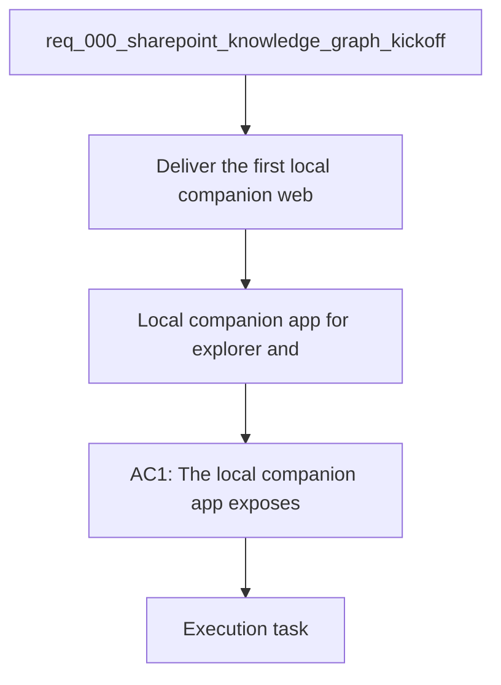

## item_006_local_companion_app_for_explorer_and_chat - Local companion app for explorer and chat
> From version: 0.0.0
> Schema version: 1.0
> Status: Ready
> Understanding: 96%
> Confidence: 92%
> Progress: 0%
> Complexity: High
> Theme: General
> Reminder: Keep this slice focused on the local companion web app and avoid drifting into later Teams integration work.

# Problem
- Deliver the first local companion web app that combines exploration, chat, and sync status for the SharePoint knowledge project.
- The current project direction needs a usable local surface before any later channel integrations.

# Scope
- In: one local web app shell with routing, layout, and a shared backend contract.
- In: explorer navigation for the pilot SharePoint sites.
- In: a local chat surface backed by the same permission-aware backend used for retrieval.
- In: a simple sync/status view so users can see whether the knowledge base is current.
- Out: Teams app packaging, tenant distribution, and other later channel integrations.

# Acceptance criteria
- AC1: The local companion app exposes explorer, chat, and sync/status views in one coherent slice.
- AC2: The app can reuse the shared backend contracts for SharePoint discovery and answer generation.
- AC3: The app stays local-first and does not require Teams packaging to validate the pilot.

# AC Traceability
- AC1 -> Scope: Deliver the first local companion web app that combines exploration, chat, and sync status for the SharePoint knowledge project. Proof: capture validation evidence in this doc.
- AC2 -> Scope: In: one local web app shell with routing, layout, and a shared backend contract. Proof: capture validation evidence in this doc.
- AC3 -> Scope: Out: Teams app packaging, tenant distribution, and other later channel integrations. Proof: capture validation evidence in this doc.

# Decision framing
- Product framing: Required
- Product signals: local site as primary V1 surface, explorer and chat together, sync visibility
- Product follow-up: Keep the product brief aligned with the local-first companion app direction.
- Architecture framing: Required
- Architecture signals: browser auth, shared backend, channel-agnostic contracts
- Architecture follow-up: Keep the local companion app architecture ADR current as the UI evolves.

# Links
- Product brief(s): `logics/product/prod_000_sharepoint_knowledge_graph_product_vision.md`
- Architecture decision(s): `logics/architecture/adr_007_local_companion_app_architecture_for_explorer_and_chat.md`, `logics/architecture/adr_009_permission_aware_retrieval_and_source_filtering.md`, `logics/architecture/adr_011_observability_audit_and_answer_traceability.md`
- Request: `logics/request/req_000_sharepoint_knowledge_graph_kickoff.md`
- Primary task(s): (none yet)

# AI Context
- Summary: Local companion web app for explorer, chat, and sync status
- Keywords: local, companion, app, explorer, chat, sync, status
- Use when: Use when implementing or reviewing the delivery slice for the local companion web app.
- Skip when: Skip when the change is unrelated to this delivery slice or its linked request.
# Priority
- Impact: High
- Urgency: High

# Notes
- Derived from request `req_000_sharepoint_knowledge_graph_kickoff`.
- Source file: `logics/request/req_000_sharepoint_knowledge_graph_kickoff.md`.
- Keep this backlog item as one bounded delivery slice; create sibling backlog items for remaining request coverage instead of widening this doc.
- Request context seeded into this backlog item from `logics/request/req_000_sharepoint_knowledge_graph_kickoff.md`.
