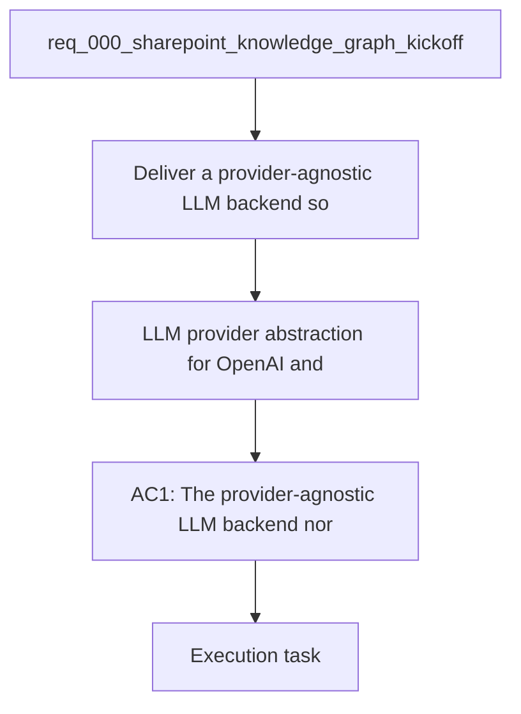

## item_007_llm_provider_abstraction_for_openai_and_gemini - LLM provider abstraction for OpenAI and Gemini
> From version: 0.0.0
> Schema version: 1.0
> Status: Ready
> Understanding: 95%
> Confidence: 92%
> Progress: 0%
> Complexity: Medium
> Theme: General
> Reminder: Keep this slice focused on the backend provider contract and do not hard-code a single vendor into the local app.

# Problem
- Deliver a provider-agnostic LLM backend so the local companion app can use OpenAI or Gemini behind one contract.
- The product already has keys configured for both providers and should not hard-code one vendor into the UI.

# Scope
- In: one backend provider abstraction that normalizes prompts, responses, and errors.
- In: a configurable primary provider plus a fallback/secondary provider route.
- In: wiring the local companion app chat path to the abstraction instead of a single vendor.
- Out: model fine-tuning, prompt science experiments, and unrelated chat UX polish.

# Acceptance criteria
- AC1: The provider-agnostic LLM backend normalizes prompts, responses, and errors for both OpenAI and Gemini.
- AC2: The local companion app can call the backend without knowing which provider handled the request.
- AC3: The primary provider is configurable and a secondary provider can be enabled as fallback.

# AC Traceability
- AC1 -> Scope: In: one backend provider abstraction that normalizes prompts, responses, and errors. Proof: capture validation evidence in this doc.
- AC2 -> Scope: In: wiring the local companion app chat path to the abstraction instead of a single vendor. Proof: capture validation evidence in this doc.
- AC3 -> Scope: In: a configurable primary provider plus a fallback/secondary provider route. Proof: capture validation evidence in this doc.

# Decision framing
- Product framing: Required
- Product signals: chat flexibility, vendor choice, quality and cost tuning
- Product follow-up: Keep the product brief aligned with the provider-agnostic chat direction.
- Architecture framing: Required
- Architecture signals: contracts and integration
- Architecture follow-up: Keep the LLM provider abstraction ADR current as the backend evolves.

# Links
- Product brief(s): `logics/product/prod_000_sharepoint_knowledge_graph_product_vision.md`
- Architecture decision(s): `logics/architecture/adr_008_llm_provider_abstraction_for_openai_and_gemini.md`
- Request: `logics/request/req_000_sharepoint_knowledge_graph_kickoff.md`
- Primary task(s): (none yet)

# AI Context
- Summary: Provider-agnostic chat backend for OpenAI and Gemini
- Keywords: llm, provider, abstraction, openai, gemini, fallback, backend
- Use when: Use when implementing or reviewing the delivery slice for the chat provider abstraction.
- Skip when: Skip when the change is unrelated to this delivery slice or its linked request.
# Priority
- Impact: High
- Urgency: High

# Notes
- Derived from request `req_000_sharepoint_knowledge_graph_kickoff`.
- Source file: `logics/request/req_000_sharepoint_knowledge_graph_kickoff.md`.
- Keep this backlog item as one bounded delivery slice; create sibling backlog items for remaining request coverage instead of widening this doc.
- Request context seeded into this backlog item from `logics/request/req_000_sharepoint_knowledge_graph_kickoff.md`.
