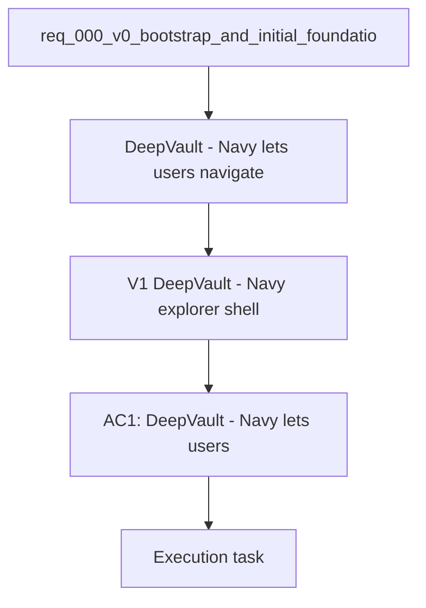

## item_008_v1_local_explorer_shell_and_navigation - V1 — DeepVault - Navy explorer shell and navigation
> From version: 0.0.1
> Schema version: 1.0
> Status: Done
> Understanding: 100%
> Confidence: 100%
> Progress: 100%
> Complexity: Medium
> Theme: General
> Reminder: Keep this slice focused on `DeepVault - Navy` and avoid drifting into `DeepVault - Bishop` or hosted backend work. For any UX/UI or frontend implementation work, use `logics/skills/logics-ui-steering/SKILL.md`.

# Problem
- `DeepVault - Navy` lets users navigate sites, libraries, folders, and lists without waiting for the hosted backend.
- `DeepVault - Navy` should validate the local runtime and the SharePoint navigation model early.

# Scope
- In: the local web shell, routing, navigation chrome, and a site/library tree.
- In: implementation of the explorer navigation contract defined in `item_003_v1_explorer_ui_for_sharepoint_navigation`.
- In: opening a selected SharePoint object with basic detail context.
- Out: chat, sync status, hosted backend, and Teams integration.

# Acceptance criteria
- AC1: `DeepVault - Navy` lets users browse SharePoint sites and their top-level structure locally.
- AC2: The shell exposes enough navigation context to validate the pilot scope.
- AC3: The shell remains independent from Teams and the hosted backend.

# AC Traceability
- AC1 -> Scope: Local web shell, routing, navigation chrome, and a site/library tree.. Proof: capture validation evidence in this doc.
- AC2 -> Scope: Opening a selected SharePoint object with basic detail context.. Proof: capture validation evidence in this doc.
- AC3 -> Scope: Out: chat, sync status, hosted backend, and Teams integration.. Proof: capture validation evidence in this doc.

# Decision framing
- Product framing: Required
- Product signals: navigation first, local validation surface, pilot structure
- Product follow-up: Keep the product brief aligned with the local-first explorer direction.
- Architecture framing: Required
- Architecture signals: browser routing, local runtime boundary, navigation contract
- Architecture follow-up: Keep ADR 012 aligned with the local explorer shell.

# Links
- Product brief(s): `logics/product/prod_000_sharepoint_knowledge_graph_product_vision.md`
- Architecture decision(s): `logics/architecture/adr_007_local_companion_app_architecture_for_explorer_and_chat.md`, `logics/architecture/adr_012_local_companion_runtime_for_explorer_and_chat.md`
- Related backlog: `logics/backlog/item_003_v1_explorer_ui_for_sharepoint_navigation.md`
- Related backlog: `logics/backlog/item_006_v1_local_companion_app_for_explorer_and_chat.md`
- Request: `logics/request/req_000_v0_bootstrap_and_initial_foundations.md`
- Primary task(s): (none yet)

# AI Context
- Summary: DeepVault - Navy explorer shell and navigation
- Keywords: local, explorer, navigation, shell, sites, libraries
- Use when: Use when implementing `DeepVault - Navy`.
- Skip when: Skip when the change is about chat, sync, or hosted backend work.

# Priority
- Impact: High
- Urgency: High

# Notes
- Derived from request `req_000_v0_bootstrap_and_initial_foundations`.
- Source file: `logics/request/req_000_v0_bootstrap_and_initial_foundations.md`.
- Keep this backlog item as one bounded delivery slice; create sibling backlog items for chat and sync instead of widening this doc.
