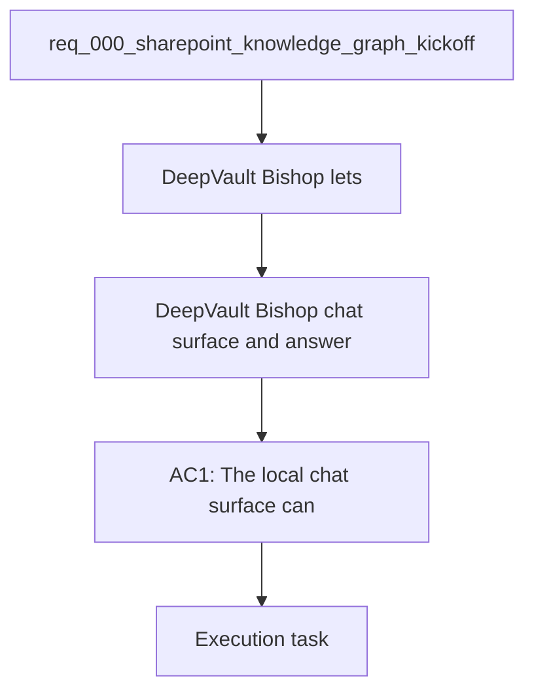

## item_009_local_chat_surface_and_answer_flow - DeepVault - Bishop chat surface and answer flow
> From version: 0.0.0
> Schema version: 1.0
> Status: Ready
> Understanding: 95%
> Confidence: 92%
> Progress: 1%
> Complexity: High
> Theme: General
> Reminder: Keep this slice focused on `DeepVault - Bishop` and avoid drifting into `DeepVault - Gordon` or hosted backend work.

# Problem
- `DeepVault - Bishop` lets users ask questions against SharePoint-derived knowledge without depending on `DeepVault - Gordon`.
- The answer flow must use the same permission-aware retrieval model that later channels will reuse.

# Scope
- In: local chat UI, message history, answer rendering, and source citations.
- In: provider-agnostic backend calls for OpenAI or Gemini.
- Out: Teams packaging, hosted backend deployment, and admin console work.

# Acceptance criteria
- AC1: `DeepVault - Bishop` can ask questions and display grounded answers locally.
- AC2: The flow can call a provider-agnostic LLM backend contract.
- AC3: The surface shows source-backed answers without requiring Teams.

# AC Traceability
- AC1 -> Scope: Local chat UI, message history, answer rendering, and source citations.. Proof: capture validation evidence in this doc.
- AC2 -> Scope: Provider-agnostic backend calls for OpenAI or Gemini.. Proof: capture validation evidence in this doc.
- AC3 -> Scope: Out: Teams packaging, hosted backend deployment, and admin console work.. Proof: capture validation evidence in this doc.

# Decision framing
- Product framing: Required
- Product signals: local chat validation, grounded answers, source trust
- Product follow-up: Keep the product brief aligned with the local chat direction.
- Architecture framing: Required
- Architecture signals: retrieval contract, LLM abstraction, permission-aware context
- Architecture follow-up: Keep ADR 009 and ADR 008 aligned with the local chat surface.

# Links
- Product brief(s): `logics/product/prod_000_sharepoint_knowledge_graph_product_vision.md`
- Architecture decision(s): `logics/architecture/adr_008_llm_provider_abstraction_for_openai_and_gemini.md`, `logics/architecture/adr_009_permission_aware_retrieval_and_source_filtering.md`, `logics/architecture/adr_012_local_companion_runtime_for_explorer_and_chat.md`
- Related backlog: `logics/backlog/item_006_local_companion_app_for_explorer_and_chat.md`
- Request: `logics/request/req_000_sharepoint_knowledge_graph_kickoff.md`
- Primary task(s): (none yet)

# AI Context
- Summary: DeepVault - Bishop chat surface and answer flow
- Keywords: local, chat, answers, retrieval, citations, openai, gemini
- Use when: Use when implementing `DeepVault - Bishop`.
- Skip when: Skip when the change is about navigation, sync, or hosted backend work.

# Priority
- Impact: High
- Urgency: High

# Notes
- Derived from request `req_000_sharepoint_knowledge_graph_kickoff`.
- Source file: `logics/request/req_000_sharepoint_knowledge_graph_kickoff.md`.
- Keep this backlog item bounded to the local chat flow; create sibling backlog items for other chat channels.
