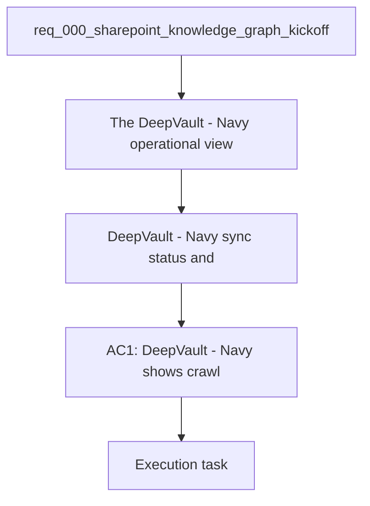

## item_010_local_sync_status_and_operational_view - DeepVault - Navy sync status and operational view
> From version: 0.0.0
> Schema version: 1.0
> Status: Ready
> Understanding: 95%
> Confidence: 92%
> Progress: 2%
> Complexity: Medium
> Theme: General
> Reminder: Keep this slice focused on `DeepVault - Navy` and its operational view. For any UX/UI or frontend implementation work, use `logics/skills/logics-ui-steering/SKILL.md`.

# Problem
- The `DeepVault - Navy` operational view lets users see crawl progress, refresh state, and basic answer provenance.
- The sync surface makes `DeepVault - Navy` inspectable before any hosted backend exists.

# Scope
- In: local sync status, last refresh time, basic run health, and simple provenance indicators.
- In: read-only operational display for ingestion and retrieval runs.
- Out: hosted dashboards, production alerting, and Teams integration.

# Acceptance criteria
- AC1: `DeepVault - Navy` shows crawl progress and last refresh status.
- AC2: The view exposes enough operational detail to support debugging.
- AC3: The view remains local-only and does not depend on the hosted backend.

# AC Traceability
- AC1 -> Scope: Local sync status, last refresh time, basic run health, and simple provenance indicators.. Proof: capture validation evidence in this doc.
- AC2 -> Scope: Read-only operational display for ingestion and retrieval runs.. Proof: capture validation evidence in this doc.
- AC3 -> Scope: Out: hosted dashboards, production alerting, and Teams integration.. Proof: capture validation evidence in this doc.

# Decision framing
- Product framing: Required
- Product signals: sync visibility, operational trust, local feedback loop
- Product follow-up: Keep the product brief aligned with the local operational view.
- Architecture framing: Required
- Architecture signals: observability, local runtime, refresh signals
- Architecture follow-up: Keep ADR 011 aligned with the local operational view.

# Links
- Product brief(s): `logics/product/prod_000_sharepoint_knowledge_graph_product_vision.md`
- Architecture decision(s): `logics/architecture/adr_010_sharepoint_sync_orchestration_and_refresh_policy.md`, `logics/architecture/adr_011_observability_audit_and_answer_traceability.md`, `logics/architecture/adr_012_local_companion_runtime_for_explorer_and_chat.md`
- Related backlog: `logics/backlog/item_006_local_companion_app_for_explorer_and_chat.md`
- Request: `logics/request/req_000_sharepoint_knowledge_graph_kickoff.md`
- Primary task(s): (none yet)

# AI Context
- Summary: DeepVault - Navy sync status and operational view
- Keywords: local, sync, status, operations, refresh, provenance
- Use when: Use when implementing the `DeepVault - Navy` sync and operational display.
- Skip when: Skip when the change is about chat, explorer, or hosted backend work.

# Priority
- Impact: Medium
- Urgency: Medium

# Notes
- Derived from request `req_000_sharepoint_knowledge_graph_kickoff`.
- Source file: `logics/request/req_000_sharepoint_knowledge_graph_kickoff.md`.
- Keep this backlog item bounded to local operational visibility; move hosted dashboards to later work.
