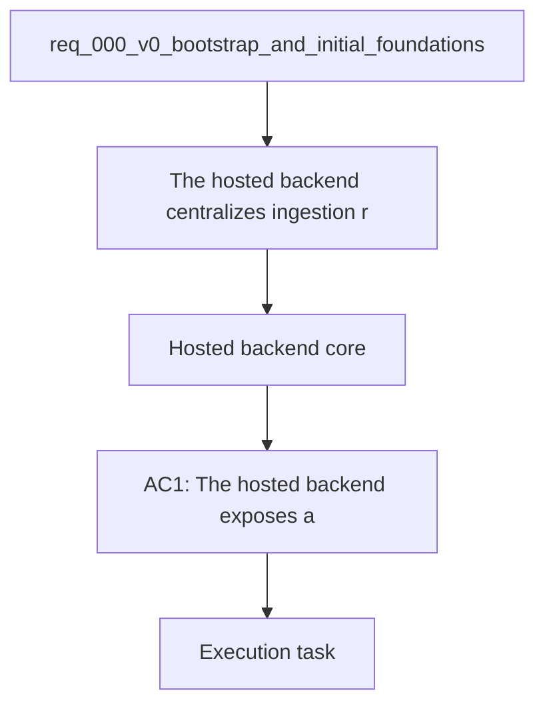

## item_011_v2_hosted_backend_core - V2 — Hosted backend core
> From version: 0.0.1
> Schema version: 1.0
> Status: Ready
> Understanding: 95%
> Confidence: 92%
> Progress: 0%
> Complexity: High
> Theme: General
> Reminder: Keep this slice focused on the hosted backend core.

# Problem
- The hosted backend centralizes ingestion, retrieval, permissions, and LLM orchestration.
- The backend is the shared runtime that Teams and other clients will call.

# Scope
- In: hosted API surface, shared runtime contracts, and channel-agnostic service boundaries.
- In: backend integration for ingestion, retrieval, and provider routing.
- Out: local-only UI work and Teams packaging details.

# Acceptance criteria
- AC1: The hosted backend exposes a reusable contract for local and Teams clients.
- AC2: The backend centralizes retrieval and provider orchestration.
- AC3: The backend remains channel-agnostic.

# AC Traceability
- AC1 -> Scope: Hosted API surface, shared runtime contracts, and channel-agnostic service boundaries.. Proof: capture validation evidence in this doc.
- AC2 -> Scope: Backend integration for ingestion, retrieval, and provider routing.. Proof: capture validation evidence in this doc.
- AC3 -> Scope: Out: local-only UI work and Teams packaging details.. Proof: capture validation evidence in this doc.

# Decision framing
- Product framing: Required
- Product signals: hosted runtime, shared services, readiness
- Product follow-up: Keep the product brief aligned with the hosted backend direction.
- Architecture framing: Required
- Architecture signals: deployment target, shared contracts, runtime governance
- Architecture follow-up: Keep ADR 013 current as the backend core evolves.

# Links
- Product brief(s): `logics/product/prod_000_sharepoint_knowledge_graph_product_vision.md`
- Architecture decision(s): `logics/architecture/adr_013_hosted_backend_and_teams_chat_channel.md`, `logics/architecture/adr_009_permission_aware_retrieval_and_source_filtering.md`, `logics/architecture/adr_011_observability_audit_and_answer_traceability.md`
- Related backlog: `logics/backlog/item_005_runtime_config_and_operations.md`
- Request: `logics/request/req_000_v0_bootstrap_and_initial_foundations.md`
- Primary task(s): (none yet)

# AI Context
- Summary: Hosted backend core
- Keywords: hosted backend, api, shared runtime, retrieval, orchestration
- Use when: Use when implementing the backend core.
- Skip when: Skip when the change is about local-only UI work.

# Priority
- Impact: High
- Urgency: High

# Notes
- Derived from request `req_000_v0_bootstrap_and_initial_foundations`.
- Source file: `logics/request/req_000_v0_bootstrap_and_initial_foundations.md`.
- Keep this backlog item bounded to the shared backend core; split client surfaces into separate items.
