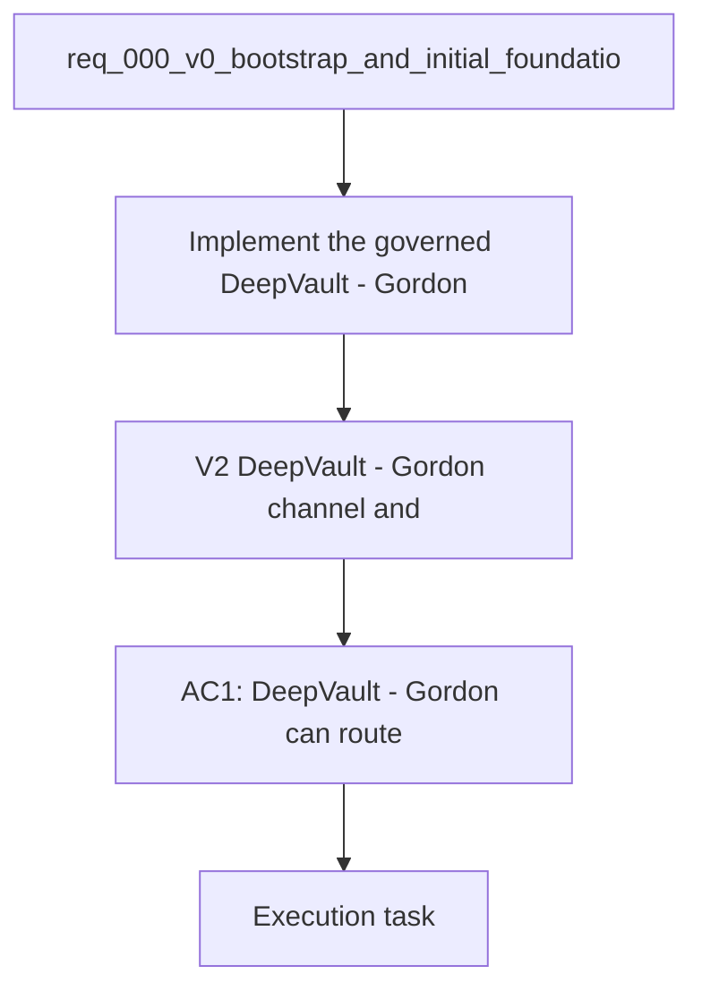

## item_012_v2_teams_bot_channel_and_permissions - V2 — DeepVault - Gordon channel and permissions
> From version: 0.0.1
> Schema version: 1.0
> Status: Ready
> Understanding: 95%
> Confidence: 92%
> Progress: 0%
> Complexity: High
> Theme: General
> Reminder: Keep this slice focused on `DeepVault - Gordon` and its permissions. For any UX/UI or frontend implementation work, use `logics/skills/logics-ui-steering/SKILL.md`.

# Problem
- Implement the governed `DeepVault - Gordon` chatbot that talks to the hosted backend and respects Microsoft identity.
- The channel must use the same permission-aware retrieval model as the backend.
- This slice turns the policy and channel rules into an actual Teams delivery.

# Scope
- In: `DeepVault - Gordon` registration, message routing, identity mapping, and permission checks.
- In: integration with the hosted backend contract.
- In: the packaging and channel plumbing required to make the Teams experience real.
- Out: policy framing, local-only runtime work, and local companion app UI work.

# Acceptance criteria
- AC1: `DeepVault - Gordon` can route user messages to the hosted backend.
- AC2: `DeepVault - Gordon` enforces the governed Microsoft identity and permission model.
- AC3: The bot remains separate from the local runtime.

# AC Traceability
- AC1 -> Scope: Teams bot registration, message routing, identity mapping, and permission checks.. Proof: capture validation evidence in this doc.
- AC2 -> Scope: Integration with the hosted backend contract.. Proof: capture validation evidence in this doc.
- AC3 -> Scope: Out: local-only runtime work and local companion app UI work.. Proof: capture validation evidence in this doc.

# Decision framing
- Product framing: Required
- Product signals: enterprise chat channel, governance, user trust
- Product follow-up: Keep the product brief aligned with the Teams channel direction.
- Architecture framing: Required
- Architecture signals: bot auth, identity mapping, permission-aware chat
- Architecture follow-up: Keep ADR 013 and ADR 001 aligned with the Teams channel.

# Links
- Product brief(s): `logics/product/prod_000_sharepoint_knowledge_graph_product_vision.md`
- Architecture decision(s): `logics/architecture/adr_001_identity_and_access_model_for_sharepoint_knowledge_graph.md`, `logics/architecture/adr_009_permission_aware_retrieval_and_source_filtering.md`, `logics/architecture/adr_013_hosted_backend_and_teams_chat_channel.md`
- Related backlog: `logics/backlog/item_004_teams_bot_chat_and_permissions.md`
- Request: `logics/request/req_000_v0_bootstrap_and_initial_foundations.md`
- Primary task(s): (none yet)

# AI Context
- Summary: DeepVault - Gordon channel and permissions
- Keywords: teams, bot, permissions, identity, hosted backend, chat
- Use when: Use when implementing `DeepVault - Gordon`.
- Skip when: Skip when the change is about local-only runtime work.

# Priority
- Impact: High
- Urgency: High

# Notes
- Derived from request `req_000_v0_bootstrap_and_initial_foundations`.
- Source file: `logics/request/req_000_v0_bootstrap_and_initial_foundations.md`.
- Keep this backlog item bounded to the Teams channel; keep local runtime work in the local items.
